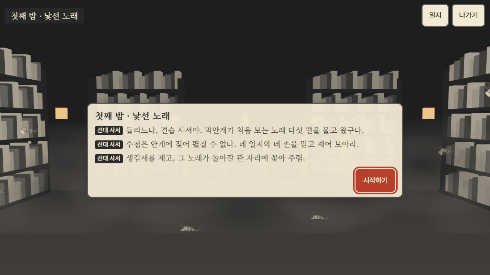
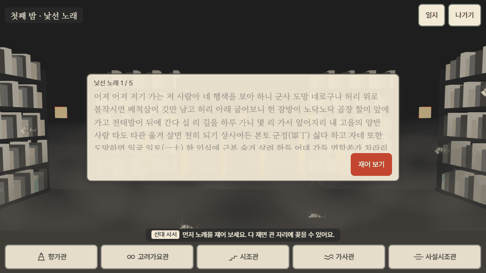
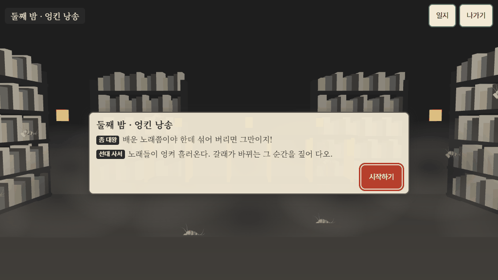
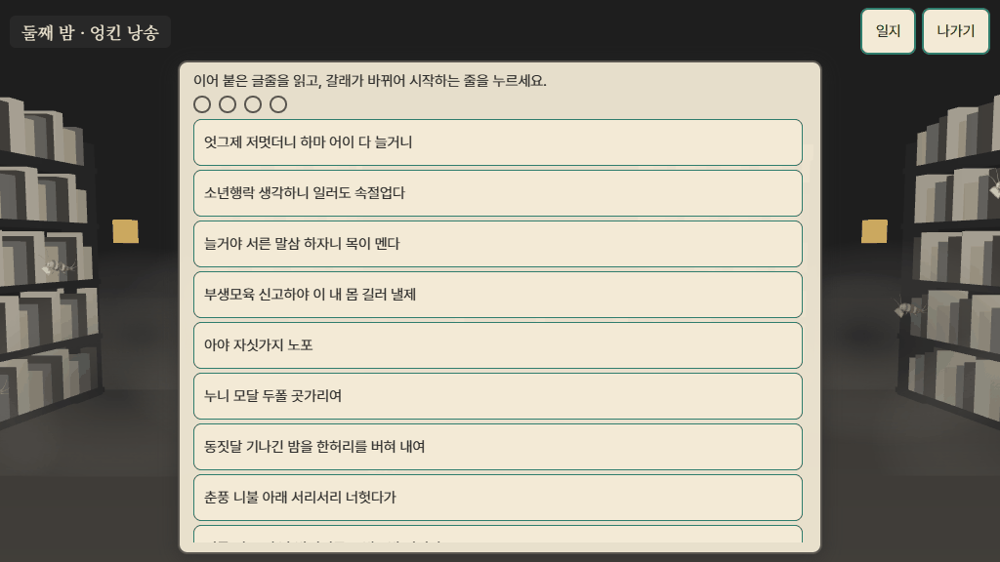
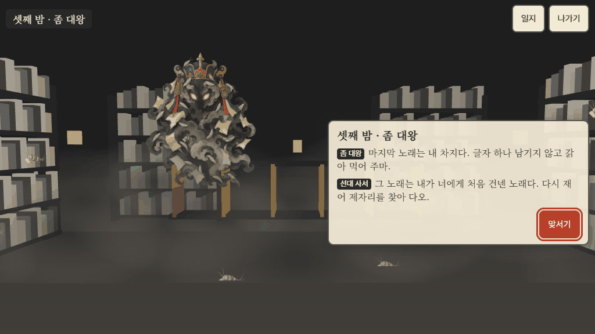
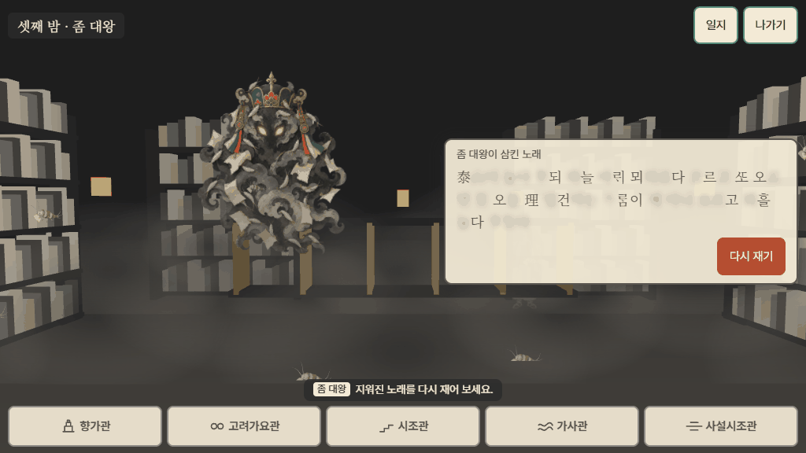
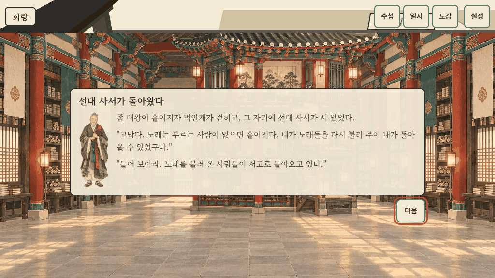
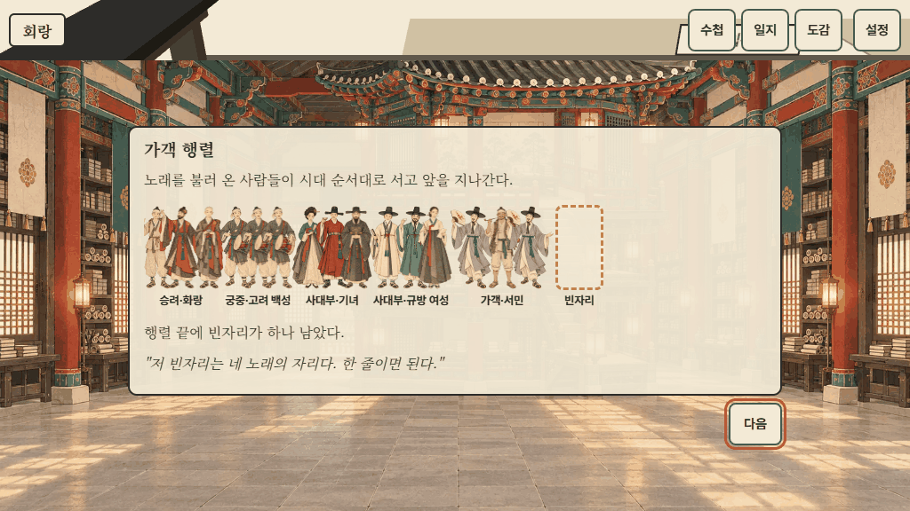
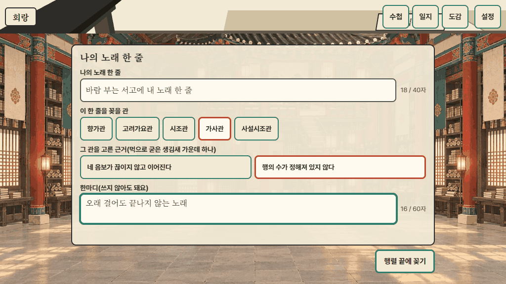
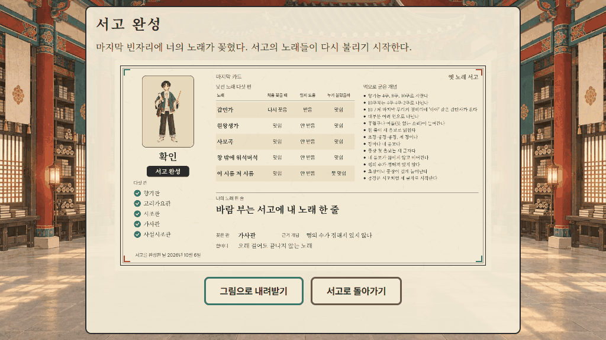

# 글 확인 문서

> 이 문서는 `node tools/text/review-doc.mjs`가 게임 데이터에서 만든다. 손으로 고치지 말고 데이터를 고친 뒤 다시 만든다.
> 보스·엔딩 화면 그림은 `node tools/text/review-shots.mjs`가 만든다(`docs/images/`). 빠진 글이 없는지는 `node tests/check-review-doc.mjs`가 대조한다.

교사가 확인할 것(spec 16.4)

1. 게임이 새로 쓴 글: 이야기, 수첩 설명, 일지 개념 문장, 가객 대사, 작품 방 해석 문장, 기념품 카드 글, 화면의 짧은 글, 노래마다 오늘 소리와 제작진 풀이
2. 확인할 노래(pending) 43편의 원문·해독·풀이와 출처. 확인을 마치면 노래 데이터의 `verification`을 `'verified'`로 바꾼다(모두 바뀐 뒤 공개).
3. 보스전과 엔딩 화면 그림

글 항목의 `파일 · 경로`는 고칠 곳이다. 함수로 된 글은 함수 원문을 그대로 보인다(따옴표 안이 화면 글).

## 먼저 볼 출처 메모

- 「서동요」 `seodongyo` — 해독·현대어역을 2차 자료(나무위키)에서 옮김(원저 대조 전); 원저와 대조하지 않음
- 「처용가」 `cheoyongga` — 해독·현대어역을 2차 자료(나무위키)에서 옮김(원저 대조 전); 원저와 대조하지 않음
- 「찬기파랑가」 `chan-giparangga` — 해독·현대어역을 2차 자료(나무위키)에서 옮김(원저 대조 전); 원저와 대조하지 않음; 무리 나눔: 뜻으로는 5·3·2, 게임은 형식 구분 4·4·2를 따름
- 「헌화가」 `heonhwaga` — 해독·현대어역을 2차 자료(나무위키)에서 옮김(원저 대조 전); 원저와 대조하지 않음
- 「모죽지랑가」 `mojukjirangga` — 해독·현대어역을 2차 자료(나무위키)에서 옮김(원저 대조 전); 원저와 대조하지 않음
- 「안민가」 `anminga` — 해독·현대어역을 2차 자료(나무위키)에서 옮김(원저 대조 전); 원저와 대조하지 않음
- 「서경별곡」 `seogyeong-byeolgok` — 해독·현대어역을 2차 자료(나무위키)에서 옮김(원저 대조 전)
- 「가시리」 `gasiri` — 해독·현대어역을 2차 자료(나무위키)에서 옮김(원저 대조 전)
- 「정석가」 `jeongseokga` — 해독·현대어역을 2차 자료(나무위키)에서 옮김(원저 대조 전); 문학 교과서 파일이 오면 교과서 수록본으로 바꿀 노래
- 「동동」 `dongdong` — 발췌(두 달치) — 범위는 제작 메모 참고
- 「상저가」 `sangjeoga` — 학습 자료(다음 카페)의 반현대 표기를 옮김
- 「정읍사」 `jeongeupsa` — 해독·현대어역을 2차 자료(나무위키)에서 옮김(원저 대조 전)
- 「창 밖에 워석버석」 `sinheum-sijo` — 수능 출제 지문의 발췌 범위
- 「면앙정가」 `myeonangjeongga` — 발췌(첫 대목) — 범위는 제작 메모 참고
- 「관동별곡」 `gwandong-byeolgok` — 발췌(첫 대목) — 범위는 제작 메모 참고
- 「상춘곡」 `sangchungok` — 교과서 대목 뒤에 교과서 밖 원문을 이어 붙임
- 「사미인곡」 `samiingok` — 발췌(첫 대목) — 범위는 제작 메모 참고
- 「속미인곡」 `songmiingok` — 발췌(첫 대목) — 범위는 제작 메모 참고
- 「누항사」 `nuhangsa` — 발췌(한 대목) — 범위는 제작 메모 참고
- 「갑민가」 `gapminga` — 발췌(한 대목) — 범위는 제작 메모 참고; 수능 출제 지문의 발췌 범위
- 「나모도 바히 돌도」 `namodo-bahi` — 문학 교과서 파일이 오면 교과서 수록본으로 바꿀 노래
- 「논밭 갈아 김매고」 `nonbat-gara` — 학습 자료(다음 카페)의 반현대 표기를 옮김
- 「이 시름 저 시름」 `suneung-saseol` — 수능 출제 지문의 발췌 범위

## 입구와 공통 화면

### 새로 쓴 글

#### 이야기와 앱 화면 글 — `js/data/story.js`

- `MISSION` — 먹안개가 서고를 삼키기 전에, 흩어진 노래들을 제자리로 돌려보내 다시 불리게 하라.
- `STORY.title` — 옛 노래 서고
- `STORY.subtitle` — 먹안개에 잠긴 서고를 물려받은 견습 사서의 이야기
- `STORY.start.recordsTitle` — 이름 기록
- `STORY.start.recordsNone` — 아직 기록이 없어요. 아래에서 새로 만들어 주세요.
- `STORY.start.continue` — 이어 하기
- `STORY.start.changeLook` — 모습 바꾸기
- `STORY.start.delete` — 지우기
- `STORY.start.complete` — 서고 완성
- `STORY.start.newTitle` — 새 기록
- `STORY.start.nameLabel` — 이름(별명도 좋아요)
- `STORY.start.namePlaceholder` — 1~12자
- `STORY.start.lookTitle` — 견습 사서의 모습
- `STORY.start.looks.a` — 모습 하나
- `STORY.start.looks.b` — 모습 둘
- `STORY.start.lookOf` — `(name) => name + '의 모습'`
- `STORY.start.create` — 새 기록 만들기
- `STORY.start.nameEmpty` — 이름을 한 글자 이상 써 주세요.
- `STORY.start.nameLong` — `(max) => '이름은 ' + max + '자까지 쓸 수 있어요.'`
- `STORY.start.existsTitle` — 같은 이름의 기록이 있어요
- `STORY.start.existsText` — `(name) => "'" + name + "' 기록이 이미 이 기기에 있어요. 그 기록을 이어 할까요?"`
- `STORY.start.existsYes` — 그 기록 이어 하기
- `STORY.start.existsNo` — 다른 이름 쓰기
- `STORY.start.deleteTitle` — 기록을 지울까요?
- `STORY.start.deleteText` — `(name) => "'" + name + "' 기록을 지우면 그 기록의 진행과 결과 카드 자료도 함께 사라져요. 되돌릴 수 없어요."`
- `STORY.start.deleteYes` — 지우기
- `STORY.start.deleteNo` — 그대로 두기
- `STORY.start.settings` — 설정
- `STORY.start.credits` — 출처
- `STORY.start.saveFailed` — 이 기기에 저장되지 않아요. 이번 창에서만 이어집니다
- `STORY.firstRun.earphoneTitle` — 이어폰을 준비해 주세요
- `STORY.firstRun.earphone[0]` — 이 서고의 노래는 소리로 들으며 재는 일이 많아요.
- `STORY.firstRun.earphone[1]` — 이어폰을 끼고, 소리가 너무 크지 않게 맞춰 주세요.
- `STORY.firstRun.earphone[2]` — 소리를 낼 수 없는 곳이라면 설정에서 소리를 끄거나 빗금 모드를 켜도 끝까지 갈 수 있어요.
- `STORY.firstRun.earphoneNext` — 이어폰을 꼈어요
- `STORY.firstRun.calTitle` — 박자 맞추기
- `STORY.firstRun.calText` — 종이 여덟 번 울려요. 종소리가 들릴 때마다 아래 단추를 눌러 주세요. 이 기기의 소리 늦음을 재어 둡니다.
- `STORY.firstRun.calStart` — 종소리 듣기
- `STORY.firstRun.calTap` — 치기
- `STORY.firstRun.calListening` — 종소리에 맞춰 눌러 주세요.
- `STORY.firstRun.calOk` — 박자를 맞췄어요.
- `STORY.firstRun.calRetry` — 종소리와 잘 맞지 않았어요. 다시 해 보거나, 그대로 가도 괜찮아요(설정에서 다시 맞출 수 있어요).
- `STORY.firstRun.calLocked` — 소리를 낼 수 없었어요. 그대로 가도 괜찮아요(설정에서 다시 맞출 수 있어요).
- `STORY.firstRun.calAgain` — 다시 해 보기
- `STORY.firstRun.calSkip` — 건너뛰기
- `STORY.firstRun.calDone` — 다음
- `STORY.settings.title` — 설정
- `STORY.settings.volumeTitle` — 소리 크기
- `STORY.settings.bgm` — 배경음
- `STORY.settings.voice` — 낭송
- `STORY.settings.sfx` — 효과음
- `STORY.settings.muted` — 소리 끄기
- `STORY.settings.slashMode` — 빗금 모드(박자 없이 마디 끝을 눌러 재기)
- `STORY.settings.textScaleTitle` — 글자 크기
- `STORY.settings.textScales[0].label` — 보통
- `STORY.settings.textScales[1].label` — 크게
- `STORY.settings.textScales[2].label` — 아주 크게
- `STORY.settings.reduceMotion` — 움직임 줄이기
- `STORY.settings.recalibrate` — 박자 다시 맞추기
- `STORY.settings.close` — 닫기
- `STORY.settings.note` — 설정은 이 기기의 모든 이름 기록에 함께 쓰여요.
- `STORY.hud.settings` — 설정
- `STORY.hud.home` — 기록
- `STORY.hud.finalCard` — 마지막 카드
- `STORY.hud.finalCardTitle` — 마지막 카드
- `STORY.hud.letter` — 편지
- `STORY.entrance.place` — 입구
- `STORY.entrance.scene` — 서고 문을 밀고 들어서자 오래된 먹 냄새가 났다. 책등의 글자는 바래어 읽히지 않고, 바닥에는 먹안개가 낮게 깔려 있다.
- `STORY.entrance.letterTitle` — 책상 위에 놓인 편지
- `STORY.entrance.letter[0]` — 이 편지를 읽는 사람에게.
- `STORY.entrance.letter[1]` — 나는 이 서고를 오래 지켜 온 사서다. 서고의 노래들이 하나둘 흩어지더니, 이제는 먹안개가 책장 사이로 차오르고 있다.
- `STORY.entrance.letter[2]` — 흩어진 노래는 생김새를 보면 제자리를 찾을 수 있다. 몇 줄로 끊어지는지, 한 줄에 몇 마디가 놓이는지, 어디서 소리가 꺾이는지.
- `STORY.entrance.letter[3]` — 서고 열쇠와 『분류 수첩』을 책상에 두고 간다. 부디 이 서고를 맡아 다오.
- `STORY.entrance.voiceTitle` — 먹안개 속에서 들리는 목소리
- `STORY.entrance.voice[0]` — ……들리느냐. 나는 안개 저편에 있다.
- `STORY.entrance.voice[1]` — 좀들이 책등의 글자를 갉아 먹을 때마다 안개가 짙어진다. 오래 버티지는 못할 것 같구나.
- `STORY.entrance.voice[2]` — 그러니 이것 하나만 부탁하마.
- `STORY.entrance.missionTitle` — 선대 사서의 부탁
- `STORY.entrance.tutorialIntro` — 먼저 내가 처음 배운 노래로 재는 법을 익혀 보자. 접기, 두드리기, 계단 오르기를 하나씩 해 보면 된다.
- `STORY.entrance.tutorialSong` — 선대 사서의 첫 노래
- `STORY.entrance.tutorialStart` — 재는 법 익히기
- `STORY.entrance.next` — 다음
- `STORY.entrance.doneTitle` — 첫 노래를 잘 재었구나
- `STORY.entrance.done[0]` — 이 노래는 '선대 사서의 첫 노래'로 사서 일지에 담았다. 어느 칸에도 꽂지 않는다.
- `STORY.entrance.done[1]` — 향가관 문이 열렸다. 회랑으로 나가 첫 관으로 가 보아라.
- `STORY.entrance.toCorridor` — 회랑으로 나가기
- `STORY.entrance.doorLabel` — 입구 — 편지 다시 읽기
- `STORY.entrance.rereadClose` — 닫기
- `STORY.wingIntroClose` — 둘러보기
- `STORY.jom.corridor` — 먹안개 속에서 좀 한 마리가 책등 글자를 갉아 먹다가 사라졌다.
- `STORY.jom.wing` — 안개 낀 서가 귀퉁이에서 작은 좀들이 글자 부스러기를 물고 달아난다.
- `STORY.jom.alt` — 책등 글자를 갉아 먹는 좀
- `STORY.complete.badge` — 서고 완성
- `STORY.complete.corridor` — 서고가 완성되었다. 관에 다시 들어가 덤을 하거나 노래를 다시 들을 수 있다.

#### 사서 일지의 개념 문장과 향유층 무리 — `js/data/concepts.js`

- `SINGER_CLASSES[0]` — 승려
- `SINGER_CLASSES[1]` — 화랑
- `SINGER_CLASSES[2]` — 민간
- `SINGER_CLASSES[3]` — 궁중
- `SINGER_CLASSES[4]` — 고려 백성
- `SINGER_CLASSES[5]` — 사대부
- `SINGER_CLASSES[6]` — 기녀
- `SINGER_CLASSES[7]` — 규방 여성
- `SINGER_CLASSES[8]` — 가객
- `SINGER_CLASSES[9]` — 서민

#### 갈래·관·고유 동작 이름 — `js/data/wings.js`

- `ACTIONS[0].name` — '아아' 문 열기
- `ACTIONS[1].name` — 후렴 고리 걸기
- `ACTIONS[2].name` — 계단 오르기
- `ACTIONS[3].name` — 걷기
- `ACTIONS[4].name` — 연타로 풀기
- `GENRES[0].name` — 향가
- `GENRES[0].unitName` — 구
- `GENRES[1].name` — 고려가요
- `GENRES[1].unitName` — 연
- `GENRES[2].name` — 시조
- `GENRES[2].unitName` — 장
- `GENRES[3].name` — 가사
- `GENRES[3].unitName` — 행
- `GENRES[4].name` — 사설시조
- `GENRES[4].unitName` — 장
- `WINGS[0].name` — 입구
- `WINGS[1].name` — 향가관
- `WINGS[2].name` — 고려가요관
- `WINGS[3].name` — 시조관
- `WINGS[4].name` — 가사관
- `WINGS[5].name` — 사설시조관

#### 출처 화면 글 — `js/data/credits.js`

- `CREDITS.title` — 출처
- `CREDITS.back` — 돌아가기
- `CREDITS.backLabel` — 시작 화면으로 돌아가기
- `CREDITS.intro` — 이 게임에 실린 노래의 글, 소리, 목소리, 그림, 글꼴이 어디에서 왔는지 적었어요.
- `CREDITS.textbook.title` — 교과서 수록본
- `CREDITS.textbook.lead` — 교과서에 실린 노래는 교과서에 실린 글 그대로 옮겼어요.
- `CREDITS.textbook.groups.textbook-common2` — 고등학교 공통국어2 교과서 수록본
- `CREDITS.textbook.groups.textbook-literature` — 고등학교 문학 교과서 수록 작품
- `CREDITS.textbook.literatureNote` — 문학 교과서 수록 작품은 지금은 옛 문헌과 공개 자료의 글로 실었고, 교과서 수록본으로 바꿀 예정이에요.
- `CREDITS.textbook.beyondNote` — `(title) => '「' + title + '」에서 교과서 대목 뒤에 이어 붙인 부분은 교과서 밖 원문이에요.'`
- `CREDITS.scholars.title` — 해독과 풀이
- `CREDITS.scholars.lead` — 향가의 해독과 몇몇 노래의 현대어 풀이는 아래 학자의 연구를 따랐어요. 그 밖의 오늘 소리와 현대어 풀이는 제작진이 새로 썼어요.
- `CREDITS.scholars.people[0].name` — 김완진
- `CREDITS.scholars.people[0].role` — 향가 해독·현대어역
- `CREDITS.scholars.people[0].works[0]` — 『향가해독법연구』(서울대학교 출판부, 1980)
- `CREDITS.scholars.people[0].works[1]` — 「「원왕생가」의 '念丁'에 대하여」, 『새국어생활』 11권 2호(국립국어원, 2001)
- `CREDITS.scholars.people[1].name` — 조규익
- `CREDITS.scholars.people[1].role` — 「동동」 현대어 풀이
- `CREDITS.scholars.people[1].works[0]` — 조규익·문숙희·손선숙·성영애, 『동동(動動) 궁중 융합무대예술, 그 본질과 아름다움』(민속원, 2019)
- `CREDITS.scholars.people[2].name` — 박병채
- `CREDITS.scholars.people[2].role` — 「정읍사」 현대어 풀이
- `CREDITS.scholars.people[2].works[0]` — 한국민족문화대백과사전 「정읍사」 항목에 실린 번역
- `CREDITS.oldTexts.title` — 옛 문헌
- `CREDITS.oldTexts.lead` — 교과서 밖 노래의 원문은 아래 옛 문헌에 실린 것을 공개된 전사본과 영인본으로 옮겼어요.
- `CREDITS.oldTexts.books[0]` — 삼국유사
- `CREDITS.oldTexts.books[1]` — 악학궤범
- `CREDITS.oldTexts.books[2]` — 악장가사
- `CREDITS.oldTexts.books[3]` — 시용향악보
- `CREDITS.oldTexts.books[4]` — 청구영언
- `CREDITS.oldTexts.books[5]` — 가곡원류
- `CREDITS.oldTexts.books[6]` — 송강가사
- `CREDITS.oldTexts.books[7]` — 노계집
- `CREDITS.oldTexts.books[8]` — 불우헌집
- `CREDITS.exam.title` — 대학수학능력시험 출제 지문
- `CREDITS.exam.lead` — 수능에 나온 노래는 한국교육과정평가원이 공개한 문제지의 출제 지문과 발췌 범위를 따랐어요.
- `CREDITS.references.title` — 찾아본 공개 자료
- `CREDITS.references.lead` — 원문을 옮기고 맞춰 볼 때 아래 공개 자료를 찾아보았어요.
- `CREDITS.references.items[0]` — 위키문헌
- `CREDITS.references.items[1]` — 한국민족문화대백과사전
- `CREDITS.references.items[2]` — 디지털한글박물관
- `CREDITS.references.items[3]` — 국립국악원
- `CREDITS.references.items[4]` — 한국교육과정평가원
- `CREDITS.references.items[5]` — 나무위키
- `CREDITS.references.items[6]` — 다음 카페
- `CREDITS.songs.title` — 노래마다 출처
- `CREDITS.songs.summary` — `(n) => '노래 ' + n + '편의 출처 모두 보기'`
- `CREDITS.music.title` — 배경음과 장구 소리
- `CREDITS.music.lead` — 배경음과 장구·효과음 일부는 국립국악원의 「국악기 디지털 음원」 악구 녹음을 잘라 잇거나 다듬어 만들었어요. 나머지 효과음은 직접 합성했어요.
- `CREDITS.music.kogl` — 본 저작물은 '국립국악원'에서 공공누리 제1유형으로 개방한 '국악기 디지털 음원(작성자: 국립국악원)'을 이용하였으며, 해당 저작물은 '국립국악원, https://www.gugak.go.kr/digitaleum'에서 무료로 다운받으실 수 있습니다.
- `CREDITS.music.license` — 이용 조건: 공공누리 제1유형(출처표시, 상업 이용·변경 가능)
- `CREDITS.music.notAffiliated` — 이 게임은 국립국악원과 관계가 없으며, 국립국악원이 후원하거나 보증한 것이 아니에요.
- `CREDITS.music.listTitle` — 쓴 곡
- `CREDITS.music.synthesized` — 직접 합성
- `CREDITS.voice.title` — 낭송 목소리
- `CREDITS.voice.lead` — 노래 낭송은 AI로 합성한 목소리예요. Fish Audio의 유료 요금제(종량 과금 API)로 만들었고, 유료 요금제는 상업적으로 쓸 수 있어요.
- `CREDITS.voice.design` — 목소리는 실제 사람의 목소리를 본뜨지 않고, 이 게임을 위해 글 설명만으로 설계한 두 목소리예요. 차분한 30대 여성 낭독자의 목소리는 여성 화자가 분명한 노래를, 따뜻하고 낮은 50대 남성 낭독자의 목소리는 나머지 노래를 읽어요.
- `CREDITS.voice.model` — `(source) => '만든 곳: ' + source`
- `CREDITS.art.title` — 그림
- `CREDITS.art.lead` — 서고와 인물, 기념품 그림은 이 게임을 위해 AI 이미지 생성으로 만들었어요. 미리 정한 화풍(한지를 오려 겹친 종이 인형, 가는 먹선)에 맞추어 만들고 다듬었어요.
- `CREDITS.art.method` — `(source) => '만든 방법: ' + source + ', OpenAI 이용 약관에 따라 상업적으로 쓸 수 있어요.'`
- `CREDITS.fonts.title` — 글꼴
- `CREDITS.fonts.lead` — 옛 글자와 향찰이 보이도록 Noto Serif KR에서 이 게임에 쓰인 글자만 남긴 부분 글꼴(Yetnorae Text)을 만들어 썼어요.
- `CREDITS.fonts.license` — Noto Serif KR — SIL Open Font License 1.1. 라이선스 전문은 assets/fonts/OFL.txt에 있어요.
- `CREDITS.fonts.fallback` — 부분 글꼴에 없는 드문 한자 몇 자는 기기에 있는 글꼴로 보여요.
- `CREDITS.code.title` — 프로그램

#### 재기 화면의 짧은 글 — `js/measure/labels.js`

- `ACTION_TEXT.aa-door.name` — '아아' 문 열기
- `ACTION_TEXT.aa-door.hint` — 노래 끝 무리의 첫머리를 눌러 문을 두드려 보세요.
- `ACTION_TEXT.aa-door.open` — 문이 열렸어요. 첫머리에 감탄사가 있어요.
- `ACTION_TEXT.aa-door.shut` — 문이 열리지 않아요. 첫머리에 감탄사가 없어요.
- `ACTION_TEXT.refrain-link.name` — 후렴 고리 걸기
- `ACTION_TEXT.refrain-link.hint` — 되풀이되는 구절을 눌러 고리로 이어 보세요.
- `ACTION_TEXT.refrain-link.none` — 되풀이되는 구절이 없다
- `ACTION_TEXT.refrain-link.done` — 되풀이되는 구절을 모두 이었어요.
- `ACTION_TEXT.refrain-link.noneDone` — 고리를 걸 구절이 없어요.
- `ACTION_TEXT.stairs.name` — 계단 오르기
- `ACTION_TEXT.stairs.hint` — 종장 첫 음보를 글자마다 눌러 계단을 오르세요.
- `ACTION_TEXT.stairs.absent` — 종장이 없어 계단이 놓이지 않아요.
- `ACTION_TEXT.stairs.ok` — 확인
- `ACTION_TEXT.stairs.done` — 계단을 다 올랐어요.
- `ACTION_TEXT.walk.name` — 걷기
- `ACTION_TEXT.walk.hint` — 한 걸음씩 걸어 보세요. 노래가 이어지는 동안 회랑이 이어져요.
- `ACTION_TEXT.walk.step` — 한 걸음
- `ACTION_TEXT.walk.walking` — 걷는 중
- `ACTION_TEXT.walk.stop` — 노래가 끝나 걸음이 멈췄어요.
- `ACTION_TEXT.rapid-unroll.name` — 연타로 풀기
- `ACTION_TEXT.rapid-unroll.hint` — 가운데를 여러 번 두드려 두루마리를 풀어 보세요.
- `ACTION_TEXT.rapid-unroll.tap` — 두드려 풀기
- `ACTION_TEXT.rapid-unroll.absent` — 가운데 장을 찾을 수 없어요.
- `ACTION_TEXT.rapid-unroll.ok` — 확인
- `ACTION_TEXT.rapid-unroll.done` — 가운데가 다 풀렸어요.
- `ACTION_TEXT.rapid-unroll.count` — `(n) => '풀린 음보 ' + n`
- `L.title` — 재기
- `L.prev` — 앞 쪽
- `L.next` — 뒤 쪽
- `L.book` — 수첩
- `L.bookTitle` — 『분류 수첩』
- `L.journal` — 일지
- `L.journalTitle` — 사서 일지
- `L.close` — 닫기
- `L.glossPaused` — 풀이를 보는 중이에요. 두루마리 막대를 누르면 원문으로 돌아가요.
- `L.foldHint` — 글줄이 이어져 있어요. 노래가 끊어지는 틈을 찾아 눌러 접어 보세요.
- `L.foldNone` — 접을 곳이 없다
- `L.foldDone` — 다 접었어요.
- `L.tapHint` — 낭송을 들으며 소리 마디가 울릴 때마다 장구를 치세요.
- `L.tapHintOffbeat` — 소리 마디가 울릴 때마다 장구를 치세요. 여음·후렴·되풀이 표시가 붙은 곳은 치지 않아요.
- `L.listen` — 낭송 듣기
- `L.drum` — 장구
- `L.replay` — 놓친 박이 있어요. 그 줄을 다시 들어요.
- `L.listenOnly` — 후렴 줄이에요. 장구는 쉬고 들어 보세요.
- `L.slashHint` — 마디가 끝나는 말 뒤를 눌러 빗금을 그으세요. 서두르지 않아도 돼요.
- `L.slashOffbeatHint` — 마디가 끝나는 말 뒤를 눌러 빗금을 그으세요. 여음·후렴·되풀이 표시가 붙은 곳은 이미 나뉘어 있어요.
- `L.suggest` — 박이 잘 안 맞나요? 빗금으로 재도 같은 증거가 모여요.
- `L.suggestYes` — 빗금으로 할래요
- `L.suggestNo` — 계속 칠래요
- `L.noSound` — 소리를 낼 수 없어 빗금으로 재요.
- `L.tapDone` — 다 쟀어요.
- `L.toolsHint` — 쓸 도구를 고르세요. 여러 번 골라도 돼요.
- `L.finishBoss` — 다 쟀다
- `L.finish` — 감정서 받기
- `L.preMeasured` — 미리 잰 노래예요. 감정서가 채워져 있어요.
- `L.sheetTitle` — 감정서
- `L.sheetRefrains` — [여음·후렴이 있다]
- `L.showScroll` — 두루마리 보기
- `L.showSheet` — 감정서 보기
- `L.introOk` — 해 볼게요
- `L.intro.fold` — 이어진 글줄에서 노래가 끊어지는 틈을 눌러 접어요.
- `L.intro.tap` — 낭송을 들으며 소리 마디마다 장구를 쳐요. 빗금 모드에서는 마디 끝 말을 눌러요.
- `L.intro.unique` — 이 관의 도구예요. 손가락이 가리키는 곳부터 해 보세요.
- `LAYER_NAMES.original` — 원문
- `LAYER_NAMES.reading` — 오늘 소리
- `LAYER_NAMES.gloss` — 풀이
- `MARK_NAMES.yeoeum` — 여음
- `MARK_NAMES.refrain` — 후렴
- `MARK_NAMES.repeat` — 되풀이

#### 한 판 화면의 짧은 글 — `js/play/labels.js`

- `L.notebook` — 수첩
- `L.journal` — 일지
- `L.collection` — 도감
- `L.listen` — 다시 듣기
- `L.leave` — 회랑으로
- `L.close` — 닫기
- `L.hand` — 손에 든 노래
- `L.handEmpty` — 손이 비어 있어요
- `L.catch` — 잡기
- `L.place` — 꽂기
- `L.look` — 살펴보기
- `L.room` — 작품 방 들어가기
- `L.next` — 다음 관으로
- `L.enter` — 들어가기
- `L.spineEmpty` — 빈 책등
- `L.slot` — `(i) => '칸 ' + (i + 1)`
- `L.floor` — `(gu) => gu + '구 층'`
- `L.bonus` — `(i) => '덤 칸 ' + (i + 1)`
- `L.basket` — 바구니
- `L.basketPlace` — `(i) => '바구니 ' + (i + 1)`
- `L.returned` — 돌아온 노래
- `L.roomDoor` — 작품 방
- `L.nextDoor` — 다음 관
- `L.entrance` — 입구
- `L.fixed` — 고정됨
- `L.remove` — 빼기
- `L.pickTitle` — 어느 노래를 꽂을까요?
- `L.pickBasket` — 바구니에 넣을 노래
- `L.destTitle` — `(title) => '「' + title + '」을(를) 어느 관으로 보낼까요?'`
- `L.basketFull` — 바구니가 찼어요. 먼저 하나를 빼세요.
- `L.nothingInHand` — 손에 든 노래가 없어요. 떠도는 노래를 먼저 잡아 재 보세요.
- `L.waitingTitle` — 입구에서 기다리는 노래
- `L.premeasured` — 미리 잰 노래
- `L.floatingLabel` — `(title) => '떠도는 노래 「' + title + '」'`
- `L.waitingLabel` — `(title) => '미리 잰 노래 「' + title + '」(연필 표시)'`
- `L.popOut` — `(title) => '「' + title + '」이(가) 모양이 맞지 않아 삐져나왔어요. 손으로 돌아왔어요.'`
- `L.popOutBasket` — `(title) => '「' + title + '」은(는) 그 관으로 갈 노래가 아니었어요. 행선지 표시가 지워졌어요.'`
- `L.bound` — 세 권이 실로 묶이고 책등에 금박이 찍혔어요. 먹안개가 물러나요.
- `L.bonusBound` — 덤 칸이 묶였어요.
- `L.roomOpen` — 작품 방 문이 열렸어요.
- `L.sentPrewait` — `(title, wing) => '「' + title + '」은(는) ' + wing + ' 입구에서 미리 잰 채로 기다려요.'`
- `L.sentReturned` — `(title, wing) => '「' + title + '」은(는) ' + wing + " '돌아온 노래' 선반에 꽂혔어요."`
- `L.helpGlow` — 『분류 수첩』의 관련 줄이 반짝여요. 펼쳐 보세요.
- `L.singersTitle` — 가객이 나타났어요
- `L.legend` — 전해지는 이야기
- `L.nextSinger` — 다음
- `L.keepsakesTitle` — 기념품을 남겼어요
- `L.keepsakesDone` — 도감에 담기
- `L.kindObject` — 노래 속 물건
- `L.kindMind` — 노래 속 마음
- `L.roomLeave` — 방에서 나가기
- `L.roomPlaceholder` — 이 작품 방은 아직 준비하고 있어요. 다음에 다시 들어와 주세요.
- `L.roomTitle` — `(title) => '작품 방 「' + title + '」'`
- `L.leak` — `(wing) => '문틈으로 ' + wing + '의 소리가 새어 나와요.'`
- `L.bonusOpen` — 덤 칸이 열렸어요. 다시 와서 덤 노래도 재어 볼 수 있어요.
- `L.doneWing` — 판을 마쳤어요. 덤과 다시 듣기만 할 수 있어요.
- `L.saveFailed` — 이 기기에 저장되지 않아요. 이번 창에서만 이어집니다
- `L.notebookTitle` — 『분류 수첩』
- `L.journalTitle` — 사서 일지
- `L.journalConcepts` — 연필과 먹
- `L.journalNone` — 아직 확인한 생김새가 없어요.
- `L.pencil` — 연필
- `L.ink` — 먹
- `L.confirmedBy` — 확인해 준 노래:
- `L.firstSong` — 선대 사서의 첫 노래
- `L.clues` — 이야기 단서
- `L.cluesNone` — 아직 찾은 단서가 없어요.
- `L.collectionTitle` — 도감
- `L.collectionNone` — 아직 모은 기념품이 없어요.
- `L.listenTitle` — 다시 듣기
- `L.listenNone` — 아직 다시 들을 노래가 없어요.
- `L.play` — 듣기
- `L.stop` — 멈추기
- `L.corridor` — 회랑

튜토리얼 노래(선대 사서의 첫 노래): 「태산이 높다 하되」 `taesan` — 글은 그 갈래 절에 있다.

## 향가관

### 새로 쓴 글

#### 이야기와 앱 화면 글 — `js/data/story.js`

- `STORY.wingIntro.hyangga` — 향가관. 탑이 아래에서 위로 층층이 자라 있다. 맨 위층 앞에는 무언가를 부르는 듯한 작은 문이 닫혀 있다.
- `STORY.clues.hyangga` — 탑 아래에서 찢긴 일지 한 쪽을 찾았다. "좀들이 책등 글자를 갉아 먹기 시작한 것은, 아무도 노래를 부르지 않은 첫날 밤부터였다."

#### 『분류 수첩』 향가 쪽 — `js/data/notebook-hyangga.js`

- `notebookPage.name` — 향가
- `notebookPage.body[0]` — 향가는 신라 때 사람들이 부른 우리말 노래다. 한글이 없던 때라 한자의 뜻과 소리를 빌려 우리말을 적었는데, 이 적는 법을 향찰이라고 한다.
- `notebookPage.body[1]` — 향가는 구(句)로 센다. 짧은 노래는 4구, 조금 긴 노래는 8구, 가장 다듬어진 노래는 10구다. 향가는 4구에서 8구로, 다시 10구로 자랐다.
- `notebookPage.body[2]` — 10구체 향가는 4구·4구·2구, 세 무리로 나뉜다. 마지막 두 구가 시작되는 9구 첫머리에는 '아아' 같은 감탄사가 와서, 앞에서 쌓은 마음을 한데 모으거나 방향을 돌린다.
- `notebookPage.body[3]` — 향가를 지은 사람은 승려와 화랑이 많았다. 아이들이 따라 부르며 마을에 퍼진 노래도 있다.
- `notebookPage.lines[0].text` — 구를 하나씩 세어 보자. 향가는 4구, 8구, 10구 가운데 하나다.
- `notebookPage.lines[1].text` — 10구체는 4구·4구·2구, 세 무리로 나뉜다.
- `notebookPage.lines[2].text` — 10구체는 9구 첫머리에 '아아' 같은 감탄사가 온다. 마지막 무리가 거기서 시작된다.

#### 작품 방 「제망매가」 글 — `js/data/rooms-hyangga.js`

- `interpretations[0].text` — 슬픔을 이겨 낸 것이다. 미타찰에서 다시 만나리라 믿으며 마음을 추슬렀다.
- `interpretations[1].text` — 견디겠다는 다짐이다. 슬픔은 그대로 남았지만 도를 닦으며 기다리겠다고 마음먹었다.
- `interpretations[2].text` — 둘 다이다. 슬픔을 품은 채로 그 너머를 바라보려 한다.
- `roomText.title` — 「제망매가」의 방
- `roomText.intro` — 바람 부는 가지에서 잎이 떨어진다. 낭송을 들으며 떨어지는 잎을 붙잡아 보자.
- `roomText.start` — 가지 아래로 가기
- `roomText.catchHint` — 떨어지는 잎을 눌러 붙잡아 보자.
- `roomText.catchAction` — 잎 잡기
- `roomText.catchLeaf` — 떨어지는 잎
- `roomText.scattered[0]` — 잡았는데, 손안에서 흩어져 버렸다.
- `roomText.scattered[1]` — 이번에도 손가락 사이로 흩어졌다.
- `roomText.scattered[2]` — 움켜쥐어도 남는 것이 없다.
- `roomText.scattered[3]` — 붙잡을 수가 없다. 잎은 바람을 따라간다.
- `roomText.waitRecite` — 낭송이 끝나면 다음 구로 넘어간다.
- `roomText.turn` — 잡으려던 손을 거두고, 미타찰로 가는 길을 닦아 보자.
- `roomText.sweepHint` — 길에 쌓인 잎을 눌러 쓸어 내자.
- `roomText.sweepAction` — 길 닦기
- `roomText.pile` — 길에 쌓인 잎
- `roomText.pileLater` — 아직 닿지 않은 길
- `roomText.swept` — 길이 한 걸음 트였다.
- `roomText.pathClear` — 미타찰로 가는 길이 트였다.
- `roomText.destination` — 미타찰
- `roomText.interpretationLabel` — 해석
- `roomText.question` — 마지막은 슬픔을 이겨 낸 것일까, 견디겠다는 다짐일까?
- `roomText.questionNote` — 정해진 답은 없다. 내 생각에 가장 가까운 것을 골라 보자.
- `roomText.confirm` — 이 해석으로 남기기
- `roomText.guLabel` — `(n) => n + '구'`
- `roomText.progressLabel` — 낭송한 구

#### 사서 일지의 개념 문장과 향유층 무리 — `js/data/concepts.js`

- `CONCEPTS[0].text` — 향가는 4구, 8구, 10구로 자란다
- `CONCEPTS[1].text` — 10구체는 4구·4구·2구로 나뉜다
- `CONCEPTS[2].text` — 10구체 마지막 무리의 첫머리에 '아아' 같은 감탄사가 온다

### 노래

칸: `seodongyo`, `cheoyongga`, `chan-giparangga` · 길 잃은 노래: `gasiri`, `cheongsanri-byeokgyesu` · 작품 방: `jemangmaega` · 덤: `heonhwaga`, `mojukjirangga`, `anminga`

### 「서동요」 — `seodongyo` · **확인할 노래(pending)**

- 갈래·쓰임: 향가 · 향가관 칸
- 가객: 서동 (민간) — 전해지는 귀속
- 해독: 김완진, 향가해독법연구(서울대학교 출판부, 1980)
- 출처(화면에 보임): 원문: 『삼국유사』 권2 기이 「무왕」(위키문헌 「서동요」 전사본). 해독·현대어역: 김완진, 『향가해독법연구』(서울대학교 출판부, 1980) — 나무위키 「서동요」의 '김완진 설'에서 옮김(원저 대조 전)
- 제작 메모: 위키백과 「서동요」에는 김완진 해독 3구가 '서동 방ᄋᆞᆯ'로 적혀 있어 나무위키('薯童 바ᅌᆞᆯ')와 다르다. 4구 '夘乙'을 김완진은 '卵(알)'의 잘못으로 보아 '알ᄒᆞᆯ'로 읽는다(나무위키). 지은이는 『삼국유사』 서동 설화가 전하는 대로 적었다(설화 속 귀속). 오늘 소리(reading)는 제작진이 김완진 해독을 오늘 발음으로 옮겨 적은 것이다(ㆍ→ㅏ, ㅿ→ㅅ, ㅸ→ㅂ 등, 한자는 한자음). 교사 확인 대상.
- 기념품(물건): 서동의 방 · 낱말 방 · 구절 서동 방을
- 기념품 카드의 향유층 한 줄: 향가는 신라 사람들이 향찰로 적어 부른 노래로, 승려와 화랑이 많이 지었고 백성 사이에서도 불렸다.
- 설화 장면 있음(화면에 '전해지는 이야기'로 표시)
- 낭송 빠르기: 1분에 25박

- **1구**
  - 원문: 善化公主主隱
  - 해독: 善化公主니리믄
  - 오늘 소리: 선화공주니리믄
  - 풀이: 선화공주님은
- **2구**
  - 원문: 他密只嫁良置古
  - 해독: ᄂᆞᆷ 그ᅀᅳᆨ 어러 두고
  - 오늘 소리: 남 그슥 어러 두고
  - 풀이: 남 몰래 짝 맞추어 두고
- **3구**
  - 원문: 薯童房乙
  - 해독: 薯童 바ᅌᆞᆯ
  - 오늘 소리: 서동 바알
  - 풀이: 서동 방을
- **4구**
  - 원문: 夜矣夘乙抱遣去如
  - 해독: 바매 알ᄒᆞᆯ 안고 가다
  - 오늘 소리: 바매 알할 안고 가다
  - 풀이: 밤에 알을 안고 간다

### 「처용가」 — `cheoyongga` · **확인할 노래(pending)**

- 갈래·쓰임: 향가 · 향가관 칸
- 가객: 처용 (민간) — 전해지는 귀속
- 해독: 김완진, 향가해독법연구(서울대학교 출판부, 1980)
- 출처(화면에 보임): 원문: 『삼국유사』 권2 기이 「처용랑 망해사」(위키문헌 「처용가」 전사본). 해독·현대어역: 김완진, 『향가해독법연구』(서울대학교 출판부, 1980) — 나무위키 「처용가」의 '김완진의 해석'에서 옮김(원저 대조 전)
- 제작 메모: 나무위키 전사본은 5·6구 첫머리가 '二肹隠'으로 위키문헌('二兮隱')과 다르다. 옛 문헌 영인본과 대조가 필요하다. 지은이는 『삼국유사』 처용 설화가 전하는 대로 적었다. 오늘 소리(reading)는 제작진이 김완진 해독을 오늘 발음으로 옮겨 적은 것이다(ㆍ→ㅏ, ㅿ→ㅅ, ㅸ→ㅂ 등, 한자는 한자음). 교사 확인 대상.
- 기념품(물건): 처용의 잠자리 · 낱말 자리 · 구절 들어와 자리 보니
- 기념품 카드의 향유층 한 줄: 향가는 신라 사람들이 향찰로 적어 부른 노래로, 승려와 화랑이 많이 지었고 백성 사이에서도 불렸다.
- 설화 장면 있음(화면에 '전해지는 이야기'로 표시)
- 낭송 빠르기: 1분에 28박

- **1구**
  - 원문: 東京明期月良
  - 해독: 東京 ᄇᆞᆯ기 ᄃᆞ라라
  - 오늘 소리: 동경 발기 다라라
  - 풀이: 동경 밝은 달에
- **2구**
  - 원문: 夜入伊遊行如可
  - 해독: 밤 드리 노니다가
  - 오늘 소리: 밤 드리 노니다가
  - 풀이: 밤들도록 노니다가
- **3구**
  - 원문: 入良沙寢矣見昆
  - 해독: 드러ᅀᅡ 자ᄅᆡ 보곤
  - 오늘 소리: 드러사 자래 보곤
  - 풀이: 들어와 자리 보니
- **4구**
  - 원문: 脚烏伊四是良羅
  - 해독: 가로리 네히러라
  - 오늘 소리: 가로리 네히러라
  - 풀이: 다리가 넷이러라
- **5구**
  - 원문: 二兮隱吾下於叱古
  - 해독: 두ᄫᅳ른 내 해엇고
  - 오늘 소리: 두브른 내 해엇고
  - 풀이: 둘은 내 해였고
- **6구**
  - 원문: 二兮隱誰支下焉古
  - 해독: 두ᄫᅳ른 누기 핸고
  - 오늘 소리: 두브른 누기 핸고
  - 풀이: 둘은 누구 핸고
- **7구**
  - 원문: 本矣吾下是如馬於隱
  - 해독: 본ᄃᆡ 내 해다마ᄅᆞᄂᆞᆫ
  - 오늘 소리: 본대 내 해다마라난
  - 풀이: 본디 내 해다마는
- **8구**
  - 원문: 奪叱良乙何如爲理古
  - 해독: 아ᅀᅡᄂᆞᆯ 엇디 ᄒᆞ릿고
  - 오늘 소리: 아사날 엇디 하릿고
  - 풀이: 앗은 걸 어찌할꼬

### 「찬기파랑가」 — `chan-giparangga` · **확인할 노래(pending)**

- 갈래·쓰임: 향가 · 향가관 칸
- 가객: 충담사 (승려)
- 해독: 김완진, 향가해독법연구(서울대학교 출판부, 1980)
- 출처(화면에 보임): 원문: 『삼국유사』 권2 기이 「경덕왕 충담사 표훈대덕」(나무위키 「찬기파랑가」 전사본). 해독·현대어역: 김완진, 『향가해독법연구』(서울대학교 출판부, 1980) — 나무위키 「찬기파랑가」의 '김완진의 해석'에서 옮김(원저 대조 전)
- 제작 메모: 고등학교 문학 교과서 수록본 파일이 오면 교과서 수록본(원문·해독·풀이)으로 바꾼다. 위키백과 「찬기파랑가」의 김완진 해독·현대어역과 글자가 조금 다르다(3구 '언저례', 현대어역 5~10구 등). 무리 나눔: 김완진의 해독을 따라 뜻으로 읽으면 이 노래는 5구·3구·2구(5·3·2)로 나눌 수 있다(위키백과 「찬기파랑가」 설명). 이 게임은 뜻에 따른 나눔이 아니라 10구체의 형식 구분, 곧 구 수에 따른 4구·4구·2구 나눔을 따르므로 grouping을 [4,4,2]로 둔다(사용자 결정). 뜻으로는 5·3·2로 나뉠 수 있다는 점과 게임이 형식 구분을 따른다는 점을 교사가 확인한다. 오늘 소리(reading)는 제작진이 김완진 해독을 오늘 발음으로 옮겨 적은 것이다(ㆍ→ㅏ, ㅿ→ㅅ, ㅸ→ㅂ 등, 한자는 한자음). 교사 확인 대상.
- 기념품(물건): 잣나무 가지 · 낱말 잣나무 가지 · 구절 아아 잣나무 가지 높아
- 기념품 카드의 향유층 한 줄: 향가는 신라 사람들이 향찰로 적어 부른 노래로, 승려와 화랑이 많이 지었고 백성 사이에서도 불렸다.
- 형식 표시: `{"grouping":[4,4,2],"exclamation":{"unit":8,"text":"아야"}}`
- 낭송 빠르기: 1분에 19박

- **1구**
  - 원문: 咽嗚爾處米
  - 해독: 늣겨곰 ᄇᆞ라매
  - 오늘 소리: 늣겨곰 바라매
  - 풀이: 흐느끼며 바라보매
- **2구**
  - 원문: 露曉邪隠月羅理
  - 해독: 이슬 ᄇᆞᆯ갼 ᄃᆞ라리
  - 오늘 소리: 이슬 발갼 다라리
  - 풀이: 이슬 밝힌 달이
- **3구**
  - 원문: 白雲音逐于浮去隠安攴下
  - 해독: ᄒᆡᆫ 구룸 조초 ᄠᅥ 간 언저레
  - 오늘 소리: 흰 구룸 조초 떠 간 언저레
  - 풀이: 흰 구름 좇아 떠 간 언저리에
- **4구**
  - 원문: 沙是八陵隠汀理也中
  - 해독: 몰이 가ᄅᆞᆫ 믈서리여ᄒᆡ
  - 오늘 소리: 몰이 가란 믈서리여해
  - 풀이: 모래 가른 물가에
- **5구**
  - 원문: 耆郎矣皃史是史藪邪
  - 해독: 耆郞ᄋᆡ 즈ᅀᅵ올시 수프리야
  - 오늘 소리: 기랑애 즈시올시 수프리야
  - 풀이: 耆郞의 모습인 수풀이여
- **6구**
  - 원문: 逸烏川理叱磧惡希
  - 해독: 逸烏 나릿 ᄌᆡᄫᅧ긔
  - 오늘 소리: 일오 나릿 재벼긔
  - 풀이: 逸烏 내[川]의 조약돌에
- **7구**
  - 원문: 郎也持以攴如賜烏隠
  - 해독: 郞이여 디니더시온
  - 오늘 소리: 낭이여 디니더시온
  - 풀이: 郞이여 지니시던
- **8구**
  - 원문: 心未際叱肹逐内良齊
  - 해독: ᄆᆞᅀᆞᄆᆡ ᄀᆞᅀᆞᆯ 좃ᄂᆞ라져
  - 오늘 소리: 마사매 가살 좃나라져
  - 풀이: 마음의 가를 좇으련다
- **9구**
  - 원문: 阿耶栢史叱枝次髙攴好
  - 해독: 아야 자싯가지 노포
  - 오늘 소리: 아야 자싯가지 노포
  - 풀이: 아아 잣나무 가지 높아
- **10구**
  - 원문: 雪是毛冬乃乎尸花判也
  - 해독: 누니 모ᄃᆞᆯ 두폴 곳가리여
  - 오늘 소리: 누니 모달 두폴 곳가리여
  - 풀이: 눈이 못 덮을 고깔이여

### 「제망매가」 — `jemangmaega` · 확인 끝(verified)

- 갈래·쓰임: 향가 · 향가관 작품 방
- 가객: 월명사 (승려)
- 해독: 김완진, 향가해독법연구(서울대학교 출판부, 1980)
- 출처(화면에 보임): 고등학교 공통국어2 교과서 수록본(월명사 지음, 김완진 해독)
- 제작 메모: 향찰과 해독은 교과서 추출본과 한 글자씩 대조했다(줄 끝 공백 정리, 9구 해독 가운데 각주 표시 ● 제거). 교과서에 해독과 따로 된 현대어 풀이가 없어 gloss에는 교과서 해독문을 그대로 썼다. 오늘 소리는 제작진이 해독문에서 괄호 속 한자와 문장 부호를 빼고 '몯다'를 '못다'로 적은 것이다(교사 확인 대상).
- 기념품(물건): 떨어질 잎 · 낱말 잎 · 구절 이에 저에 떨어질 잎처럼
- 기념품 카드의 향유층 한 줄: 향가는 신라 사람들이 향찰로 적어 부른 노래로, 승려와 화랑이 많이 지었고 백성 사이에서도 불렸다.
- 형식 표시: `{"grouping":[4,4,2],"exclamation":{"unit":8,"text":"아아"}}`
- 낭송 빠르기: 1분에 17박

- **1구**
  - 원문: 生死路隱
  - 해독: 생사(生死) 길은
  - 오늘 소리: 생사 길은
  - 풀이: 생사(生死) 길은
- **2구**
  - 원문: 此矣有阿米次肹伊遣
  - 해독: 예 있으매 머뭇거리고,
  - 오늘 소리: 예 있으매 머뭇거리고
  - 풀이: 예 있으매 머뭇거리고,
- **3구**
  - 원문: 吾隱去內如辭叱都
  - 해독: 나는 간다는 말도
  - 오늘 소리: 나는 간다는 말도
  - 풀이: 나는 간다는 말도
- **4구**
  - 원문: 毛如云遣去內尼叱古
  - 해독: 몯다 이르고 어찌 갑니까.
  - 오늘 소리: 못다 이르고 어찌 갑니까
  - 풀이: 몯다 이르고 어찌 갑니까.
- **5구**
  - 원문: 於內秋察早隱風未
  - 해독: 어느 가을 이른 바람에
  - 오늘 소리: 어느 가을 이른 바람에
  - 풀이: 어느 가을 이른 바람에
- **6구**
  - 원문: 此矣彼矣浮良落尸葉如
  - 해독: 이에 저에 떨어질 잎처럼,
  - 오늘 소리: 이에 저에 떨어질 잎처럼
  - 풀이: 이에 저에 떨어질 잎처럼,
- **7구**
  - 원문: 一等隱枝良出古
  - 해독: 한 가지에 나고
  - 오늘 소리: 한 가지에 나고
  - 풀이: 한 가지에 나고
- **8구**
  - 원문: 去奴隱處毛冬乎丁
  - 해독: 가는 곳 모르온저.
  - 오늘 소리: 가는 곳 모르온저
  - 풀이: 가는 곳 모르온저.
- **9구**
  - 원문: 阿也 彌陀刹良逢乎吾
  - 해독: 아아, 미타찰(彌陀刹)에서 만날 나
  - 오늘 소리: 아아, 미타찰에서 만날 나
  - 풀이: 아아, 미타찰(彌陀刹)에서 만날 나
- **10구**
  - 원문: 道修良待是古如
  - 해독: 도(道) 닦아 기다리겠노라.
  - 오늘 소리: 도 닦아 기다리겠노라
  - 풀이: 도(道) 닦아 기다리겠노라.

### 「헌화가」 — `heonhwaga` · **확인할 노래(pending)**

- 갈래·쓰임: 향가 · 향가관 덤
- 가객: 이름 모를 노인 (민간)
- 해독: 김완진, 향가해독법연구(서울대학교 출판부, 1980)
- 출처(화면에 보임): 원문: 『삼국유사』 권2 기이 「수로부인」(위키문헌 「헌화가」 전사본). 해독·현대어역: 김완진, 『향가해독법연구』(서울대학교 출판부, 1980) — 나무위키 「헌화가」의 '김완진의 해석'에서 옮김(원저 대조 전)
- 제작 메모: 나무위키 전사본은 1구가 '紫布岩乎过希'로 위키문헌('邊')과 다르다. 『삼국유사』는 소를 끌고 가던 노인이 꽃을 꺾어 바치며 부른 노래로 전한다. 오늘 소리(reading)는 제작진이 김완진 해독을 오늘 발음으로 옮겨 적은 것이다(ㆍ→ㅏ, ㅿ→ㅅ, ㅸ→ㅂ 등, 한자는 한자음). 교사 확인 대상.
- 기념품(물건): 꺾어 바친 꽃 · 낱말 꽃 · 구절 꽃을 꺾어 바치오리다
- 기념품 카드의 향유층 한 줄: 향가는 신라 사람들이 향찰로 적어 부른 노래로, 승려와 화랑이 많이 지었고 백성 사이에서도 불렸다.
- 설화 장면 있음(화면에 '전해지는 이야기'로 표시)
- 낭송 빠르기: 1분에 23박

- **1구**
  - 원문: 紫布岩乎邊希
  - 해독: 지뵈 바회 ᄀᆞᅀᅢ
  - 오늘 소리: 지뵈 바회 가새
  - 풀이: 자줏빛 바윗가에
- **2구**
  - 원문: 執音乎手母牛放敎遣
  - 해독: 자ᄫᆞ온손 암쇼 노히시고
  - 오늘 소리: 자바온손 암쇼 노히시고
  - 풀이: 암소 잡은 손 놓게 하시고,
- **3구**
  - 원문: 吾肹不喩慙肹伊賜等
  - 해독: 나ᄅᆞᆯ 안디 붓그리샤ᄃᆞᆫ
  - 오늘 소리: 나랄 안디 붓그리샤단
  - 풀이: 나를 아니 부끄러워하신다면
- **4구**
  - 원문: 花肹折叱可獻乎理音如
  - 해독: 고ᄌᆞᆯ 것거 바도림다
  - 오늘 소리: 고잘 것거 바도림다
  - 풀이: 꽃을 꺾어 바치오리다.

### 「모죽지랑가」 — `mojukjirangga` · **확인할 노래(pending)**

- 갈래·쓰임: 향가 · 향가관 덤
- 가객: 득오 (화랑)
- 해독: 김완진, 향가해독법연구(서울대학교 출판부, 1980)
- 출처(화면에 보임): 원문: 『삼국유사』 권2 기이 「효소왕대 죽지랑」(나무위키 「모죽지랑가」 전사본). 해독·현대어역: 김완진, 『향가해독법연구』(서울대학교 출판부, 1980) — 나무위키 「모죽지랑가」의 '김완진의 해석'에서 옮김(원저 대조 전)
- 제작 메모: 원문은 김완진 해독과 맞는 나무위키 전사본(1구 '皆理米', 2구 '居叱沙')을 따랐다. 위키문헌은 '得烏去隱春皆林米', '毛冬居叱哭屋尸以憂音'으로 적는다. 7구는 김완진이 '心未'와 '行' 사이에 '皃'를 보충해 읽는데(해독의 '즛'), 원문에는 보충하지 않은 채 두었다. 오늘 소리(reading)는 제작진이 김완진 해독을 오늘 발음으로 옮겨 적은 것이다(ㆍ→ㅏ, ㅿ→ㅅ, ㅸ→ㅂ 등, 한자는 한자음). 교사 확인 대상.
- 기념품(물건): 다복쑥 덤불 · 낱말 다복 · 구절 다복 굴헝에서 잘 밤 있으리
- 기념품 카드의 향유층 한 줄: 향가는 신라 사람들이 향찰로 적어 부른 노래로, 승려와 화랑이 많이 지었고 백성 사이에서도 불렸다.
- 낭송 빠르기: 1분에 17박

- **1구**
  - 원문: 去隱春皆理米
  - 해독: 간 봄 몯 오리매
  - 오늘 소리: 간 봄 못 오리매
  - 풀이: 지나간 봄 돌아오지 못하니
- **2구**
  - 원문: 毛冬居叱沙哭屋尸以憂音
  - 해독: 모ᄃᆞᆯ 기ᅀᅳ샤 우롤 이 시름
  - 오늘 소리: 모달 기스샤 우롤 이 시름
  - 풀이: 살아 계시지 못해 우올 이 시름
- **3구**
  - 원문: 阿冬音乃叱好支賜烏隱
  - 해독: ᄆᆞᄃᆞᆷ곳 ᄇᆞᆯ기시온
  - 오늘 소리: 마담곳 발기시온
  - 풀이: 전각을 밝히오신
- **4구**
  - 원문: 皃史年数就音墮支行齊
  - 해독: 즈ᅀᅵ ᄒᆡ 혜나ᅀᅡᆷ 헐니져
  - 오늘 소리: 즈시 해 혜나삼 헐니져
  - 풀이: 모습이 해가 갈수록 헐어 가도다
- **5구**
  - 원문: 目煙廻扵尸七史伊衣
  - 해독: 누늬 도랄 업시 뎌옷
  - 오늘 소리: 누늬 도랄 업시 뎌옷
  - 풀이: 눈의 돌음 없이 저를
- **6구**
  - 원문: 逢烏支惡知作乎下是
  - 해독: 맛보기 엇디 일오아리
  - 오늘 소리: 맛보기 엇디 일오아리
  - 풀이: 만나보기 어찌 이루리
- **7구**
  - 원문: 郞也慕理尸心未行乎尸道尸
  - 해독: 郞이여 그릴 ᄆᆞᅀᆞᄆᆡ 즛 녀올 길
  - 오늘 소리: 낭이여 그릴 마사매 즛 녀올 길
  - 풀이: 낭 그리는 마음의 모습이 가는 길
- **8구**
  - 원문: 蓬次叱巷中宿尸夜音有叱下是
  - 해독: 다보짓 굴허ᇰᄒᆡ 잘 밤 이샤리
  - 오늘 소리: 다보짓 굴헝해 잘 밤 이샤리
  - 풀이: 다복 굴헝에서 잘 밤 있으리

### 「안민가」 — `anminga` · **확인할 노래(pending)**

- 갈래·쓰임: 향가 · 향가관 덤
- 가객: 충담사 (승려)
- 해독: 김완진, 향가해독법연구(서울대학교 출판부, 1980)
- 출처(화면에 보임): 원문: 『삼국유사』 권2 기이 「경덕왕 충담사 표훈대덕」(위키문헌 「안민가」 전사본). 해독·현대어역: 김완진, 『향가해독법연구』(서울대학교 출판부, 1980) — 나무위키 「안민가」의 '김완진의 해석'에서 옮김(원저 대조 전)
- 제작 메모: 구 나눔은 김완진 해독을 따랐다(3·4구를 '阿孩古'와 '爲賜尸知' 사이에서 끊고, '爲內尸等焉'을 10구 첫머리에 둠 — 나무위키 주석). 위키문헌은 9·10구를 '後句…民隱如爲內尸等焉 / 國惡太平恨音叱如'로 나눈다. 6구 '食'은 다른 전사본에 '喰'·'湌'으로도 적힌다. 오늘 소리(reading)는 제작진이 김완진 해독을 오늘 발음으로 옮겨 적은 것이다(ㆍ→ㅏ, ㅿ→ㅅ, ㅸ→ㅂ 등, 한자는 한자음). 교사 확인 대상.
- 기념품(물건): 이 땅 · 낱말 땅 · 구절 이 땅을 버리고 어디로 가겠는가
- 기념품 카드의 향유층 한 줄: 향가는 신라 사람들이 향찰로 적어 부른 노래로, 승려와 화랑이 많이 지었고 백성 사이에서도 불렸다.
- 형식 표시: `{"grouping":[4,4,2],"exclamation":{"unit":8,"text":"아야"}}`
- 낭송 빠르기: 1분에 18박

- **1구**
  - 원문: 君隱父也
  - 해독: 君은 아비여
  - 오늘 소리: 군은 아비여
  - 풀이: 군은 아비요
- **2구**
  - 원문: 臣隱愛賜尸母史也
  - 해독: 臣은 ᄃᆞᅀᆞ실 어ᅀᅵ여
  - 오늘 소리: 신은 다사실 어시여
  - 풀이: 신은 사랑하시는 어미요
- **3구**
  - 원문: 民焉狂尸恨阿孩古
  - 해독: 民은 어릴ᄒᆞᆫ 아ᄒᆡ고
  - 오늘 소리: 민은 어릴한 아해고
  - 풀이: 민은 어리석은 아이라고
- **4구**
  - 원문: 爲賜尸知民是愛尸知古如
  - 해독: ᄒᆞ샬디 民이 ᄃᆞᅀᆞᆯ 알고다
  - 오늘 소리: 하샬디 민이 다살 알고다
  - 풀이: 하실진댄 민이 사랑을 알리라
- **5구**
  - 원문: 窟理叱大肹生以支所音物生
  - 해독: 구릿 하ᄂᆞᆯ 살이기 바라ᄆᆞᆯᄊᆡ
  - 오늘 소리: 구릿 하날 살이기 바라말쌔
  - 풀이: 대중을 살리기에 익숙해져 있기에
- **6구**
  - 원문: 此肹食惡支治良羅
  - 해독: 이를 치악 다ᄉᆞ릴러라
  - 오늘 소리: 이를 치악 다사릴러라
  - 풀이: 이를 먹여 다스릴러라
- **7구**
  - 원문: 此地肹捨遣只於冬是去於丁
  - 해독: 이 ᄯᅡᄒᆞᆯ ᄇᆞ리곡 어드리 가ᄂᆞᆯ뎌
  - 오늘 소리: 이 따할 바리곡 어드리 가날뎌
  - 풀이: 이 땅을 버리고 어디로 가겠는가
- **8구**
  - 원문: 爲尸知國惡支持以支知古如
  - 해독: ᄒᆞᆯ디 나락 디니기 알고다
  - 오늘 소리: 할디 나락 디니기 알고다
  - 풀이: 할진댄 나라 보전할 것을 알리라
- **9구**
  - 원문: 後句君如臣多支民隱如
  - 해독: 아야 君다 臣다히 民다
  - 오늘 소리: 아야 군다 신다히 민다
  - 풀이: 아아, 군답게 신답게 민답게
- **10구**
  - 원문: 爲內尸等焉國惡太平恨音叱如
  - 해독: ᄒᆞᄂᆞᆯᄃᆞᆫ 나락 太平ᄒᆞᄂᆞᆷᄯᅡ
  - 오늘 소리: 하날단 나락 태평하남따
  - 풀이: 한다면 나라 태평을 지속하느니라

### 「원왕생가」 — `wonwangsaengga` · **확인할 노래(pending)**

- 갈래·쓰임: 향가 · 보스 낯선 노래
- 가객: 광덕 (승려) — 전해지는 귀속
- 해독: 김완진, 향가해독법연구(서울대학교 출판부, 1980)
- 출처(화면에 보임): 원문·해독·현대어역: 김완진, 「「원왕생가」의 '念丁'에 대하여」, 『새국어생활』 11권 2호(국립국어원, 2001), 85~87쪽(김완진, 『향가해독법연구』(서울대학교 출판부, 1980)의 해독을 다시 실음). 원문 출전: 『삼국유사』 권5 감통 「광덕 엄장」
- 제작 메모: 4구의 할주(鄕言云報言也)는 두 줄 잔글씨를 괄호로 한 줄에 적었다. 해독의 옛한글 글자는 PDF 글자층에 없어 쪽 그림을 보고 옮겼다. 지은이: 한국민족문화대백과사전 「원왕생가」는 사문(승려) 광덕으로 보는 견해가 정설이고 광덕의 아내 등 다른 설도 있다고 한다(traditional). 보스 출제: spec 4.2에 수능 학년도가 적혀 있지 않고 수능 출제 지문을 확인하지 못해, 김완진 본인의 글에 실린 원문·해독을 썼다. singerGroups 근거: 승려 광덕의 노래로 전하는 불교 향가이고, 향가 향유층 무리는 승려·화랑(monk-hwarang)이다. 오늘 소리(reading)는 제작진이 김완진 해독을 오늘 발음으로 옮겨 적은 것이다(ㆍ→ㅏ, ㅿ→ㅅ, ㅸ→ㅂ 등, 한자는 한자음). 교사 확인 대상.
- 기념품(물건): 서방으로 가는 달 · 낱말 달 · 구절 달이 어째서
- 기념품 카드의 향유층 한 줄: 향가는 신라 사람들이 향찰로 적어 부른 노래로, 승려와 화랑이 많이 지었고 백성 사이에서도 불렸다.
- 보스 '누가 불렀을까' 정답 무리: monk-hwarang
- 형식 표시: `{"grouping":[4,4,2],"exclamation":{"unit":8,"text":"아야"}}`
- 낭송 빠르기: 1분에 16박

- **1구**
  - 원문: 月下伊底亦
  - 해독: ᄃᆞ라리 엇뎨역
  - 오늘 소리: 다라리 엇데역
  - 풀이: 달이 어째서
- **2구**
  - 원문: 西方念丁去賜里遣
  - 해독: 西方ᄭᆞ장 가시리고.
  - 오늘 소리: 서방까장 가시리고
  - 풀이: 西方까지 가시겠습니까.
- **3구**
  - 원문: 無量壽佛前乃
  - 해독: 無量壽佛前의
  - 오늘 소리: 무량수불전의
  - 풀이: 無量壽佛前에
- **4구**
  - 원문: 惱叱古音(鄕言云報言也)多可攴白遣賜立
  - 해독: ᄀᆞᆽ곰 함ᄌᆞᆨ ᄉᆞᆲ고쇼셔.
  - 오늘 소리: 갖곰 함작 삷고쇼셔
  - 풀이: 報告의 말씀 빠짐없이 사뢰소서.
- **5구**
  - 원문: 誓音深史隱尊衣希仰攴
  - 해독: 다딤 기프신 ᄆᆞᄅᆞ옷 ᄇᆞ라 울워러,
  - 오늘 소리: 다딤 기프신 마라옷 바라 울워러
  - 풀이: 誓願 깊으신 부처님을 우러러 바라보며,
- **6구**
  - 원문: 兩手集刀花乎白良
  - 해독: 두 손 모도 고조ᄉᆞᆯᄫᅡ
  - 오늘 소리: 두 손 모도 고조살바
  - 풀이: 두 손 곧추 모아
- **7구**
  - 원문: 願往生願往生
  - 해독: 願往生願往生
  - 오늘 소리: 원왕생 원왕생
  - 풀이: 願往生願往生
- **8구**
  - 원문: 慕人有如白遣賜立
  - 해독: 그리리 잇다 ᄉᆞᆲ고쇼셔.
  - 오늘 소리: 그리리 잇다 삷고쇼셔
  - 풀이: 그리는 이 있다 사뢰소서.
- **9구**
  - 원문: 阿邪 此身遺也置遣
  - 해독: 아야 이 모마 기텨 두고
  - 오늘 소리: 아야 이 모마 기텨 두고
  - 풀이: 아아, 이 몸 남겨 두고
- **10구**
  - 원문: 四十八大願成遣賜去
  - 해독: 四十八大願 일고실가.
  - 오늘 소리: 사십팔대원 일고실가
  - 풀이: 四十八大願 이루실까.

## 고려가요관

### 새로 쓴 글

#### 이야기와 앱 화면 글 — `js/data/story.js`

- `STORY.wingIntro.goryeo` — 고려가요관. 똑같이 생긴 방들이 줄지어 있고, 방과 방 사이 복도에서 같은 소리가 되풀이해 울린다.
- `STORY.clues.goryeo` — 방 사이 복도에 떨어진 쪽지. "나는 밤마다 노래를 읽었다. 그러나 소리 내어 부르지는 않았다. 읽기만 한 노래는 조금씩 가벼워졌다."

#### 『분류 수첩』 고려가요 쪽 — `js/data/notebook-goryeo.js`

- `notebookPage.name` — 고려가요
- `notebookPage.body[0]` — 고려 때 백성들이 부르던 노래가 궁중 잔치의 음악으로 다듬어진 것이 고려가요다. 오래 입으로만 불리다가 조선 때 노래책과 악보에 한글로 적혔다.
- `notebookPage.body[1]` — 고려가요는 대부분 여러 연으로 나뉜다. 연마다 비슷한 말을 되풀이하며 이야기를 이어 가고, 연이 끝날 때마다 같은 후렴이 돌아온다.
- `notebookPage.body[2]` — 후렴과 여음에는 "얄리얄리 얄라셩", "위 두어렁셩 두어렁셩 다링디리"처럼 뜻 없는 소리가 많다. 악기 소리를 흉내 내거나 가락을 맞추는 소리라서, 뜻을 몰라도 귀로 먼저 알아챌 수 있다.
- `notebookPage.body[3]` — 한 줄은 대개 세 음보로 읽힌다. "가시리 / 가시리 / 잇고"처럼 낱말 안에서도 3·3·2로 셋씩 끊어 두드려 보면 고려가요의 걸음이 느껴진다. 줄 끝에 붙는 "나ᄂᆞᆫ" 같은 여음과 후렴은 음보로 세지 않는다.
- `notebookPage.body[4]` — 다만 모두가 꼭 그렇지는 않다. 연이 하나뿐인 노래도 있고, 연마다 후렴이 붙지 않는 노래도 있다. 줄 사이를 오가는 후렴이나 여음이 보이면 고려가요관을 먼저 떠올려 보자.
- `notebookPage.lines[0].text` — 여러 연으로 나뉘고, 연마다 비슷한 말이 되풀이된다.
- `notebookPage.lines[1].text` — 연이나 줄 끝에 후렴이 돌아오고, 뜻 없는 소리(여음)가 끼어든다.
- `notebookPage.lines[2].text` — 한 줄을 세 번 끊어 읽는다. 세 음보다.

#### 작품 방 「정석가」 글 — `js/data/rooms-goryeo.js`

- `room.cards[0].label` — 구운 밤에서 싹이 나면
- `room.cards[0].objection` — 모래가 따뜻하면 밤 한 톨쯤은 움이 틀지도 모르지 않소?
- `room.cards[1].label` — 옥 연꽃이 피어나면
- `room.cards[1].objection` — 솜씨 좋은 장인이 새긴 꽃이라면 피어나 보일 수도 있지 않소?
- `room.cards[2].label` — 무쇠 철릭이 해어지면
- `room.cards[2].objection` — 오래오래 입으면 무쇠 옷도 언젠가는 닳아 해어지지 않겠소?
- `room.cards[3].label` — 무쇠 소가 쇠풀을 먹으면
- `room.cards[3].objection` — 쇠나무 산이라면 무쇠 소가 먹을 쇠풀도 자라지 않겠소?
- `room.speaker` — 임
- `room.text.title` — 끝나지 않을 약속
- `room.text.intro` — 불가능한 조건 카드를 골라 내세우세요. 그 일이 이루어져야만 임과 헤어지겠다는 약속입니다.
- `room.text.nimIntro` — 헤어지지 않겠다니, 그 약속이 정말 끝나지 않을 수 있소?
- `room.text.objection` — 그건 될 수도 있지 않소?
- `room.text.escalate` — 더 불가능한 조건으로 맞서 보세요.
- `room.text.allUsed` — 「정석가」의 조건 카드를 모두 내세웠어요. 이제 조건이 아닌 것으로 답할 차례입니다.
- `room.text.toFinal` — 조건 대신 마음으로 답하기
- `room.text.nimFinal` — 그 일들이 모두 이루어진다면, 그때는 어찌하겠소?
- `room.text.finalHead` — 마지막 연
- `room.text.finalNote` — 조건을 쌓던 노래가 마지막 연에서는 끊어지지 않는 끈과 믿음을 노래한다.
- `room.text.discover` — 이 연, 어디서 본 듯한데…
- `room.text.discoverHead` — 칸에 꽂힌 「서경별곡」을 펼쳐 같은 연을 찾아보세요.
- `room.text.tabSuffix` — 연
- `room.text.notHere` — 이 연에는 구슬이 보이지 않아요. 다른 연을 펼쳐 보세요.
- `room.text.found` — 찾았다! 「서경별곡」 둘째 연에 같은 사설이 있어요.
- `room.text.foundNote` — 같은 사설이 두 노래에 함께 들어 있다. 「서경별곡」에서는 줄마다 여음 '아즐가'가 끼어들고 후렴이 붙는다.
- `room.text.refrainNote` — 줄마다 후렴
- `room.text.repeated` — 두 번
- `room.text.finish` — 약속을 마친다
- `room.text.nimDone` — 끈이 끊어지지 않듯, 그 믿음도 끊어지지 않겠구려.
- `room.text.slipHead` — 내세운 조건
- `room.text.towerHead` — 쌓인 약속
- `room.text.replay` — 다시 듣기
- `room.text.leftSong` — 「정석가」
- `room.text.rightSong` — 「서경별곡」

#### 사서 일지의 개념 문장과 향유층 무리 — `js/data/concepts.js`

- `CONCEPTS[3].text` — 대부분 여러 연으로 나뉜다
- `CONCEPTS[4].text` — 후렴구나 여음(뜻 없는 소리)이 들어간다
- `CONCEPTS[5].text` — 한 줄이 세 음보로 읽힌다

### 노래

칸: `cheongsan-byeolgok`, `seogyeong-byeolgok`, `gasiri` · 길 잃은 노래: `dongjitdal`, `myeonangjeongga` · 작품 방: `jeongseokga` · 덤: `dongdong`, `sangjeoga`, `jeongeupsa`

### 「청산별곡」 — `cheongsan-byeolgok` · **확인할 노래(pending)**

- 갈래·쓰임: 고려가요 · 고려가요관 칸
- 가객: 이름 모를 고려 백성 (고려 백성)
- 출처(화면에 보임): 『악장가사』 수록 「청산별곡」. 원문은 위키문헌 「청산별곡」 전사본(ko.wikisource.org)을 바탕으로 한국민족문화대백과사전 「청산별곡」 항목에 실린 『악장가사』 사진과 맞춰 적음. 현대어 풀이는 제작진이 새로 씀
- 제작 메모: 위키문헌 전사본과 다르게 적은 곳: 1연 2구 '살러리랏다' → '살어리랏다', 4연 4구 '오리라' → '호리라'(『악장가사』 사진). 7연 '지ᇝ대에'는 위키문헌 표기 그대로(교과서에 따라 '대예'). 음보 나눔은 '3·3·2조 3음보'라는 일반 설명을 따라 '살어리 / 살어리 / 랏다'처럼 나눴다(교사 확인). 1연 후렴만 '얄랑셩'인 것은 원문 그대로다. 음보 세기(교사 결정: 여음·후렴은 음보에서 뺀다, 3·3·2로 나눈다): 후렴 '얄리얄리 얄라셩 얄라리 얄라' 줄은 후렴으로 표시해 듣기만 한다. 나머지 줄은 한국민족문화대백과사전 「청산별곡」(성현경 집필)의 '3·3·2의 기본 음수율' 설명에 따라 '살어리 / 살어리 / 랏다'처럼 세 음보로 둔다. '자고 니러 / 우니로라', '나즈란 / 디내와손뎌', '마자셔 / 우니노라'는 3·3·2로 나뉘지 않아 세 음보로 억지로 맞추지 않고 두 음보로 두었다(교사 확인)
- 기념품(물건): 해금 · 낱말 해금 · 구절 해금을 켜는 것을 듣노라
- 기념품 카드의 향유층 한 줄: 고려가요는 고려 백성들이 부르던 노래가 궁중 음악으로 다듬어져 불리다가, 조선 때 노래책과 악보에 한글로 적혀 전해졌다.
- 형식 표시: `{"refrains":[{"kind":"refrain","text":"얄리얄리 얄라셩 얄라리 얄라","ranges":[{"unit":0,"line":4,"from":0,"to":2},{"unit":1,"line":4,"from":0,"to":2},{"unit":2,"line":4,"from":0,"to":2},{"unit":3,"line":4,"from":0,"to":2},{"unit":4,"line":4,"from":0,"to":2},{"unit":5,"line":4,"from":0,"to":2},{"unit":6,"line":4,"from":0,"to":2},{"unit":7,"line":4,"from":0,"to":2}]}]}`
- 낭송 빠르기: 1분에 35박

- **1연**
  - 1줄 원문: 살어리 / 살어리 / 랏다 · 박 3개
    - 오늘 소리: 살어리 / 살어리 / 랏다
    - 풀이: 살리라, 살리라
  - 2줄 원문: 靑山애 / 살어리 / 랏다 · 박 3개
    - 오늘 소리: 청산애 / 살어리 / 랏다
    - 풀이: 청산에 살리라
  - 3줄 원문: 멀위랑 / ᄃᆞ래랑 / 먹고 · 박 3개
    - 오늘 소리: 멀위랑 / 다래랑 / 먹고
    - 풀이: 머루랑 다래랑 먹고
  - 4줄 원문: 靑山애 / 살어리 / 랏다 · 박 3개
    - 오늘 소리: 청산애 / 살어리 / 랏다
    - 풀이: 청산에 살리라
  - 5줄 원문: [후렴 얄리얄리] / [후렴 얄랑셩] / [후렴 얄라리 얄라] · 듣기만 하는 줄(박 없음)
    - 오늘 소리: [후렴 얄리얄리] / [후렴 얄랑성] / [후렴 얄라리 얄라]
    - 풀이: (악기 소리를 흉내 낸 뜻 없는 소리로 된 후렴)
- **2연**
  - 1줄 원문: 우러라 / 우러라 / 새여 · 박 3개
    - 오늘 소리: 우러라 / 우러라 / 새여
    - 풀이: 울어라 울어라 새여
  - 2줄 원문: 자고 니러 / 우러라 / 새여 · 박 3개
    - 오늘 소리: 자고 니러 / 우러라 / 새여
    - 풀이: 자고 일어나 울어라 새여
  - 3줄 원문: 널라와 / 시름 한 / 나도 · 박 3개
    - 오늘 소리: 널라와 / 시름 한 / 나도
    - 풀이: 너보다 시름 많은 나도
  - 4줄 원문: 자고 니러 / 우니로라 · 박 2개
    - 오늘 소리: 자고 니러 / 우니로라
    - 풀이: 자고 일어나 울고 있노라
  - 5줄 원문: [후렴 얄리얄리] / [후렴 얄라셩] / [후렴 얄라리 얄라] · 듣기만 하는 줄(박 없음)
    - 오늘 소리: [후렴 얄리얄리] / [후렴 얄라성] / [후렴 얄라리 얄라]
    - 풀이: (악기 소리를 흉내 낸 뜻 없는 소리로 된 후렴)
- **3연**
  - 1줄 원문: 가던 새 / 가던 새 / 본다 · 박 3개
    - 오늘 소리: 가던 새 / 가던 새 / 본다
    - 풀이: 가던 새, 가던 새를 본다
  - 2줄 원문: 믈 아래 / 가던 새 / 본다 · 박 3개
    - 오늘 소리: 물 아래 / 가던 새 / 본다
    - 풀이: 물 아래 가던 새를 본다
  - 3줄 원문: 잉 무든 / 장글란 / 가지고 · 박 3개
    - 오늘 소리: 잉 무든 / 장글란 / 가지고
    - 풀이: 이끼 묻은 쟁기를 가지고
  - 4줄 원문: 믈 아래 / 가던 새 / 본다 · 박 3개
    - 오늘 소리: 물 아래 / 가던 새 / 본다
    - 풀이: 물 아래 가던 새를 본다
  - 5줄 원문: [후렴 얄리얄리] / [후렴 얄라셩] / [후렴 얄라리 얄라] · 듣기만 하는 줄(박 없음)
    - 오늘 소리: [후렴 얄리얄리] / [후렴 얄라성] / [후렴 얄라리 얄라]
    - 풀이: (악기 소리를 흉내 낸 뜻 없는 소리로 된 후렴)
- **4연**
  - 1줄 원문: 이링공 / 뎌링공 / ᄒᆞ야 · 박 3개
    - 오늘 소리: 이링공 / 뎌링공 / 하야
    - 풀이: 이럭저럭 하여
  - 2줄 원문: 나즈란 / 디내와손뎌 · 박 2개
    - 오늘 소리: 나즈란 / 디내와손뎌
    - 풀이: 낮일랑 지내 왔건만
  - 3줄 원문: 오리도 / 가리도 / 업슨 · 박 3개
    - 오늘 소리: 오리도 / 가리도 / 업슨
    - 풀이: 올 사람도 갈 사람도 없는
  - 4줄 원문: 바므란 / ᄯᅩ 엇디 / 호리라 · 박 3개
    - 오늘 소리: 바므란 / 또 엇디 / 호리라
    - 풀이: 밤일랑 또 어찌하리오
  - 5줄 원문: [후렴 얄리얄리] / [후렴 얄라셩] / [후렴 얄라리 얄라] · 듣기만 하는 줄(박 없음)
    - 오늘 소리: [후렴 얄리얄리] / [후렴 얄라성] / [후렴 얄라리 얄라]
    - 풀이: (악기 소리를 흉내 낸 뜻 없는 소리로 된 후렴)
- **5연**
  - 1줄 원문: 어듸라 / 더디던 / 돌코 · 박 3개
    - 오늘 소리: 어듸라 / 더디던 / 돌코
    - 풀이: 어디에 던지던 돌인가
  - 2줄 원문: 누리라 / 마치던 / 돌코 · 박 3개
    - 오늘 소리: 누리라 / 마치던 / 돌코
    - 풀이: 누구를 맞히려던 돌인가
  - 3줄 원문: 믜리도 / 괴리도 / 업시 · 박 3개
    - 오늘 소리: 믜리도 / 괴리도 / 업시
    - 풀이: 미워할 이도 사랑할 이도 없이
  - 4줄 원문: 마자셔 / 우니노라 · 박 2개
    - 오늘 소리: 마자서 / 우니노라
    - 풀이: 맞아서 울고 있노라
  - 5줄 원문: [후렴 얄리얄리] / [후렴 얄라셩] / [후렴 얄라리 얄라] · 듣기만 하는 줄(박 없음)
    - 오늘 소리: [후렴 얄리얄리] / [후렴 얄라성] / [후렴 얄라리 얄라]
    - 풀이: (악기 소리를 흉내 낸 뜻 없는 소리로 된 후렴)
- **6연**
  - 1줄 원문: 살어리 / 살어리 / 랏다 · 박 3개
    - 오늘 소리: 살어리 / 살어리 / 랏다
    - 풀이: 살리라, 살리라
  - 2줄 원문: 바ᄅᆞ래 / 살어리 / 랏다 · 박 3개
    - 오늘 소리: 바라래 / 살어리 / 랏다
    - 풀이: 바다에 살리라
  - 3줄 원문: ᄂᆞᄆᆞ자기 / 구조개랑 / 먹고 · 박 3개
    - 오늘 소리: 나마자기 / 구조개랑 / 먹고
    - 풀이: 나문재와 굴, 조개랑 먹고
  - 4줄 원문: 바ᄅᆞ래 / 살어리 / 랏다 · 박 3개
    - 오늘 소리: 바라래 / 살어리 / 랏다
    - 풀이: 바다에 살리라
  - 5줄 원문: [후렴 얄리얄리] / [후렴 얄라셩] / [후렴 얄라리 얄라] · 듣기만 하는 줄(박 없음)
    - 오늘 소리: [후렴 얄리얄리] / [후렴 얄라성] / [후렴 얄라리 얄라]
    - 풀이: (악기 소리를 흉내 낸 뜻 없는 소리로 된 후렴)
- **7연**
  - 1줄 원문: 가다가 / 가다가 / 드로라 · 박 3개
    - 오늘 소리: 가다가 / 가다가 / 드로라
    - 풀이: 가다가 가다가 듣노라
  - 2줄 원문: 에졍지 / 가다가 / 드로라 · 박 3개
    - 오늘 소리: 에정지 / 가다가 / 드로라
    - 풀이: 에정지(외딴 부엌으로 풀기도 한다)를 가다가 듣노라
  - 3줄 원문: 사ᄉᆞ미 / 지ᇝ대에 / 올아셔 · 박 3개
    - 오늘 소리: 사사미 / 짒대에 / 올아서
    - 풀이: 사슴이 장대에 올라서
  - 4줄 원문: 奚琴을 / 혀거를 / 드로라 · 박 3개
    - 오늘 소리: 해금을 / 혀거를 / 드로라
    - 풀이: 해금을 켜는 것을 듣노라
  - 5줄 원문: [후렴 얄리얄리] / [후렴 얄라셩] / [후렴 얄라리 얄라] · 듣기만 하는 줄(박 없음)
    - 오늘 소리: [후렴 얄리얄리] / [후렴 얄라성] / [후렴 얄라리 얄라]
    - 풀이: (악기 소리를 흉내 낸 뜻 없는 소리로 된 후렴)
- **8연**
  - 1줄 원문: 가다니 / ᄇᆡ브른 / 도긔 · 박 3개
    - 오늘 소리: 가다니 / 배브른 / 도긔
    - 풀이: 가더니 불룩한 독에
  - 2줄 원문: 설진 / 강수를 / 비조라 · 박 3개
    - 오늘 소리: 설진 / 강수를 / 비조라
    - 풀이: 진한 강술을 빚는구나
  - 3줄 원문: 조롱곳 / 누로기 / ᄆᆡ와 · 박 3개
    - 오늘 소리: 조롱곳 / 누로기 / 매와
    - 풀이: 조롱박꽃 같은 누룩이 매워
  - 4줄 원문: 잡ᄉᆞ와니 / 내 엇디 / ᄒᆞ리잇고 · 박 3개
    - 오늘 소리: 잡사와니 / 내 엇디 / 하리잇고
    - 풀이: 붙잡으니 내 어찌하리오
  - 5줄 원문: [후렴 얄리얄리] / [후렴 얄라셩] / [후렴 얄라리 얄라] · 듣기만 하는 줄(박 없음)
    - 오늘 소리: [후렴 얄리얄리] / [후렴 얄라성] / [후렴 얄라리 얄라]
    - 풀이: (악기 소리를 흉내 낸 뜻 없는 소리로 된 후렴)

### 「서경별곡」 — `seogyeong-byeolgok` · **확인할 노래(pending)**

- 갈래·쓰임: 고려가요 · 고려가요관 칸
- 가객: 이름 모를 고려 백성 (고려 백성)
- 출처(화면에 보임): 『악장가사』 수록 「서경별곡」. 원문은 위키문헌 「서경별곡」 전사본(ko.wikisource.org)을 바탕으로 한국민족문화대백과사전 「서경별곡」 항목의 『악장가사』 사진과 맞춰 적음. 세 연 나눔은 같은 항목의 설명(여음을 빼면 3연, 둘째 연은 「정석가」와 같은 사설)을 따름. 현대어 풀이는 제작진이 새로 씀
- 제작 메모: 위키문헌 전사본과 다르게 적은 곳: 2연 둘째 줄 '그치리잇가' → '그츠리잇가', 3연 다섯째 줄 '거넌편' → '건넌편'(『악장가사』 사진). 음악으로는 13연으로 나누기도 한다. 「정석가」 방에서 이 노래의 둘째 연(units[1])을 같은 사설로 보여 준다. 음보 세기(교사 결정: 여음·후렴은 음보에서 뺀다): 한국민족문화대백과사전 「서경별곡」(김학성 집필)은 이 노래를 '3음보 율격 구조에다 모든 연의 끝에 후렴이 붙는' 노래로 보고, 여음을 빼면 3연이라 한다. 그래서 '아즐가'는 여음(나무위키 「서경별곡」 각주는 '뜻이 없는 조흥구', 출처가 약한 자료), '위 두어렁셩 두어렁셩 다링디리' 줄은 후렴으로 표시해 음보에서 뺐다. 줄 첫머리 '西京이'는 '아즐가' 뒤에서 다시 부를 말을 미리 불러 둔 되풀이 머리로 보아 음보에서 빼고 '西京이 / 셔울히 / 마르는' 세 음보만 센다(국립국악원 국악사전 「서경별곡」의 『시용향악보』 노랫말 '西京이 아즐가 西京이 셔울히 마르는'을 보고 제작진이 판단, 교사 확인). 2연 '그츠리잇가 나ᄂᆞᆫ', 3연 '것고리이다 나ᄂᆞᆫ'의 '나ᄂᆞᆫ'은 같은 사설이 「정석가」에는 없고 나무위키 각주도 '뜻이 없는 조흥구'라 하여 여음으로 표시했고, 남은 말은 3·3·2로 '그츠리 / 잇가', '것고리 / 이다'로 나눴다. 전에는 되풀이 머리와 '아즐가'까지 세어 한 줄을 다섯 음보로 두었다(근거 없음)
- 기념품(물건): 사공의 배 · 낱말 ᄇᆡ · 구절 ᄇᆡ 내여 노ᄒᆞᆫ다 샤공아
- 기념품 카드의 향유층 한 줄: 고려가요는 고려 백성들이 부르던 노래가 궁중 음악으로 다듬어져 불리다가, 조선 때 노래책과 악보에 한글로 적혀 전해졌다.
- 형식 표시: `{"refrains":[{"kind":"yeoeum","text":"아즐가","ranges":[{"unit":0,"line":0,"from":1,"to":1},{"unit":0,"line":2,"from":1,"to":1},{"unit":0,"line":4,"from":1,"to":1},{"unit":0,"line":6,"from":1,"to":1},{"unit":1,"line":0,"from":1,"to":1},{"unit":1,"line":2,"from":1,"to":1},{"unit":1,"line":4,"from":1,"to":1},{"unit":1,"line":6,"from":1,"to":1},{"unit":2,"line":0,"from":1,"to":1},{"unit":2,"line":2,"from":1,"to":1},{"unit":2,"line":4,"from":1,"to":1},{"unit":2,"line":6,"from":1,"to":1},{"unit":2,"line":8,"from":1,"to":1},{"unit":2,"line":10,"from":1,"to":1}]},{"kind":"refrain","text":"위 두어렁셩 두어렁셩 다링디리","ranges":[{"unit":0,"line":1,"from":0,"to":2},{"unit":0,"line":3,"from":0,"to":2},{"unit":0,"line":5,"from":0,"to":2},{"unit":0,"line":7,"from":0,"to":2},{"unit":1,"line":1,"from":0,"to":2},{"unit":1,"line":3,"from":0,"to":2},{"unit":1,"line":5,"from":0,"to":2},{"unit":1,"line":7,"from":0,"to":2},{"unit":2,"line":1,"from":0,"to":2},{"unit":2,"line":3,"from":0,"to":2},{"unit":2,"line":5,"from":0,"to":2},{"unit":2,"line":7,"from":0,"to":2},{"unit":2,"line":9,"from":0,"to":2},{"unit":2,"line":11,"from":0,"to":2}]},{"kind":"yeoeum","text":"나ᄂᆞᆫ","ranges":[{"unit":1,"line":2,"from":5,"to":5},{"unit":1,"line":6,"from":5,"to":5},{"unit":2,"line":10,"from":5,"to":5}]}]}`
- 낭송 빠르기: 1분에 44박

- **1연**
  - 1줄 원문: [되풀이 西京이] / [여음 아즐가] / 西京이 / 셔울히 / 마르는 · 박 3개
    - 오늘 소리: [되풀이 서경이] / [여음 아즐가] / 서경이 / 서울히 / 마르는
    - 풀이: 서경이 서울이지마는
  - 2줄 원문: [후렴 위 두어렁셩] / [후렴 두어렁셩] / [후렴 다링디리] · 듣기만 하는 줄(박 없음)
    - 오늘 소리: [후렴 위 두어렁성] / [후렴 두어렁성] / [후렴 다링디리]
    - 풀이: (악기 소리를 흉내 낸 뜻 없는 소리로 된 후렴)
  - 3줄 원문: [되풀이 닷곤ᄃᆡ] / [여음 아즐가] / 닷곤ᄃᆡ / 쇼셩경 / 고ᄋᆈ마른 · 박 3개
    - 오늘 소리: [되풀이 닷곤대] / [여음 아즐가] / 닷곤대 / 소성경 / 고외마른
    - 풀이: 새로 닦은 곳 소성경을 사랑하지마는
  - 4줄 원문: [후렴 위 두어렁셩] / [후렴 두어렁셩] / [후렴 다링디리] · 듣기만 하는 줄(박 없음)
    - 오늘 소리: [후렴 위 두어렁성] / [후렴 두어렁성] / [후렴 다링디리]
    - 풀이: (악기 소리를 흉내 낸 뜻 없는 소리로 된 후렴)
  - 5줄 원문: [되풀이 여ᄒᆡ므론] / [여음 아즐가] / 여ᄒᆡ므론 / 질삼 뵈 / ᄇᆞ리시고 · 박 3개
    - 오늘 소리: [되풀이 여해므론] / [여음 아즐가] / 여해므론 / 질삼 뵈 / 바리시고
    - 풀이: 임과 이별하기보다는 길쌈하던 베를 버리고
  - 6줄 원문: [후렴 위 두어렁셩] / [후렴 두어렁셩] / [후렴 다링디리] · 듣기만 하는 줄(박 없음)
    - 오늘 소리: [후렴 위 두어렁성] / [후렴 두어렁성] / [후렴 다링디리]
    - 풀이: (악기 소리를 흉내 낸 뜻 없는 소리로 된 후렴)
  - 7줄 원문: [되풀이 괴시란ᄃᆡ] / [여음 아즐가] / 괴시란ᄃᆡ / 우러곰 / 좃니노이다 · 박 3개
    - 오늘 소리: [되풀이 괴시란대] / [여음 아즐가] / 괴시란대 / 우러곰 / 좃니노이다
    - 풀이: 사랑해 주신다면 울면서 따르겠습니다
  - 8줄 원문: [후렴 위 두어렁셩] / [후렴 두어렁셩] / [후렴 다링디리] · 듣기만 하는 줄(박 없음)
    - 오늘 소리: [후렴 위 두어렁성] / [후렴 두어렁성] / [후렴 다링디리]
    - 풀이: (악기 소리를 흉내 낸 뜻 없는 소리로 된 후렴)
- **2연**
  - 1줄 원문: [되풀이 구스리] / [여음 아즐가] / 구스리 / 바회예 / 디신ᄃᆞᆯ · 박 3개
    - 오늘 소리: [되풀이 구스리] / [여음 아즐가] / 구스리 / 바회예 / 디신달
    - 풀이: 구슬이 바위에 떨어진들
  - 2줄 원문: [후렴 위 두어렁셩] / [후렴 두어렁셩] / [후렴 다링디리] · 듣기만 하는 줄(박 없음)
    - 오늘 소리: [후렴 위 두어렁성] / [후렴 두어렁성] / [후렴 다링디리]
    - 풀이: (악기 소리를 흉내 낸 뜻 없는 소리로 된 후렴)
  - 3줄 원문: [되풀이 긴히ᄯᆞᆫ] / [여음 아즐가] / 긴힛ᄯᆞᆫ / 그츠리 / 잇가 / [여음 나ᄂᆞᆫ] · 박 3개
    - 오늘 소리: [되풀이 긴히딴] / [여음 아즐가] / 긴힛딴 / 그츠리 / 잇가 / [여음 나는]
    - 풀이: 끈이야 끊어지겠습니까
  - 4줄 원문: [후렴 위 두어렁셩] / [후렴 두어렁셩] / [후렴 다링디리] · 듣기만 하는 줄(박 없음)
    - 오늘 소리: [후렴 위 두어렁성] / [후렴 두어렁성] / [후렴 다링디리]
    - 풀이: (악기 소리를 흉내 낸 뜻 없는 소리로 된 후렴)
  - 5줄 원문: [되풀이 즈믄 ᄒᆡ를] / [여음 아즐가] / 즈믄 ᄒᆡ를 / 외오곰 / 녀신ᄃᆞᆯ · 박 3개
    - 오늘 소리: [되풀이 즈믄 해를] / [여음 아즐가] / 즈믄 해를 / 외오곰 / 녀신달
    - 풀이: 천 년을 홀로 살아간들
  - 6줄 원문: [후렴 위 두어렁셩] / [후렴 두어렁셩] / [후렴 다링디리] · 듣기만 하는 줄(박 없음)
    - 오늘 소리: [후렴 위 두어렁성] / [후렴 두어렁성] / [후렴 다링디리]
    - 풀이: (악기 소리를 흉내 낸 뜻 없는 소리로 된 후렴)
  - 7줄 원문: [되풀이 信잇ᄃᆞᆫ] / [여음 아즐가] / 信잇ᄃᆞᆫ / 그츠리 / 잇가 / [여음 나ᄂᆞᆫ] · 박 3개
    - 오늘 소리: [되풀이 신잇단] / [여음 아즐가] / 신잇단 / 그츠리 / 잇가 / [여음 나는]
    - 풀이: 믿음이야 끊어지겠습니까
  - 8줄 원문: [후렴 위 두어렁셩] / [후렴 두어렁셩] / [후렴 다링디리] · 듣기만 하는 줄(박 없음)
    - 오늘 소리: [후렴 위 두어렁성] / [후렴 두어렁성] / [후렴 다링디리]
    - 풀이: (악기 소리를 흉내 낸 뜻 없는 소리로 된 후렴)
- **3연**
  - 1줄 원문: [되풀이 大同江] / [여음 아즐가] / 大同江 / 너븐디 / 몰라셔 · 박 3개
    - 오늘 소리: [되풀이 대동강] / [여음 아즐가] / 대동강 / 너븐디 / 몰라서
    - 풀이: 대동강 넓은 줄 몰라서
  - 2줄 원문: [후렴 위 두어렁셩] / [후렴 두어렁셩] / [후렴 다링디리] · 듣기만 하는 줄(박 없음)
    - 오늘 소리: [후렴 위 두어렁성] / [후렴 두어렁성] / [후렴 다링디리]
    - 풀이: (악기 소리를 흉내 낸 뜻 없는 소리로 된 후렴)
  - 3줄 원문: [되풀이 ᄇᆡ 내여] / [여음 아즐가] / ᄇᆡ 내여 / 노ᄒᆞᆫ다 / 샤공아 · 박 3개
    - 오늘 소리: [되풀이 배 내여] / [여음 아즐가] / 배 내여 / 노한다 / 사공아
    - 풀이: 배를 내어 놓았느냐 사공아
  - 4줄 원문: [후렴 위 두어렁셩] / [후렴 두어렁셩] / [후렴 다링디리] · 듣기만 하는 줄(박 없음)
    - 오늘 소리: [후렴 위 두어렁성] / [후렴 두어렁성] / [후렴 다링디리]
    - 풀이: (악기 소리를 흉내 낸 뜻 없는 소리로 된 후렴)
  - 5줄 원문: [되풀이 네 가시] / [여음 아즐가] / 네 가시 / 럼난디 / 몰라셔 · 박 3개
    - 오늘 소리: [되풀이 네 가시] / [여음 아즐가] / 네 가시 / 럼난디 / 몰라서
    - 풀이: 네 아내가 음란한 줄 몰라서
  - 6줄 원문: [후렴 위 두어렁셩] / [후렴 두어렁셩] / [후렴 다링디리] · 듣기만 하는 줄(박 없음)
    - 오늘 소리: [후렴 위 두어렁성] / [후렴 두어렁성] / [후렴 다링디리]
    - 풀이: (악기 소리를 흉내 낸 뜻 없는 소리로 된 후렴)
  - 7줄 원문: [되풀이 녈 ᄇᆡ예] / [여음 아즐가] / 녈 ᄇᆡ예 / 연즌다 / 샤공아 · 박 3개
    - 오늘 소리: [되풀이 녈 배예] / [여음 아즐가] / 녈 배예 / 연즌다 / 사공아
    - 풀이: 떠나는 배에 (내 임을) 태웠느냐 사공아
  - 8줄 원문: [후렴 위 두어렁셩] / [후렴 두어렁셩] / [후렴 다링디리] · 듣기만 하는 줄(박 없음)
    - 오늘 소리: [후렴 위 두어렁성] / [후렴 두어렁성] / [후렴 다링디리]
    - 풀이: (악기 소리를 흉내 낸 뜻 없는 소리로 된 후렴)
  - 9줄 원문: [되풀이 大同江] / [여음 아즐가] / 大同江 / 건넌편 / 고즐여 · 박 3개
    - 오늘 소리: [되풀이 대동강] / [여음 아즐가] / 대동강 / 건넌편 / 고즐여
    - 풀이: 대동강 건너편 꽃을
  - 10줄 원문: [후렴 위 두어렁셩] / [후렴 두어렁셩] / [후렴 다링디리] · 듣기만 하는 줄(박 없음)
    - 오늘 소리: [후렴 위 두어렁성] / [후렴 두어렁성] / [후렴 다링디리]
    - 풀이: (악기 소리를 흉내 낸 뜻 없는 소리로 된 후렴)
  - 11줄 원문: [되풀이 ᄇᆡ 타들면] / [여음 아즐가] / ᄇᆡ 타들면 / 것고리 / 이다 / [여음 나ᄂᆞᆫ] · 박 3개
    - 오늘 소리: [되풀이 배 타들면] / [여음 아즐가] / 배 타들면 / 것고리 / 이다 / [여음 나는]
    - 풀이: 배를 타고 건너가면 꺾을 것입니다
  - 12줄 원문: [후렴 위 두어렁셩] / [후렴 두어렁셩] / [후렴 다링디리] · 듣기만 하는 줄(박 없음)
    - 오늘 소리: [후렴 위 두어렁성] / [후렴 두어렁성] / [후렴 다링디리]
    - 풀이: (악기 소리를 흉내 낸 뜻 없는 소리로 된 후렴)

### 「가시리」 — `gasiri` · **확인할 노래(pending)**

- 갈래·쓰임: 고려가요 · 향가관 길 잃은 노래 → 고려가요관, 고려가요관 칸
- 가객: 이름 모를 고려 백성 (고려 백성)
- 출처(화면에 보임): 『악장가사』 수록 「가시리」(『시용향악보』에는 「귀호곡」으로 1연만). 원문은 위키문헌 「가시리」 전사본(ko.wikisource.org)을 바탕으로 한국민족문화대백과사전 「가시리」 항목의 『악장가사』 사진과 맞춰 적음. 현대어 풀이는 제작진이 새로 씀
- 제작 메모: 위키문헌 전사본과 다르게 적은 곳: 4연 둘째 줄 '오셔셔' → '오쇼셔', 2연 첫 줄 '날러는' → '날러ᄂᆞᆫ'(『악장가사』 사진). 3연 '선ᄒᆞ면'은 '서운하면'·'선뜻하면' 등 풀이가 갈린다. 기념품: 이 노래에는 손에 잡히는 물건이 나오지 않아 '노래 속 마음' 카드(keepsake.kind: mind, 사용자 결정)로 만들고, 4연 원문에 그대로 나오는 '셜온 님'을 담았다. 카드 한 줄(cardNote)은 제작진이 씀(교사 확인 대상). 음보 세기(교사 결정: 여음·후렴은 음보에서 뺀다, 3·3·2로 나눈다): 한국민족문화대백과사전 「가시리」(김학성 집필)는 '매 연은 2행으로, 각 행은 3음보격'이고 '각 행의 제3음보가 기준음절수보다 적은 음보일 경우' '나ᄂᆞᆫ'이라는 투식어가 맨 끝에 덧붙는다고 설명한다. 그래서 '나ᄂᆞᆫ'은 여음, '위 증즐가 大平盛代'는 후렴으로 표시해 음보에서 뺐다. 세 음보는 참고서의 3·3·2 나눔('가시리/가시리/잇고 (나난)', 참사랑국어 카페 전공 질문 게시판에 인용된 문제집 — 출처가 약한 자료)을 따라 '가시리 / 가시리 / 잇고', '셜온 님 / 보내ᄋᆞᆸ / 노니'로 나눴다. 견해 차이: 같은 게시판에는 '잡ᄉᆞ와 두어리마ᄂᆞᄂᆞᆫ'은 3음보가 아니라는 지적이 있다. 이 게임은 3·3·2를 따라 '잡ᄉᆞ와 / 두어리 / 마ᄂᆞᄂᆞᆫ'으로 나눴다(전에는 한 낱말을 '두어리마 / ᄂᆞᄂᆞᆫ'으로 나눴음, 교사 확인). '가시ᄂᆞᆫ ᄃᆞᆺ / 도셔 / 오쇼셔'는 나눔 자료를 찾지 못해 띄어쓰기대로 나눴다(교사 확인). 나무위키 「가시리」 각주는 '나ᄂᆞᆫ'을 '3음보 음율을 맞추기 위한 여음'이라 적어, '나ᄂᆞᆫ'을 셋째 음보 자리로 보는 읽기도 있다(출처가 약한 자료). 한국민족문화대백과사전 「속요」(김학성 집필)는 「가시리」를 속요의 형식 구조를 갖추기 전 단계의 가요로 다루는 견해도 소개한다
- 기념품(노래 속 마음): 서러운 님을 보내는 마음 · 낱말 셜온 님 · 구절 셜온 님 보내ᄋᆞᆸ노니
- 기념품 카드의 향유층 한 줄: 고려가요는 고려 백성들이 부르던 노래가 궁중 음악으로 다듬어져 불리다가, 조선 때 노래책과 악보에 한글로 적혀 전해졌다.
- 카드 한 줄: 붙잡지 못하고 서러운 임을 보내면서도, 가시는 듯 돌아와 주기를 바라는 마음
- 형식 표시: `{"refrains":[{"kind":"refrain","text":"위 증즐가 大平盛代","ranges":[{"unit":0,"line":2,"from":0,"to":2},{"unit":1,"line":2,"from":0,"to":2},{"unit":2,"line":2,"from":0,"to":2},{"unit":3,"line":2,"from":0,"to":2}]},{"kind":"yeoeum","text":"나ᄂᆞᆫ","ranges":[{"unit":0,"line":0,"from":3,"to":3},{"unit":0,"line":1,"from":3,"to":3},{"unit":1,"line":1,"from":3,"to":3},{"unit":3,"line":0,"from":3,"to":3},{"unit":3,"line":1,"from":3,"to":3}]}]}`
- 낭송 빠르기: 1분에 46박

- **1연**
  - 1줄 원문: 가시리 / 가시리 / 잇고 / [여음 나ᄂᆞᆫ] · 박 3개
    - 오늘 소리: 가시리 / 가시리 / 잇고 / [여음 나는]
    - 풀이: 가시렵니까, 가시렵니까
  - 2줄 원문: ᄇᆞ리고 / 가시리 / 잇고 / [여음 나ᄂᆞᆫ] · 박 3개
    - 오늘 소리: 바리고 / 가시리 / 잇고 / [여음 나는]
    - 풀이: (나를) 버리고 가시렵니까
  - 3줄 원문: [후렴 위] / [후렴 증즐가] / [후렴 大平盛代] · 듣기만 하는 줄(박 없음)
    - 오늘 소리: [후렴 위] / [후렴 증즐가] / [후렴 대평성대]
    - 풀이: (악기 소리를 흉내 낸 소리와 태평한 시절을 기리는 말로 된 후렴)
- **2연**
  - 1줄 원문: 날러ᄂᆞᆫ / 엇디 / 살라 ᄒᆞ고 · 박 3개
    - 오늘 소리: 날러는 / 엇디 / 살라 하고
    - 풀이: 나더러는 어찌 살라 하고
  - 2줄 원문: ᄇᆞ리고 / 가시리 / 잇고 / [여음 나ᄂᆞᆫ] · 박 3개
    - 오늘 소리: 바리고 / 가시리 / 잇고 / [여음 나는]
    - 풀이: 버리고 가시렵니까
  - 3줄 원문: [후렴 위] / [후렴 증즐가] / [후렴 大平盛代] · 듣기만 하는 줄(박 없음)
    - 오늘 소리: [후렴 위] / [후렴 증즐가] / [후렴 대평성대]
    - 풀이: (악기 소리를 흉내 낸 소리와 태평한 시절을 기리는 말로 된 후렴)
- **3연**
  - 1줄 원문: 잡ᄉᆞ와 / 두어리 / 마ᄂᆞᄂᆞᆫ · 박 3개
    - 오늘 소리: 잡사와 / 두어리 / 마나는
    - 풀이: 붙잡아 둘 수도 있지마는
  - 2줄 원문: 선ᄒᆞ면 / 아니 / 올셰라 · 박 3개
    - 오늘 소리: 선하면 / 아니 / 올세라
    - 풀이: 서운하면 아니 올까 두렵습니다
  - 3줄 원문: [후렴 위] / [후렴 증즐가] / [후렴 大平盛代] · 듣기만 하는 줄(박 없음)
    - 오늘 소리: [후렴 위] / [후렴 증즐가] / [후렴 대평성대]
    - 풀이: (악기 소리를 흉내 낸 소리와 태평한 시절을 기리는 말로 된 후렴)
- **4연**
  - 1줄 원문: 셜온 님 / 보내ᄋᆞᆸ / 노니 / [여음 나ᄂᆞᆫ] · 박 3개
    - 오늘 소리: 설운 님 / 보내압 / 노니 / [여음 나는]
    - 풀이: 서러운 임 보내 드리니
  - 2줄 원문: 가시ᄂᆞᆫ ᄃᆞᆺ / 도셔 / 오쇼셔 / [여음 나ᄂᆞᆫ] · 박 3개
    - 오늘 소리: 가시는 닷 / 도서 / 오소서 / [여음 나는]
    - 풀이: 가시는 듯 돌아서서 오소서
  - 3줄 원문: [후렴 위] / [후렴 증즐가] / [후렴 大平盛代] · 듣기만 하는 줄(박 없음)
    - 오늘 소리: [후렴 위] / [후렴 증즐가] / [후렴 대평성대]
    - 풀이: (악기 소리를 흉내 낸 소리와 태평한 시절을 기리는 말로 된 후렴)

### 「정석가」 — `jeongseokga` · **확인할 노래(pending)**

- 갈래·쓰임: 고려가요 · 고려가요관 작품 방
- 가객: 이름 모를 고려 백성 (고려 백성)
- 출처(화면에 보임): 『악장가사』 수록 「정석가」. 원문은 위키문헌 「정석가」 전사본(ko.wikisource.org)을 바탕으로 한국민족문화대백과사전 「정석가」 항목(6연 구성 설명과 『악장가사』 사진)과 맞춰 적음. 현대어 풀이는 제작진이 새로 씀. 고등학교 문학 교과서 수록 작품으로, 교과서 파일을 받으면 교과서 수록본(원문·풀이)으로 교체한다
- 제작 메모: 문학 교과서 파일이 아직 없어 공개 자료로 먼저 채움(spec 16.2). 교체 때 연 나눔(교과서가 11연으로 나눴는지 6연으로 나눴는지)도 교과서를 따른다. 한자는 『악장가사』처럼 한자로 적고 오늘 소리에 한글 음을 적었다. 2연 끝줄만 '님믈', 3~5연은 '님'(원문 그대로). 음보 세기(교사 결정: 여음·후렴은 음보에서 뺀다): 한국민족문화대백과사전 「정석가」(김학성 집필)는 2연 이하를 '각 행이 3음보로 구조된 6행체'로, 각 연 끝행을 '후렴의 역할'로 설명한다. 교사 결정에 따라 끝행 '有德ᄒᆞ신 님 여ᄒᆡᄋᆞ와지이다'는 후렴으로 표시해 듣기만 한다. 견해 차이: 백과사전은 이 끝행도 3음보 행으로 센다(뜻 있는 말이라 박에 넣는 쪽을 교사가 고를 수 있다). '삭삭기 셰몰애 별헤 나ᄂᆞᆫ', '므쇠로 텰릭을 ᄆᆞᆯ아 나ᄂᆞᆫ'의 '나ᄂᆞᆫ'은 나무위키 「정석가」 각주('아무런 뜻도 없는 여음', 출처가 약한 자료)와 「가시리」 항목이 설명한 투식어(셋째 음보가 짧을 때 붙음)에 맞아 여음으로 표시했다. 풀이의 '나는'은 그대로 두었다(교사 확인). 6연 '그츠리잇가'는 3·3·2로 '그츠리 / 잇가'. 1연 '先王聖代예 / 노니ᄋᆞ와지이다'와 5연 '鐵樹山애 / 노호이다'는 두 음보로 두었다(백과사전은 1연을 다른 연과 이질적인 서사로 본다)
- 기념품(물건): 구운 밤 닷 되 · 낱말 구은 밤 · 구절 구은 밤 닷 되를 심고이다
- 기념품 카드의 향유층 한 줄: 고려가요는 고려 백성들이 부르던 노래가 궁중 음악으로 다듬어져 불리다가, 조선 때 노래책과 악보에 한글로 적혀 전해졌다.
- 형식 표시: `{"refrains":[{"kind":"refrain","text":"有德ᄒᆞ신 님 여ᄒᆡᄋᆞ와지이다","ranges":[{"unit":1,"line":5,"from":0,"to":2},{"unit":2,"line":5,"from":0,"to":2},{"unit":3,"line":5,"from":0,"to":2},{"unit":4,"line":5,"from":0,"to":2}]},{"kind":"yeoeum","text":"나ᄂᆞᆫ","ranges":[{"unit":1,"line":0,"from":3,"to":3},{"unit":1,"line":1,"from":3,"to":3},{"unit":3,"line":0,"from":3,"to":3},{"unit":3,"line":1,"from":3,"to":3}]}]}`
- 낭송 빠르기: 1분에 36박

- **1연**
  - 1줄 원문: 딩아 돌하 / 當今에 / 계샹이다 · 박 3개
    - 오늘 소리: 딩아 돌하 / 당금에 / 계상이다
    - 풀이: 징이여 돌(경쇠)이여, 지금 (임금께서) 계십니다
  - 2줄 원문: 딩아 돌하 / 當今에 / 계샹이다 · 박 3개
    - 오늘 소리: 딩아 돌하 / 당금에 / 계상이다
    - 풀이: 징이여 돌(경쇠)이여, 지금 (임금께서) 계십니다
  - 3줄 원문: 先王聖代예 / 노니ᄋᆞ와지이다 · 박 2개
    - 오늘 소리: 선왕성대예 / 노니아와지이다
    - 풀이: 태평한 성대에 놀고 싶습니다
- **2연**
  - 1줄 원문: 삭삭기 / 셰몰애 / 별헤 / [여음 나ᄂᆞᆫ] · 박 3개
    - 오늘 소리: 삭삭기 / 세몰애 / 별헤 / [여음 나는]
    - 풀이: 바삭바삭한 가는 모래 벼랑에, 나는
  - 2줄 원문: 삭삭기 / 셰몰애 / 별헤 / [여음 나ᄂᆞᆫ] · 박 3개
    - 오늘 소리: 삭삭기 / 세몰애 / 별헤 / [여음 나는]
    - 풀이: 바삭바삭한 가는 모래 벼랑에, 나는
  - 3줄 원문: 구은 밤 / 닷 되를 / 심고이다 · 박 3개
    - 오늘 소리: 구은 밤 / 닷 되를 / 심고이다
    - 풀이: 구운 밤 닷 되를 심습니다
  - 4줄 원문: 그 바미 / 우미 도다 / 삭 나거시아 · 박 3개
    - 오늘 소리: 그 바미 / 우미 도다 / 삭 나거시아
    - 풀이: 그 밤이 움이 돋아 싹이 나야만
  - 5줄 원문: 그 바미 / 우미 도다 / 삭 나거시아 · 박 3개
    - 오늘 소리: 그 바미 / 우미 도다 / 삭 나거시아
    - 풀이: 그 밤이 움이 돋아 싹이 나야만
  - 6줄 원문: [후렴 有德ᄒᆞ신] / [후렴 님믈] / [후렴 여ᄒᆡᄋᆞ와지이다] · 듣기만 하는 줄(박 없음)
    - 오늘 소리: [후렴 유덕하신] / [후렴 님믈] / [후렴 여해아와지이다]
    - 풀이: 덕이 있으신 임과 이별하겠습니다
- **3연**
  - 1줄 원문: 玉으로 / 蓮ㅅ고즐 / 사교이다 · 박 3개
    - 오늘 소리: 옥으로 / 연꼬즐 / 사교이다
    - 풀이: 옥으로 연꽃을 새깁니다
  - 2줄 원문: 玉으로 / 蓮ㅅ고즐 / 사교이다 · 박 3개
    - 오늘 소리: 옥으로 / 연꼬즐 / 사교이다
    - 풀이: 옥으로 연꽃을 새깁니다
  - 3줄 원문: 바회 / 우희 / 接柱ᄒᆞ요이다 · 박 3개
    - 오늘 소리: 바회 / 우희 / 접주하요이다
    - 풀이: 바위 위에 접을 붙입니다
  - 4줄 원문: 그 고지 / 三同이 / 퓌거시아 · 박 3개
    - 오늘 소리: 그 고지 / 삼동이 / 퓌거시아
    - 풀이: 그 꽃이 세 묶음 피어야만
  - 5줄 원문: 그 고지 / 三同이 / 퓌거시아 · 박 3개
    - 오늘 소리: 그 고지 / 삼동이 / 퓌거시아
    - 풀이: 그 꽃이 세 묶음 피어야만
  - 6줄 원문: [후렴 有德ᄒᆞ신] / [후렴 님] / [후렴 여ᄒᆡᄋᆞ와지이다] · 듣기만 하는 줄(박 없음)
    - 오늘 소리: [후렴 유덕하신] / [후렴 님] / [후렴 여해아와지이다]
    - 풀이: 덕이 있으신 임과 이별하겠습니다
- **4연**
  - 1줄 원문: 므쇠로 / 텰릭을 / ᄆᆞᆯ아 / [여음 나ᄂᆞᆫ] · 박 3개
    - 오늘 소리: 므쇠로 / 텰릭을 / 말아 / [여음 나는]
    - 풀이: 무쇠로 철릭을 마름질해, 나는
  - 2줄 원문: 므쇠로 / 텰릭을 / ᄆᆞᆯ아 / [여음 나ᄂᆞᆫ] · 박 3개
    - 오늘 소리: 므쇠로 / 텰릭을 / 말아 / [여음 나는]
    - 풀이: 무쇠로 철릭을 마름질해, 나는
  - 3줄 원문: 鐵絲로 / 주롬 / 바고이다 · 박 3개
    - 오늘 소리: 철사로 / 주롬 / 바고이다
    - 풀이: 철사로 주름을 박습니다
  - 4줄 원문: 그 오시 / 다 / 헐어시아 · 박 3개
    - 오늘 소리: 그 오시 / 다 / 헐어시아
    - 풀이: 그 옷이 다 헐어야만
  - 5줄 원문: 그 오시 / 다 / 헐어시아 · 박 3개
    - 오늘 소리: 그 오시 / 다 / 헐어시아
    - 풀이: 그 옷이 다 헐어야만
  - 6줄 원문: [후렴 有德ᄒᆞ신] / [후렴 님] / [후렴 여ᄒᆡᄋᆞ와지이다] · 듣기만 하는 줄(박 없음)
    - 오늘 소리: [후렴 유덕하신] / [후렴 님] / [후렴 여해아와지이다]
    - 풀이: 덕이 있으신 임과 이별하겠습니다
- **5연**
  - 1줄 원문: 므쇠로 / 한쇼를 / 디여다가 · 박 3개
    - 오늘 소리: 므쇠로 / 한소를 / 디여다가
    - 풀이: 무쇠로 큰 소를 지어다가
  - 2줄 원문: 므쇠로 / 한쇼를 / 디여다가 · 박 3개
    - 오늘 소리: 므쇠로 / 한소를 / 디여다가
    - 풀이: 무쇠로 큰 소를 지어다가
  - 3줄 원문: 鐵樹山애 / 노호이다 · 박 2개
    - 오늘 소리: 철수산애 / 노호이다
    - 풀이: 쇠나무 산에 놓습니다
  - 4줄 원문: 그 쇠 / 鐵草를 / 머거아 · 박 3개
    - 오늘 소리: 그 쇠 / 철초를 / 머거아
    - 풀이: 그 소가 쇠풀을 먹어야만
  - 5줄 원문: 그 쇠 / 鐵草를 / 머거아 · 박 3개
    - 오늘 소리: 그 쇠 / 철초를 / 머거아
    - 풀이: 그 소가 쇠풀을 먹어야만
  - 6줄 원문: [후렴 有德ᄒᆞ신] / [후렴 님] / [후렴 여ᄒᆡᄋᆞ와지이다] · 듣기만 하는 줄(박 없음)
    - 오늘 소리: [후렴 유덕하신] / [후렴 님] / [후렴 여해아와지이다]
    - 풀이: 덕이 있으신 임과 이별하겠습니다
- **6연**
  - 1줄 원문: 구스리 / 바회예 / 디신ᄃᆞᆯ · 박 3개
    - 오늘 소리: 구스리 / 바회예 / 디신달
    - 풀이: 구슬이 바위에 떨어진들
  - 2줄 원문: 구스리 / 바회예 / 디신ᄃᆞᆯ · 박 3개
    - 오늘 소리: 구스리 / 바회예 / 디신달
    - 풀이: 구슬이 바위에 떨어진들
  - 3줄 원문: 긴힛ᄃᆞᆫ / 그츠리 / 잇가 · 박 3개
    - 오늘 소리: 긴힛단 / 그츠리 / 잇가
    - 풀이: 끈이야 끊어지겠습니까
  - 4줄 원문: 즈믄 ᄒᆡᄅᆞᆯ / 외오곰 / 녀신ᄃᆞᆯ · 박 3개
    - 오늘 소리: 즈믄 해를 / 외오곰 / 녀신달
    - 풀이: 천 년을 홀로 살아간들
  - 5줄 원문: 즈믄 ᄒᆡᄅᆞᆯ / 외오곰 / 녀신ᄃᆞᆯ · 박 3개
    - 오늘 소리: 즈믄 해를 / 외오곰 / 녀신달
    - 풀이: 천 년을 홀로 살아간들
  - 6줄 원문: 信잇ᄃᆞᆫ / 그츠리 / 잇가 · 박 3개
    - 오늘 소리: 신잇단 / 그츠리 / 잇가
    - 풀이: 믿음이야 끊어지겠습니까

### 「동동」(두 달치) — `dongdong` · **확인할 노래(pending)**

- 갈래·쓰임: 고려가요 · 고려가요관 덤
- 가객: 이름 모를 고려 백성 (고려 백성)
- 출처(화면에 보임): 『악학궤범』 권5 수록 「동동」 가운데 정월·이월 두 연. 원문과 현대어 풀이는 한국민족문화대백과사전 「동동」 항목(문숙희 집필)에 실린 것을 따름. 풀이는 조규익 번역(조규익·문숙희·손선숙·성영애, 『동동(動動) 궁중 융합무대예술, 그 본질과 아름다움』, 민속원, 2019). 원문은 위키문헌 「동동」 전사본과 맞춰 봄
- 제작 메모: 발췌 범위: 교과서 수록본이 없어 서사 다음의 첫 두 달(정월·이월)을 골랐다. 백과사전은 '아으 動動 다리'로 띄어 적었으나 위키문헌을 따라 '動動다리'로 붙여 적었다. 음보 세기(교사 결정: 여음·후렴은 음보에서 뺀다): 후렴 '아으 動動다리' 줄은 후렴으로 표시해 듣기만 한다(한국민족문화대백과사전 「동동」(최진원 집필)은 제목이 매장마다 되풀이되는 후렴구 '아으 동동 다리'에서 왔다고 설명). 줄 첫머리의 감탄사 '아으'는 여음으로 본 자료를 찾지 못해 음보로 두었다(교사 확인: 여음으로 보면 '노피 / 현'은 두 음보가 된다). '二月ㅅ / 보로매', '燈ㅅ블 / 다호라'는 두 음보라 세 음보로 억지로 맞추지 않았다
- 발췌: 두 달치(노래 표의 발췌 범위)
- 기념품(물건): 이월 보름 등불 · 낱말 燈ㅅ블 · 구절 燈ㅅ블 다호라
- 기념품 카드의 향유층 한 줄: 고려가요는 고려 백성들이 부르던 노래가 궁중 음악으로 다듬어져 불리다가, 조선 때 노래책과 악보에 한글로 적혀 전해졌다.
- 형식 표시: `{"refrains":[{"kind":"refrain","text":"아으 動動다리","ranges":[{"unit":0,"line":4,"from":0,"to":1},{"unit":1,"line":4,"from":0,"to":1}]}]}`
- 낭송 빠르기: 1분에 48박

- **1연**
  - 1줄 원문: 正月ㅅ / 나릿 / 므른 · 박 3개
    - 오늘 소리: 정월 / 나릿 / 므른
    - 풀이: 정월의 냇물은
  - 2줄 원문: 아으 / 어져 녹져 / ᄒᆞ논ᄃᆡ · 박 3개
    - 오늘 소리: 아으 / 어져 녹져 / 하논대
    - 풀이: 아아, 얼며 녹으며 하는데
  - 3줄 원문: 누릿 / 가온ᄃᆡ / 나곤 · 박 3개
    - 오늘 소리: 누릿 / 가온대 / 나곤
    - 풀이: 세상 가운데 태어나
  - 4줄 원문: 몸하 / ᄒᆞ올로 / 녈셔 · 박 3개
    - 오늘 소리: 몸하 / 하올로 / 녈셔
    - 풀이: 이내 몸이여, 홀로 살아가는구나
  - 5줄 원문: [후렴 아으] / [후렴 動動다리] · 듣기만 하는 줄(박 없음)
    - 오늘 소리: [후렴 아으] / [후렴 동동다리]
    - 풀이: 아아, 동동다리
- **2연**
  - 1줄 원문: 二月ㅅ / 보로매 · 박 2개
    - 오늘 소리: 이월 / 보로매
    - 풀이: 2월 보름에
  - 2줄 원문: 아으 / 노피 / 현 · 박 3개
    - 오늘 소리: 아으 / 노피 / 현
    - 풀이: 아아, 높이 켜 달아맨
  - 3줄 원문: 燈ㅅ블 / 다호라 · 박 2개
    - 오늘 소리: 등블 / 다호라
    - 풀이: 등불 같으시도다
  - 4줄 원문: 萬人 / 비취실 / 즈ᅀᅵ샷다 · 박 3개
    - 오늘 소리: 만인 / 비취실 / 즈시샷다
    - 풀이: 만인을 비추실 모습이시로다
  - 5줄 원문: [후렴 아으] / [후렴 動動다리] · 듣기만 하는 줄(박 없음)
    - 오늘 소리: [후렴 아으] / [후렴 동동다리]
    - 풀이: 아아, 동동다리

### 「상저가」 — `sangjeoga` · **확인할 노래(pending)**

- 갈래·쓰임: 고려가요 · 고려가요관 덤
- 가객: 이름 모를 고려 백성 (고려 백성)
- 출처(화면에 보임): 『시용향악보』 수록 「상저가」. 원문은 한국민족문화대백과사전 「상저가」 항목(윤아영 집필)에 실린 노랫말을 따르고 위키문헌 「상저가」 전사본과 맞춰 봄. 현대어 풀이는 같은 항목의 일반적 해석을 참고해 제작진이 새로 씀
- 제작 메모: 두 자료가 다른 곳: 셋째 줄 '아바님'(백과사전)·'아버님'(위키문헌) → 백과사전을 따름. 같은 줄 '어머님ᄭᅴ'의 'ᄭᅴ'는 백과사전 화면에서 글자가 깨져 위키문헌 표기를 씀. 넷째 줄 끝 '히야 해 히야해'는 백과사전(위키문헌은 '히야해' 한 번). 『시용향악보』 사진과 대조가 필요하다. 음보 세기(교사 결정: 여음·후렴은 음보에서 뺀다): 줄 끝 '히얘'·'히야해'는 방아를 찧으며 숨을 고르는 감탄사·여음이라는 설명(어린이경제신문 「고려 노동요 방아타령-상저가」, 다음 카페 「상저가」 해설 — 모두 출처가 약한 자료)에 따라 여음으로 표시해 음보에서 뺐다. 국립국악원 국악사전 「상저가」(윤아영 집필)도 노랫말을 '듥긔동 방해나/ 디히 히얘'처럼 끊어 '히얘'를 줄 끝에 둔다. 남는 말은 줄마다 세 음보('듥긔동 / 방해나 / 디히'). 넷째 줄 '남거시든 / 내 / 머고리'의 나눔은 근거 자료를 찾지 못한 제작진 나눔이다(교사 확인)
- 기념품(물건): 듥긔동 방아 · 낱말 방해 · 구절 듥긔동 방해나
- 기념품 카드의 향유층 한 줄: 고려가요는 고려 백성들이 부르던 노래가 궁중 음악으로 다듬어져 불리다가, 조선 때 노래책과 악보에 한글로 적혀 전해졌다.
- 형식 표시: `{"refrains":[{"kind":"yeoeum","text":"히얘","ranges":[{"unit":0,"line":0,"from":3,"to":3},{"unit":0,"line":1,"from":3,"to":3}]},{"kind":"yeoeum","text":"히야해","ranges":[{"unit":0,"line":2,"from":3,"to":3},{"unit":0,"line":3,"from":3,"to":3},{"unit":0,"line":3,"from":4,"to":4}]}]}`
- 낭송 빠르기: 1분에 51박

- **1연**
  - 1줄 원문: 듥긔동 / 방해나 / 디히 / [여음 히얘] · 박 3개
    - 오늘 소리: 듥긔동 / 방해나 / 디히 / [여음 히얘]
    - 풀이: 덜커덩 방아나 찧어 (히얘)
  - 2줄 원문: 게우즌 / 바비나 / 지ᅀᅥ / [여음 히얘] · 박 3개
    - 오늘 소리: 게우즌 / 바비나 / 지서 / [여음 히얘]
    - 풀이: 거친 밥이나 지어 (히얘)
  - 3줄 원문: 아바님 / 어머님ᄭᅴ / 받ᄌᆞᆸ고 / [여음 히야해] · 박 3개
    - 오늘 소리: 아바님 / 어머님끠 / 받잡고 / [여음 히야해]
    - 풀이: 아버님 어머님께 드리고 (히야해)
  - 4줄 원문: 남거시든 / 내 / 머고리 / [여음 히야 해] / [여음 히야해] · 박 3개
    - 오늘 소리: 남거시든 / 내 / 머고리 / [여음 히야 해] / [여음 히야해]
    - 풀이: 남거든 내가 먹으리 (히야해 히야해)

### 「정읍사」 — `jeongeupsa` · **확인할 노래(pending)**

- 갈래·쓰임: 고려가요 · 고려가요관 덤
- 가객: 이름 모를 정읍 행상인의 아내 (민간) — 전해지는 귀속
- 출처(화면에 보임): 『악학궤범』 권5 수록 「정읍사」. 원문은 한국민족문화대백과사전 「정읍사」 항목(이종출 집필)에 실린 원문과 『악학궤범』 사진을 맞춰 적음. 현대어 풀이는 같은 항목에 실린 박병채 역을 따름
- 제작 메모: 백과사전 원문과 다르게 적은 곳: '즌ᄃᆡ를' → '즌ᄃᆡᄅᆞᆯ', '점그ᄅᆞᆯ셰라' → '졈그ᄅᆞᆯ셰라'(사진과 같은 항목 본문). 둘째 연 첫머리 '全'은 악곡 이름(後腔全)으로 보는 견해와 가사(全져재)로 보는 견해가 갈려, 교과서에 흔한 '져재 녀러신고요'로 적음. 연 나눔은 같은 항목의 '3연' 설명(전강+소엽 / 후강 / 과편+금선조+소엽)을 따름. 지은이는 『고려사』 악지의 기록(행상인의 아내)에 따른 전해지는 귀속이다. 음보 세기(교사 결정: 여음·후렴은 음보에서 뺀다): 한국민족문화대백과사전 「정읍사」(이종출 집필)는 '후렴을 뺀 기본 시행만으로 본다면 3연 6구'이고 음절수가 3음이나 4음을 바탕으로 한다고 설명한다. 그래서 '어긔야 어강됴리'·'아으 다롱디리' 줄은 후렴, 줄 첫머리 '어긔야'는 여음으로 표시해 음보에서 뺐다(나무위키 「정읍사」도 이 부분을 뜻 없는 여음구로 적음, 출처가 약한 자료). 남는 6구는 대부분 두 음보('머리곰 / 비취오시라')라 세 음보로 억지로 맞추지 않았다. 전에는 '어긔야'를 음보로 세어 세 음보로 두었다(근거 없음)
- 기념품(물건): 높이 돋은 달 · 낱말 ᄃᆞᆯ · 구절 ᄃᆞᆯ하 노피곰 도ᄃᆞ샤
- 기념품 카드의 향유층 한 줄: 「정읍사」는 백제 노래인데, 고려 궁중에서 불리며 여음이 붙어 고려가요와 함께 전해졌다.
- 카드 한 줄: 백제 노래, 고려 궁중에서 불리며 여음이 붙어 전해짐
- 형식 표시: `{"refrains":[{"kind":"yeoeum","text":"어긔야","ranges":[{"unit":0,"line":1,"from":0,"to":0},{"unit":1,"line":1,"from":0,"to":0},{"unit":2,"line":1,"from":0,"to":0}]},{"kind":"refrain","text":"어긔야 어강됴리","ranges":[{"unit":0,"line":2,"from":0,"to":1},{"unit":1,"line":2,"from":0,"to":1},{"unit":2,"line":2,"from":0,"to":1}]},{"kind":"refrain","text":"아으 다롱디리","ranges":[{"unit":0,"line":3,"from":0,"to":1},{"unit":2,"line":3,"from":0,"to":1}]}]}`
- 낭송 빠르기: 1분에 47박

- **1연**
  - 1줄 원문: ᄃᆞᆯ하 / 노피곰 / 도ᄃᆞ샤 · 박 3개
    - 오늘 소리: 달하 / 노피곰 / 도다샤
    - 풀이: 달아 높이 높이 돋으시어
  - 2줄 원문: [여음 어긔야] / 머리곰 / 비취오시라 · 박 2개
    - 오늘 소리: [여음 어긔야] / 머리곰 / 비취오시라
    - 풀이: 어기야차 멀리멀리 비치게 하시라
  - 3줄 원문: [후렴 어긔야] / [후렴 어강됴리] · 듣기만 하는 줄(박 없음)
    - 오늘 소리: [후렴 어긔야] / [후렴 어강됴리]
    - 풀이: 어기야차 어강됴리
  - 4줄 원문: [후렴 아으] / [후렴 다롱디리] · 듣기만 하는 줄(박 없음)
    - 오늘 소리: [후렴 아으] / [후렴 다롱디리]
    - 풀이: 아으 다롱디리
- **2연**
  - 1줄 원문: 져재 / 녀러신고요 · 박 2개
    - 오늘 소리: 저재 / 녀러신고요
    - 풀이: 시장에 가 계신가요
  - 2줄 원문: [여음 어긔야] / 즌ᄃᆡᄅᆞᆯ / 드ᄃᆡ욜셰라 · 박 2개
    - 오늘 소리: [여음 어긔야] / 즌대를 / 드대욜세라
    - 풀이: 어기야차 진 곳을 디딜세라
  - 3줄 원문: [후렴 어긔야] / [후렴 어강됴리] · 듣기만 하는 줄(박 없음)
    - 오늘 소리: [후렴 어긔야] / [후렴 어강됴리]
    - 풀이: 어기야차 어강됴리
- **3연**
  - 1줄 원문: 어느이다 / 노코시라 · 박 2개
    - 오늘 소리: 어느이다 / 노코시라
    - 풀이: 어느 것에다 놓고 계시는가
  - 2줄 원문: [여음 어긔야] / 내 가논ᄃᆡ / 졈그ᄅᆞᆯ셰라 · 박 2개
    - 오늘 소리: [여음 어긔야] / 내 가논대 / 점그를세라
    - 풀이: 어기야차 나의 가는 곳에 저물세라
  - 3줄 원문: [후렴 어긔야] / [후렴 어강됴리] · 듣기만 하는 줄(박 없음)
    - 오늘 소리: [후렴 어긔야] / [후렴 어강됴리]
    - 풀이: 어기야차 어강됴리
  - 4줄 원문: [후렴 아으] / [후렴 다롱디리] · 듣기만 하는 줄(박 없음)
    - 오늘 소리: [후렴 아으] / [후렴 다롱디리]
    - 풀이: 아으 다롱디리

### 「사모곡」 — `samogok` · **확인할 노래(pending)**

- 갈래·쓰임: 고려가요 · 보스 낯선 노래
- 가객: 이름 모를 고려 백성 (고려 백성)
- 출처(화면에 보임): 『악장가사』 수록 「사모곡」(『시용향악보』에는 「엇노리」라는 속칭과 함께 실림). 원문은 위키문헌 「사모곡」 전사본(ko.wikisource.org)을 한국민족문화대백과사전 「사모곡」 항목의 『악장가사』 사진과 맞춰 적음. 현대어 풀이는 제작진이 새로 씀
- 제작 메모: 위키문헌 전사본과 다르게 적은 곳: 끝줄 '아마님ᄀᆞ티' → '어마님ᄀᆞ티'(『악장가사』 사진). 백과사전 본문에 실린 것은 『시용향악보』 표기('ᄂᆞᆯ히어신 마ᄅᆞᄂᆞᆫ', '어ᄡᅦ라' 등)라 쓰지 않았다. spec 4.2가 이 노래의 수능 출제 연도를 정하지 않아 옛 문헌(old-text)으로 둠. singerGroups 근거: 지은이를 모르는 고려 속요로 고려 궁중 악장으로 전해졌으므로 '궁중·고려 백성'. 음보 세기(교사 결정: 여음·후렴은 음보에서 뺀다): '위 덩더둥셩'은 여음이라 듣기만 하는 줄로 표시했다(한국민족문화대백과사전 「사모곡」(송방송 집필)은 '3음보 율격의 반복 어구', '여음의 사용'을 이 노래가 고려 속요로 인정받는 까닭으로 든다). '호ᄆᆡ도 / ᄂᆞᆯ히언마ᄅᆞᄂᆞᆫ', '아바님도 / 어이어신마ᄅᆞᄂᆞᆫ', '아소 / 님하'는 낱말 안을 3·3·2로 나눈 자료를 찾지 못해 두 음보로 두었다(교사 확인). '아소 님하'는 감탄의 말이지만 여음으로 본 자료를 찾지 못해 음보로 두었다. 한국민족문화대백과사전 「속요」(김학성 집필)는 「사모곡」을 속요의 형식 구조를 갖추기 전 단계의 가요로 다루는 견해도 소개한다
- 기념품(물건): 호미와 낫 · 낱말 호ᄆᆡ · 구절 호ᄆᆡ도 ᄂᆞᆯ히언마ᄅᆞᄂᆞᆫ
- 기념품 카드의 향유층 한 줄: 고려가요는 고려 백성들이 부르던 노래가 궁중 음악으로 다듬어져 불리다가, 조선 때 노래책과 악보에 한글로 적혀 전해졌다.
- 보스 '누가 불렀을까' 정답 무리: court-goryeo
- 형식 표시: `{"refrains":[{"kind":"yeoeum","text":"위 덩더둥셩","ranges":[{"unit":0,"line":3,"from":0,"to":1}]}]}`
- 낭송 빠르기: 1분에 38박

- **1연**
  - 1줄 원문: 호ᄆᆡ도 / ᄂᆞᆯ히언마ᄅᆞᄂᆞᆫ · 박 2개
    - 오늘 소리: 호매도 / 날히언마르는
    - 풀이: 호미도 날이 있지마는
  - 2줄 원문: 낟ᄀᆞ티 / 들 리도 / 업스니이다 · 박 3개
    - 오늘 소리: 낟가티 / 들 리도 / 업스니이다
    - 풀이: 낫같이 잘 들 리는 없습니다
  - 3줄 원문: 아바님도 / 어이어신마ᄅᆞᄂᆞᆫ · 박 2개
    - 오늘 소리: 아바님도 / 어이어신마르는
    - 풀이: 아버님도 어버이시지마는
  - 4줄 원문: [여음 위] / [여음 덩더둥셩] · 듣기만 하는 줄(박 없음)
    - 오늘 소리: [여음 위] / [여음 덩더둥성]
    - 풀이: (악기 소리를 흉내 낸 뜻 없는 소리, 여음)
  - 5줄 원문: 어마님ᄀᆞ티 / 괴시리 / 업세라 · 박 3개
    - 오늘 소리: 어마님가티 / 괴시리 / 업세라
    - 풀이: 어머님같이 사랑하실 이 없어라
  - 6줄 원문: 아소 / 님하 · 박 2개
    - 오늘 소리: 아소 / 님하
    - 풀이: 아, 임이시여
  - 7줄 원문: 어마님ᄀᆞ티 / 괴시리 / 업세라 · 박 3개
    - 오늘 소리: 어마님가티 / 괴시리 / 업세라
    - 풀이: 어머님같이 사랑하실 이 없어라

## 시조관

### 새로 쓴 글

#### 이야기와 앱 화면 글 — `js/data/story.js`

- `STORY.wingIntro.sijo` — 시조관. 세 층짜리 정자다. 꼭대기 층으로 오르는 첫 계단만 유난히 짧다.
- `STORY.clues.sijo` — 정자 계단참에 끼워 둔 쪽지. "가벼워진 글자부터 좀들의 먹이가 되었다. 부르는 사람이 없는 노래는 붙들 손잡이가 없다."

#### 『분류 수첩』 시조 쪽 — `js/data/notebook-sijo.js`

- `notebookPage.name` — 시조
- `notebookPage.body[0]` — 시조는 고려 말에 자리 잡아 조선 시대 내내 불린 짧은 노래다. 사대부는 자연과 충절을, 기녀는 사랑과 그리움을 시조에 담았다.
- `notebookPage.body[1]` — 시조는 초장·중장·종장, 세 장으로 되어 있다. 장마다 네 번 끊어 읽히니, 장마다 네 음보다.
- `notebookPage.body[2]` — 눈여겨볼 곳은 종장의 첫머리다. 종장 첫 음보는 세 글자로 시작한다(‘어즈버’, ‘사람이’처럼). 여기서 생각이 한 번 꺾이며 노래가 맺힌다. 시조관 정자의 종장으로 오르는 첫 계단이 세 칸인 까닭이다.
- `notebookPage.body[3]` — 사설시조와 헷갈리면 가운데를 보라. 시조는 초장과 중장이 길게 늘어나지 않고 네 음보를 지킨다.
- `notebookPage.lines[0].text` — 초장·중장·종장, 세 장이면 시조의 틀이다.
- `notebookPage.lines[1].text` — 장마다 네 번 끊어 읽어 보라. 네 음보다.
- `notebookPage.lines[2].text` — 종장 첫 음보는 세 글자다. 종장으로 오르는 첫 계단도 세 칸이다.

#### 작품 방 「십 년을 경영하야」 글 — `js/data/rooms-sijo.js`

- `ROOM_SIJO.speaker` — 송순
- `ROOM_SIJO.items[0].name` — 나
- `ROOM_SIJO.items[0].note` — 집주인
- `ROOM_SIJO.items[1].name` — 달
- `ROOM_SIJO.items[1].note` — 밤하늘 달
- `ROOM_SIJO.items[2].name` — 청풍
- `ROOM_SIJO.items[2].note` — 맑은 바람
- `ROOM_SIJO.items[3].name` — 강산
- `ROOM_SIJO.items[3].note` — 강과 산
- `ROOM_SIJO.items[4].name` — 금붙이
- `ROOM_SIJO.items[4].note` — 재물
- `ROOM_SIJO.items[5].name` — 관복
- `ROOM_SIJO.items[5].note` — 벼슬
- `ROOM_SIJO.items[6].name` — 손님
- `ROOM_SIJO.items[6].note` — 찾아온 벗
- `ROOM_SIJO.slots[0]` — 첫째 칸
- `ROOM_SIJO.slots[1]` — 둘째 칸
- `ROOM_SIJO.slots[2]` — 셋째 칸
- `ROOM_SIJO.outside` — 집 밖
- `ROOM_SIJO.tray` — 들일 것
- `ROOM_SIJO.summaryRooms` — 세 칸
- `ROOM_SIJO.title` — 작품 방 「십 년을 경영하야」
- `ROOM_SIJO.lines.ask` — 십 년 걸려 지은 초가 세 칸에 무엇을 들이겠소?
- `ROOM_SIJO.lines.hint` — 물건을 고른 다음 칸이나 집 밖을 누르세요. 놓인 자리를 한 번 더 누르면 도로 꺼냅니다.
- `ROOM_SIJO.lines.chosen` — 어디에 둘까요? 칸이나 집 밖을 누르세요.
- `ROOM_SIJO.lines.gangsanNoRoom` — 강산을 어찌 한 칸에 들이겠소. 들일 데가 없구려.
- `ROOM_SIJO.lines.gangsanWaiting` — 강산은 밖에 두셨구려. 세 칸도 마저 채워 주시오.
- `ROOM_SIJO.lines.gangsanOutsideReady` — 강산은 밖에 두셨구려. 세 칸이 다 찼으니 들여 보시오.
- `ROOM_SIJO.lines.needThree` — 세 칸을 모두 채우면 들일 수 있소.
- `ROOM_SIJO.lines.accepted` — 좋소, 그리 들이리다.
- `ROOM_SIJO.lines.askBack.gold` — 허허, 초가 한 칸에 금붙이를 들이시겠다? 그 칸에 달빛 들 자리는 남겠소?
- `ROOM_SIJO.lines.askBack.robe` — 허허, 관복을 들이시겠다? 이 초가에서도 벼슬 옷을 걸어 두고 살겠소?
- `ROOM_SIJO.lines.askBack.both` — 허허, 금붙이에 관복까지 들이시겠다? 세 칸 초가가 꽤 무겁겠구려.
- `ROOM_SIJO.lines.keepReply` — 허허, 그 또한 한 가지 생각이오.
- `ROOM_SIJO.lines.reveal` — 나는 이렇게 맡겨 두었소.
- `ROOM_SIJO.lines.askGangsan` — 그럼 강산은 어디에 두겠소?
- `ROOM_SIJO.lines.pullback` — 한 걸음 물러서서 보시오. 강산이 병풍처럼 집을 둘렀소.
- `ROOM_SIJO.lines.interpretLead` — 세 칸에 들인 것을 보니, 이렇게 읽을 수도 있겠소.
- `ROOM_SIJO.buttons.confirm` — 이대로 들이겠소
- `ROOM_SIJO.buttons.redo` — 다시 놓아 보겠소
- `ROOM_SIJO.buttons.keep` — 이대로 두겠소
- `ROOM_SIJO.buttons.next` — 다음
- `ROOM_SIJO.buttons.finish` — 방을 나서기
- `ROOM_SIJO.interpretationLabel` — 해석
- `ROOM_SIJO.interpretationNote` — 해석은 하나로 정해져 있지 않아요.
- `ROOM_SIJO.interpretations[0].text` — 송순이 노래한 그대로, 나와 달과 맑은 바람이 한 칸씩 나누어 산다. 사람과 자연이 한집에 어울려 욕심 없이 사는 삶으로 읽을 수 있다.
- `ROOM_SIJO.interpretations[1].text` — 세 칸 가운데 한 자리를 손님에게 내주었다. 자연을 벗 삼아 살면서도 사람과 정을 나누고 싶은 마음으로 읽을 수 있다.
- `ROOM_SIJO.interpretations[2].text` — 재물이나 벼슬이 초가 한 칸을 차지했다. 자연 속에 살면서도 세상의 것을 놓지 못하는 마음으로 읽을 수 있다.
- `ROOM_SIJO.interpretations[3].text` — 달도 맑은 바람도 들지 못한 초가가 되었다. 집 안은 세상의 것으로 채우고 자연은 밖에만 둔 삶으로 읽을 수 있다.

#### 사서 일지의 개념 문장과 향유층 무리 — `js/data/concepts.js`

- `CONCEPTS[6].text` — 초장·중장·종장, 세 장이다
- `CONCEPTS[7].text` — 장마다 네 음보다
- `CONCEPTS[8].text` — 종장 첫 음보는 세 글자다

### 노래

칸: `dongjitdal`, `ireondeul`, `imomi-jukgo` · 길 잃은 노래: `chang-naegoja`, `gwandong-byeolgok` · 작품 방: `simnyeon-gyeongyeong` · 덤: `ihwa-wolbaek`, `hanson-makdae`, `sakpung`

### 「태산이 높다 하되」 — `taesan` · **확인할 노래(pending)**

- 갈래·쓰임: 시조 · 입구 튜토리얼
- 가객: 양사언 (사대부)
- 출처(화면에 보임): 박효관·안민영 편 『가곡원류』(1876) 우조 두거, 양사언(楊士彦) 작 — 위키문헌 전사본(국립국악원 소장본 대본). 오늘 소리와 현대어 풀이는 제작진이 새로 씀
- 제작 메모: 원문: https://ko.wikisource.org/wiki/가곡원류/우조_두거 . 진본 『청구영언』 무명씨 항에도 실려 있으나(위키문헌 전사본은 중장이 '모 오를 理'로 되어 있음) 작자를 밝힌 『가곡원류』 본을 썼다. 한국민족문화대백과사전 「양사언」 항목도 양사언의 시조로 소개한다. 음보 나눔은 제작진.
- 기념품(물건): 하늘 아래 뫼 · 낱말 뫼 · 구절 하늘 아ᄅᆡ 뫼히로다
- 기념품 카드의 향유층 한 줄: 시조는 짧은 세 장에 깨달음을 담을 수 있어, 사대부들이 마음을 다잡는 노래로도 즐겨 불렀다.
- 형식 표시: `{"finalFirstFoot":{"syllables":3}}`
- 낭송 빠르기: 1분에 33박

- **초장**
  - 원문: 泰山이 / 놉다 ᄒᆞ되 / 하늘 아ᄅᆡ / 뫼히로다
  - 오늘 소리: 태산이 / 놉다 하되 / 하늘 아래 / 뫼히로다
  - 풀이: 태산이 높다고들 하지만 하늘 아래에 있는 산일 뿐이다
- **중장**
  - 원문: 오르고 / ᄯᅩ 오르면 / 못 오를 理 / 업건마는
  - 오늘 소리: 오르고 / 또 오르면 / 못 오를 리 / 업건마는
  - 풀이: 오르고 또 오르면 못 오를 까닭이 없건마는
- **종장**
  - 원문: ᄉᆞᄅᆞᆷ이 / 제 아니 오르고 / 뫼흘 / 놉다 ᄒᆞ돗다
  - 오늘 소리: 사람이 / 제 아니 오르고 / 뫼흘 / 놉다 하돗다
  - 풀이: 사람이 스스로 오르지는 않고 산만 높다고 하는구나

### 「동짓달 기나긴 밤을」 — `dongjitdal` · **확인할 노래(pending)**

- 갈래·쓰임: 시조 · 고려가요관 길 잃은 노래 → 시조관, 시조관 칸
- 가객: 황진이 (기녀)
- 출처(화면에 보임): 김천택 편 『청구영언』(진본, 1728) 이삭대엽 규수삼인, 황진(黃眞) 작 — 위키문헌 전사본(디지털한글박물관 영인본 대본). 오늘 소리와 현대어 풀이는 제작진이 새로 씀
- 제작 메모: 원문: https://ko.wikisource.org/wiki/청구영언/규수삼인 . 음보 나눔은 제작진.
- 기념품(물건): 춘풍 이불 · 낱말 니불 · 구절 春風 니불 아레
- 기념품 카드의 향유층 한 줄: 시조는 사대부만 부른 노래가 아니어서, 기녀들도 시조를 지어 부르며 마음을 전했다.
- 형식 표시: `{"finalFirstFoot":{"syllables":3}}`
- 낭송 빠르기: 1분에 33박

- **초장**
  - 원문: 冬至ㅅᄃᆞᆯ / 기나긴 밤을 / 한허리를 / 버혀 내여
  - 오늘 소리: 동짓달 / 기나긴 밤을 / 한허리를 / 버혀 내여
  - 풀이: 동짓달 기나긴 밤의 한가운데를 베어 내어
- **중장**
  - 원문: 春風 / 니불 아레 / 서리서리 / 너헛다가
  - 오늘 소리: 춘풍 / 니불 아래 / 서리서리 / 너헛다가
  - 풀이: 봄바람처럼 따뜻한 이불 아래에 굽이굽이 서려 넣어 두었다가
- **종장**
  - 원문: 어론 님 / 오신 날 밤이여든 / 구뷔구뷔 / 펴리라
  - 오늘 소리: 어론 님 / 오신 날 밤이여든 / 구뷔구뷔 / 펴리라
  - 풀이: 사랑하는 임이 오신 날 밤이 되면 굽이굽이 펴리라

### 「이런들 어떠하며」 — `ireondeul` · **확인할 노래(pending)**

- 갈래·쓰임: 시조 · 시조관 칸
- 가객: 이방원 (사대부)
- 출처(화면에 보임): 김천택 편 『청구영언』(진본, 1728) 이삭대엽 열성어제, 태종(太宗) 작 — 위키문헌 전사본(디지털한글박물관 영인본 대본). 오늘 소리와 현대어 풀이는 제작진이 새로 씀
- 제작 메모: 원문: https://ko.wikisource.org/wiki/청구영언/열성어제 . 노래를 부른 때(고려 말) 이방원은 고려의 신하였으므로 향유층을 사대부로 적었다. 설화: 한국민족문화대백과사전 「하여가」 항목. 음보 나눔은 제작진.
- 기념품(물건): 만수산 드렁칡 · 낱말 드렁츩 · 구절 萬壽山 드렁츩이
- 기념품 카드의 향유층 한 줄: 시조는 고려 말에 자리 잡아 조선의 사대부들이 즐겨 지어 부른 노래였다.
- 카드 한 줄: 전해지는 이야기: 이방원이 정몽주의 마음을 떠보려고 부른 노래라고 하며, 정몽주는 「이 몸이 죽고 죽어」로 답했다고 한다.
- 설화 장면 있음(화면에 '전해지는 이야기'로 표시)
- 형식 표시: `{"finalFirstFoot":{"syllables":3}}`
- 낭송 빠르기: 1분에 34박

- **초장**
  - 원문: 이런들 / 엇더ᄒᆞ며 / 져런들 / 엇더ᄒᆞ료
  - 오늘 소리: 이런들 / 엇더하며 / 져런들 / 엇더하료
  - 풀이: 이런들 어떠하며 저런들 어떠하리
- **중장**
  - 원문: 萬壽山 / 드렁츩이 / 얼거진들 / 엇더ᄒᆞ리
  - 오늘 소리: 만수산 / 드렁칡이 / 얼거진들 / 엇더하리
  - 풀이: 만수산의 칡덩굴이 서로 얽혀 있은들 어떠하리
- **종장**
  - 원문: 우리도 / 이 ᄀᆞᆺ치 얼거져 / 百年ᄭᆞ지 / 누리리라
  - 오늘 소리: 우리도 / 이 갓치 얼거져 / 백년까지 / 누리리라
  - 풀이: 우리도 이처럼 얽혀서 백 년까지 누리리라

### 「이 몸이 죽고 죽어」 — `imomi-jukgo` · **확인할 노래(pending)**

- 갈래·쓰임: 시조 · 시조관 칸
- 가객: 정몽주 (사대부)
- 출처(화면에 보임): 김천택 편 『청구영언』(진본, 1728) 이삭대엽 여말, 포은(圃隱) 정몽주 작 — 위키문헌 전사본(디지털한글박물관 영인본 대본). 오늘 소리와 현대어 풀이는 제작진이 새로 씀
- 제작 메모: 원문: https://ko.wikisource.org/wiki/청구영언/여말 . 설화: 한국민족문화대백과사전 「단심가」·「하여가」 항목. 음보 나눔은 제작진.
- 기념품(물건): 한 조각 붉은 마음 · 낱말 一片丹心 · 구절 님 向ᄒᆞᆫ 一片丹心이야
- 기념품 카드의 향유층 한 줄: 시조는 고려 말에 자리 잡아 조선의 사대부들이 즐겨 지어 부른 노래였다.
- 카드 한 줄: 전해지는 이야기: 이방원의 「이런들 어떠하며」에 정몽주가 이 노래로 답했다고 한다.
- 설화 장면 있음(화면에 '전해지는 이야기'로 표시)
- 형식 표시: `{"finalFirstFoot":{"syllables":3}}`
- 낭송 빠르기: 1분에 39박

- **초장**
  - 원문: 이 몸이 / 주거주거 / 一百番 / 고쳐 주거
  - 오늘 소리: 이 몸이 / 주거주거 / 일백번 / 고쳐 주거
  - 풀이: 이 몸이 죽고 또 죽어 일백 번 다시 죽어
- **중장**
  - 원문: 白骨이 / 塵土ㅣ 되여 / 넉시라도 / 잇고 업고
  - 오늘 소리: 백골이 / 진토이 되여 / 넉시라도 / 잇고 업고
  - 풀이: 백골이 흙과 먼지가 되어 넋이야 있든 없든
- **종장**
  - 원문: 님 向ᄒᆞᆫ / 一片丹心이야 / 가싈 줄이 / 이시랴
  - 오늘 소리: 님 향한 / 일편단심이야 / 가실 줄이 / 이시랴
  - 풀이: 임을 향한 한 조각 붉은 마음이야 변할 리가 있으랴

### 「십 년을 경영하야」 — `simnyeon-gyeongyeong` · 확인 끝(verified)

- 갈래·쓰임: 시조 · 시조관 작품 방
- 가객: 송순 (사대부)
- 출처(화면에 보임): 고등학교 공통국어2 교과서 수록본(원문). 오늘 소리와 현대어 풀이는 제작진이 새로 씀
- 제작 메모: 교과서 2단원 (1) 옛 노래의 향기, 추출본 p7. 원문은 추출본과 글자 단위로 대조함(공백 뺀 기준 일치, tools/text/compare-textbook.mjs). 교과서에는 낱말 풀이(초려: 초가)만 있고 전문 풀이가 없어 현대어 풀이는 새로 씀. 추출본에서 '초려'와 '삼간(草廬三間)' 사이가 줄바꿈과 풀이 표시(●)로 끊겨 있어 붙여 썼다(띄어 썼는지는 교과서 지면 확인 필요).
- 기념품(물건): 초가 세 칸 · 낱말 초려삼간 · 구절 초려삼간(草廬三間) 지어 내니
- 기념품 카드의 향유층 한 줄: 시조는 자연 속에서 욕심 없이 사는 삶을 노래하기에 알맞아, 사대부들이 즐겨 불렀다.
- 형식 표시: `{"finalFirstFoot":{"syllables":3}}`
- 낭송 빠르기: 1분에 49박

- **초장**
  - 원문: 십 년(十年)을 / 경영(經營)하야 / 초려삼간(草廬三間) / 지어 내니
  - 오늘 소리: 십 년을 / 경영하야 / 초려삼간 / 지어 내니
  - 풀이: 십 년을 애써 계획하여 초가 세 칸을 지어 내니
- **중장**
  - 원문: 나 한 간 / 달 한 간에 / 청풍(淸風) 한 간 / 맛져 두고
  - 오늘 소리: 나 한 간 / 달 한 간에 / 청풍 한 간 / 맛져 두고
  - 풀이: 나 한 칸, 달 한 칸, 맑은 바람 한 칸을 맡겨 두고
- **종장**
  - 원문: 강산(江山)은 / 드릴 듸 업스니 / 둘너 두고 / 보리라
  - 오늘 소리: 강산은 / 드릴 데 업스니 / 둘러 두고 / 보리라
  - 풀이: 강과 산은 들여놓을 데가 없으니 둘러 두고 보리라

### 「청산리 벽계수야」 — `cheongsanri-byeokgyesu` · **확인할 노래(pending)**

- 갈래·쓰임: 시조 · 향가관 길 잃은 노래 → 시조관
- 가객: 황진이 (기녀)
- 출처(화면에 보임): 김천택 편 『청구영언』(진본, 1728) 이삭대엽 규수삼인, 황진(黃眞) 작 — 위키문헌 전사본(디지털한글박물관 영인본 대본). 오늘 소리와 현대어 풀이는 제작진이 새로 씀
- 제작 메모: 원문: https://ko.wikisource.org/wiki/청구영언/규수삼인 . 음보 나눔은 제작진.
- 기념품(물건): 빈 산 가득한 밝은 달 · 낱말 明月 · 구절 明月이 滿空山ᄒᆞ니
- 기념품 카드의 향유층 한 줄: 시조는 사대부만 부른 노래가 아니어서, 기녀들도 시조를 지어 부르며 마음을 전했다.
- 형식 표시: `{"finalFirstFoot":{"syllables":3}}`
- 낭송 빠르기: 1분에 53박

- **초장**
  - 원문: 靑山裏 / 碧溪水ㅣ야 / 수이 감을 / 쟈랑 마라
  - 오늘 소리: 청산리 / 벽계수야 / 수이 감을 / 자랑 마라
  - 풀이: 푸른 산속을 흐르는 맑은 시냇물아, 빨리 흘러간다고 자랑하지 마라
- **중장**
  - 원문: 一到 / 滄海ᄒᆞ면 / 도라오기 / 어려오니
  - 오늘 소리: 일도 / 창해하면 / 도라오기 / 어려오니
  - 풀이: 한번 넓은 바다에 이르면 다시 돌아오기 어려우니
- **종장**
  - 원문: 明月이 / 滿空山ᄒᆞ니 / 수여 간들 / 엇더리
  - 오늘 소리: 명월이 / 만공산하니 / 수여 간들 / 엇더리
  - 풀이: 밝은 달이 빈 산에 가득하니 쉬어 간들 어떠하리

### 「오백 년 도읍지를」 — `obaengnyeon-doeupji` · **확인할 노래(pending)**

- 갈래·쓰임: 시조 · 가사관 길 잃은 노래 → 시조관
- 가객: 길재 (사대부)
- 출처(화면에 보임): 김천택 편 『청구영언』(진본, 1728) 이삭대엽 무명씨(【右 懷古】) — 위키문헌 전사본(디지털한글박물관 영인본 대본). 작자는 『가곡원류』·한국민족문화대백과사전 「회고가」에 따름. 오늘 소리와 현대어 풀이는 제작진이 새로 씀
- 제작 메모: 원문: https://ko.wikisource.org/wiki/청구영언/무명씨 . 진본 『청구영언』은 작자를 적지 않았고, 『가곡원류』 계면조 평거(위키문헌)는 길재(吉再) 작으로 싣되 중장이 '依舊커늘 人傑은 어듸 간고'로 다르다. 한국민족문화대백과사전 「회고가」가 진본 『청구영언』 본문을 길재 작으로 소개하므로 그 본문을 썼다. 음보 나눔은 제작진.
- 기념품(물건): 말 한 필 · 낱말 匹馬 · 구절 匹馬로 도라드니
- 기념품 카드의 향유층 한 줄: 시조는 고려 말에 자리 잡아 조선의 사대부들이 즐겨 지어 부른 노래였다.
- 형식 표시: `{"finalFirstFoot":{"syllables":3}}`
- 낭송 빠르기: 1분에 48박

- **초장**
  - 원문: 五百年 / 都邑地를 / 匹馬로 / 도라드니
  - 오늘 소리: 오백 년 / 도읍지를 / 필마로 / 도라드니
  - 풀이: 오백 년 고려의 도읍지를 말 한 필을 타고 돌아드니
- **중장**
  - 원문: 山川은 / 依舊ᄒᆞ되 / 人傑은 / 간 듸 업다
  - 오늘 소리: 산천은 / 의구하되 / 인걸은 / 간 데 업다
  - 풀이: 산과 내는 예와 같은데 뛰어난 인물들은 간 데 없다
- **종장**
  - 원문: 어즈버 / 太平烟月이 / ᄭᅮᆷ이런가 / ᄒᆞ노라
  - 오늘 소리: 어즈버 / 태평연월이 / 꿈이런가 / 하노라
  - 풀이: 아아, 태평하던 시절이 꿈이었던가 하노라

### 「어져 내 일이여」 — `eojeo-nae-iriyeo` · **확인할 노래(pending)**

- 갈래·쓰임: 시조 · 사설시조관 길 잃은 노래 → 시조관
- 가객: 황진이 (기녀)
- 출처(화면에 보임): 박효관·안민영 편 『가곡원류』(1876) 우조 초삭대엽, 진이(眞伊) 작 — 위키문헌 전사본(국립국악원 소장본 대본). 오늘 소리와 현대어 풀이는 제작진이 새로 씀
- 제작 메모: 원문: https://ko.wikisource.org/wiki/가곡원류/우조_초삭대엽 (眞伊 다음 '仝人'으로 실림). 진본 『청구영언』 위키문헌 전사본에서는 찾지 못했다. 중장 '제 굿ᄒᆞ여'는 낭송용으로 '제 구태여'라 적었다. 음보 나눔은 제작진(중장을 이시라/ᄒᆞ면/가라마는/제 굿ᄒᆞ여로 나눔). 기념품: 노래에 물건이 나오지 않아 '노래 속 마음' 카드(keepsake.kind: mind, 사용자 결정)로 만들고, 종장 원문에 그대로 나오는 '글이는 情'을 담았다. 카드 한 줄(cardNote)은 제작진이 씀(교사 확인 대상).
- 기념품(노래 속 마음): 보내고 그리는 정 · 낱말 글이는 情 · 구절 보ᄂᆡ고 글이는 情은
- 기념품 카드의 향유층 한 줄: 시조는 사대부만 부른 노래가 아니어서, 기녀들도 시조를 지어 부르며 마음을 전했다.
- 카드 한 줄: 가지 말라 붙잡지 않고 스스로 임을 보내 놓고서, 이제야 그리워하는 마음
- 형식 표시: `{"finalFirstFoot":{"syllables":3}}`
- 낭송 빠르기: 1분에 49박

- **초장**
  - 원문: 어져 / ᄂᆡ 일이여 / 글일 쥴을 / 모로던가
  - 오늘 소리: 어져 / 내 일이여 / 그릴 줄을 / 모로던가
  - 풀이: 아아, 내가 한 일이여, 그리워할 줄을 몰랐던가
- **중장**
  - 원문: 이시라 / ᄒᆞ면 / 가라마는 / 제 굿ᄒᆞ여
  - 오늘 소리: 이시라 / 하면 / 가라마는 / 제 구태여
  - 풀이: 있으라 했더라면 임이 가셨으랴마는 제가 굳이 (보내 놓고)
- **종장**
  - 원문: 보ᄂᆡ고 / 글이는 情은 / 나도 몰나 / ᄒᆞ노라
  - 오늘 소리: 보내고 / 그리는 정은 / 나도 몰라 / 하노라
  - 풀이: 보내고 그리워하는 이 마음은 나도 모르겠구나

### 「이화에 월백하고」 — `ihwa-wolbaek` · **확인할 노래(pending)**

- 갈래·쓰임: 시조 · 시조관 덤
- 가객: 이조년 (사대부)
- 출처(화면에 보임): 김천택 편 『청구영언』(진본, 1728) 이삭대엽 무명씨 — 위키문헌 전사본(디지털한글박물관 영인본 대본). 작자는 『가곡원류』에 따름. 오늘 소리와 현대어 풀이는 제작진이 새로 씀
- 제작 메모: 원문: https://ko.wikisource.org/wiki/청구영언/무명씨 . 진본 『청구영언』은 작자를 적지 않았고, 『가곡원류』 여창 계면조 중거(위키문헌)는 이조년(李兆年) 작으로 싣되 종장이 'ᄌᆞᆷ 못 일워'로 다르다. 음보 나눔은 제작진.
- 기념품(물건): 달빛 아래 배꽃 · 낱말 梨花 · 구절 梨花에 月白ᄒᆞ고
- 기념품 카드의 향유층 한 줄: 시조는 고려 말에 자리 잡아 조선의 사대부들이 즐겨 지어 부른 노래였다.
- 형식 표시: `{"finalFirstFoot":{"syllables":3}}`
- 낭송 빠르기: 1분에 43박

- **초장**
  - 원문: 梨花에 / 月白ᄒᆞ고 / 銀漢이 / 三更인 제
  - 오늘 소리: 이화에 / 월백하고 / 은한이 / 삼경인 제
  - 풀이: 배꽃에 달빛이 하얗게 비치고 은하수가 한밤중을 가리키는 때
- **중장**
  - 원문: 一枝 / 春心을 / 子規ㅣ야 / 아라마ᄂᆞᆫ
  - 오늘 소리: 일지 / 춘심을 / 자규야 / 아라마는
  - 풀이: 나뭇가지 하나에 어린 봄 마음을 소쩍새가 알겠느냐마는
- **종장**
  - 원문: 多情도 / 病이 냥ᄒᆞ여 / ᄌᆞᆷ 못 드러 / ᄒᆞ노라
  - 오늘 소리: 다정도 / 병이 양하여 / 잠 못 드러 / 하노라
  - 풀이: 정이 많은 것도 병인 듯하여 잠들지 못하노라

### 「한 손에 막대 잡고」 — `hanson-makdae` · **확인할 노래(pending)**

- 갈래·쓰임: 시조 · 시조관 덤
- 가객: 우탁 (사대부) — 전해지는 귀속
- 출처(화면에 보임): 박효관·안민영 편 『가곡원류』(1876) 여창 계면조 농가(작자 표시 없음) — 위키문헌 전사본(국립국악원 소장본 대본). 작자는 한국민족문화대백과사전 「탄로가」에 따름. 오늘 소리와 현대어 풀이는 제작진이 새로 씀
- 제작 메모: 원문: https://ko.wikisource.org/wiki/가곡원류/여창_계면조_농가 . 이 본에는 작자 표시가 없고, 한국민족문화대백과사전 「탄로가」는 '한 손에 가시를 들고 또 한 손에 막대 들고'로 시작하는 우탁의 작품으로 소개한다(전해지는 귀속으로 표시). 노래 표의 제목('막대 잡고')과 이 본의 첫 장('막ᄃᆡ를 들고')이 조금 다르다. 음보 나눔은 제작진.
- 기념품(물건): 늙음을 막는 막대 · 낱말 막ᄃᆡ · 구절 한 손에 막ᄃᆡ를 들고
- 기념품 카드의 향유층 한 줄: 시조는 고려 말에 자리 잡아 조선의 사대부들이 즐겨 지어 부른 노래였다.
- 형식 표시: `{"finalFirstFoot":{"syllables":3}}`
- 낭송 빠르기: 1분에 36박

- **초장**
  - 원문: 한 손에 / 막ᄃᆡ를 들고 / ᄯᅩ 한 손에 / ᄀᆞ싀를 쥐여
  - 오늘 소리: 한 손에 / 막대를 들고 / 또 한 손에 / 가시를 쥐여
  - 풀이: 한 손에 막대를 들고 또 한 손에 가시를 쥐고
- **중장**
  - 원문: 늙는 길 / ᄀᆞ싀로 막고 / 오는 白髮을 / ᄆᆡ로 티렷터니
  - 오늘 소리: 늙는 길 / 가시로 막고 / 오는 백발을 / 매로 티렷터니
  - 풀이: 늙는 길은 가시로 막고 오는 백발은 매로 치려 했더니
- **종장**
  - 원문: 白髮이 / 제 몬져 알고 / 즈럼ᄭᅴᆯ로 / 오도다
  - 오늘 소리: 백발이 / 제 몬져 알고 / 즈럼길로 / 오도다
  - 풀이: 백발이 제가 먼저 알고 지름길로 오는구나

### 「삭풍은 나무 끝을 불고」 — `sakpung` · **확인할 노래(pending)**

- 갈래·쓰임: 시조 · 시조관 덤
- 가객: 김종서 (사대부)
- 출처(화면에 보임): 김천택 편 『청구영언』(진본, 1728) 이삭대엽 본조, 절재(節齋) 김종서 작 — 위키문헌 전사본(디지털한글박물관 영인본 대본). 오늘 소리와 현대어 풀이는 제작진이 새로 씀
- 제작 메모: 원문: https://ko.wikisource.org/wiki/청구영언/본조 . 한국민족문화대백과사전 「호기가」 항목의 본문과 같다(띄어쓰기 차이만). 음보 나눔은 제작진.
- 기념품(물건): 긴 칼 한 자루 · 낱말 一長劍 · 구절 一長劍 집고 셔셔
- 기념품 카드의 향유층 한 줄: 시조는 고려 말에 자리 잡아 조선의 사대부들이 즐겨 지어 부른 노래였다.
- 형식 표시: `{"finalFirstFoot":{"syllables":3}}`
- 낭송 빠르기: 1분에 41박

- **초장**
  - 원문: 朔風은 / 나모 긋ᄐᆡ 불고 / 明月은 / 눈 속에 ᄎᆞᆫ듸
  - 오늘 소리: 삭풍은 / 나모 긋태 불고 / 명월은 / 눈 속에 찬데
  - 풀이: 북쪽 찬 바람은 나뭇가지 끝에 불고 밝은 달은 눈 속에 차가운데
- **중장**
  - 원문: 萬里 / 邊城에 / 一長劍 / 집고 셔셔
  - 오늘 소리: 만리 / 변성에 / 일장검 / 짚고 서서
  - 풀이: 만 리 먼 변방의 성에서 긴 칼을 짚고 서서
- **종장**
  - 원문: 긴 ᄑᆞ람 / 큰 ᄒᆞᆫ 소릐에 / 거칠 거시 / 업세라
  - 오늘 소리: 긴 파람 / 큰 한 소리에 / 거칠 거시 / 업세라
  - 풀이: 긴 휘파람 불고 큰 소리 한 번 지르니 거칠 것이 없구나

### 「창 밖에 워석버석」 — `sinheum-sijo` · **확인할 노래(pending)**

- 갈래·쓰임: 시조 · 보스 낯선 노래
- 가객: 신흠 (사대부)
- 출처(화면에 보임): 2021학년도 대학수학능력시험 국어 영역 [38~42] (나) 신흠의 시조 출제 지문(한국교육과정평가원). 오늘 소리와 현대어 풀이는 제작진이 새로 씀
- 제작 메모: 출제 지문 범위: 홀수형 14쪽 [38~42] (나) 세 줄 전부(작품 전문). 문제지 PDF를 그림으로 확인해 옮겼다(옛한글 ᄒᆞᆫ·ᄒᆞ는 그림에서 확인). 지문의 각주 표시(*: 혜란 혜경 — 난초 핀 지름길)는 원문에서 뺐다. 진본 『청구영언』 이삭대엽 본조 상촌(象村) 신흠 항(위키문헌 https://ko.wikisource.org/wiki/청구영언/본조)에도 '窓 밧긔 워석버석 님이신가 니러 보니 / 蕙蘭 蹊徑에 落葉은 므스 일고 / 어즈버 有限ᄒᆞᆫ 肝腸이 다 그츨가 ᄒᆞ노라'로 실려 작자를 확인함. 제목은 첫 구절을 오늘 표기로 적음. singerGroups 근거: 신흠은 조선 중기 사대부(영의정을 지냄)라 사대부·기녀 무리.
- 기념품(물건): 난초 길의 낙엽 · 낱말 낙엽 · 구절 낙엽은 므스 일고
- 기념품 카드의 향유층 한 줄: 시조는 고려 말에 자리 잡아 조선의 사대부들이 즐겨 지어 부른 노래였다.
- 보스 '누가 불렀을까' 정답 무리: literati-gisaeng
- 형식 표시: `{"finalFirstFoot":{"syllables":3}}`
- 낭송 빠르기: 1분에 47박

- **초장**
  - 원문: 창 밧긔 / 워석버석 / 님이신가 / 니러 보니
  - 오늘 소리: 창 밧긔 / 워석버석 / 님이신가 / 니러 보니
  - 풀이: 창밖에서 워석버석 소리가 나니 임이신가 하여 일어나 보니
- **중장**
  - 원문: 혜란(蕙蘭) / 혜경(蹊徑)에 / 낙엽은 / 므스 일고
  - 오늘 소리: 혜란 / 혜경에 / 낙엽은 / 므스 일고
  - 풀이: 난초 핀 지름길에 떨어진 잎은 무슨 일인가
- **종장**
  - 원문: 어즈버 / 유한(有限)ᄒᆞᆫ 간장(肝腸)이 / 다 그츨가 / ᄒᆞ노라
  - 오늘 소리: 어즈버 / 유한한 간장이 / 다 그츨가 / 하노라
  - 풀이: 아아, 끝이 있는 내 애간장이 다 끊어질까 하노라

## 가사관

### 새로 쓴 글

#### 이야기와 앱 화면 글 — `js/data/story.js`

- `STORY.wingIntro.gasa` — 가사관. 끝이 보이지 않는 회랑에 기둥이 같은 간격으로 늘어서 있다. 걸음을 세며 걸어야 할 것 같다.
- `STORY.clues.gasa` — 긴 회랑 끝에 남은 발자국과 쪽지. "흩어지는 노래를 혼자 붙들려고 안개 한가운데로 들어갔다. 안개는 나를 글자처럼 감싸 버렸다."

#### 『분류 수첩』 가사 쪽 — `js/data/notebook-gasa.js`

- `notebookPage.name` — 가사
- `notebookPage.body[0]` — 가사는 한 행에 네 음보가 실리고, 그 네 음보가 다음 행, 또 다음 행으로 끊이지 않고 이어지는 노래다. 네 박자마다 한 걸음씩 길을 걷듯 읽으면 된다.
- `notebookPage.body[1]` — 시조는 세 장에서 멈추지만 가사는 행의 수가 정해져 있지 않다. 열 행 남짓에서 끝나기도 하고 백 행을 훌쩍 넘기도 한다. 그래서 긴 가사는 첫 대목이나 한 대목만 떼어 읽기도 한다.
- `notebookPage.body[2]` — 가사는 조선 시대에 널리 지어졌다. 사대부는 자연 속에서 사는 즐거움이나 임금을 그리는 마음을, 규방의 여성은 가슴에 쌓인 사연을, 조선 후기의 백성은 고단한 살림살이를 길게 풀어 노래했다.
- `notebookPage.lines[0].text` — 한 행을 네 음보로 끊어 읽어 보라. 네 박마다 한 걸음, 걸음이 끊이지 않고 이어지면 가사다.
- `notebookPage.lines[1].text` — 세 장에서 멈추지 않는다. 행이 넷이든 백이든, 가사에는 정해진 끝이 없다.

#### 작품 방 「상춘곡」 글 — `js/data/rooms-gasa.js`

- `roomGasa.stations[0].name` — 수간모옥
- `roomGasa.stations[0].arrive` — 초가 몇 칸, 수간모옥에서 길을 나섭니다. 집 둘레에 새봄이 와 있어요.
- `roomGasa.stations[0].collect` — 수간모옥 둘레에서 본 봄 경치의 시어를 모아 보세요.
- `roomGasa.stations[0].words[0].text` — 새봄
- `roomGasa.stations[0].words[1].text` — 도화 행화(桃花杏花)
- `roomGasa.stations[0].words[2].text` — 녹양방초(綠楊芳草)
- `roomGasa.stations[0].words[3].text` — 춘기(春氣)
- `roomGasa.stations[1].name` — 정자
- `roomGasa.stations[1].arrive` — 사립문 밖을 거닐다 정자에 앉아 봅니다. 이웃에게 산수 구경을 가자고 부르지요.
- `roomGasa.stations[1].collect` — 정자에서 꾸린 봄나들이의 시어를 모아 보세요.
- `roomGasa.stations[1].words[0].text` — 산수(山水)
- `roomGasa.stations[1].words[1].text` — 답청(踏靑)
- `roomGasa.stations[1].words[2].text` — 채산(採山)
- `roomGasa.stations[1].words[3].text` — 곳나모
- `roomGasa.stations[2].name` — 시냇가
- `roomGasa.stations[2].arrive` — 봄바람이 시냇물을 건너옵니다. 시냇가에 앉아 잔을 씻고 흐르는 물을 굽어봅니다.
- `roomGasa.stations[2].collect` — 시냇가에서 만난 봄 경치의 시어를 모아 보세요.
- `roomGasa.stations[2].words[0].text` — 화풍(和風)
- `roomGasa.stations[2].words[1].text` — 녹수(綠水)
- `roomGasa.stations[2].words[2].text` — 청향(淸香)
- `roomGasa.stations[2].words[3].text` — 낙홍(落紅)
- `roomGasa.stations[2].words[4].text` — 청류(淸流)
- `roomGasa.stations[2].words[5].text` — 도화(桃花)
- `roomGasa.stations[3].name` — 산봉우리
- `roomGasa.stations[3].arrive` — 소나무 사이 좁은 길로 산봉우리에 올라 구름 속에 앉습니다. 마을과 들판이 한눈에 보여요.
- `roomGasa.stations[3].collect` — 산봉우리에서 내려다본 봄 경치의 시어를 모아 보세요.
- `roomGasa.stations[3].words[0].text` — 두견화(杜鵑花)
- `roomGasa.stations[3].words[1].text` — 천촌만락(千村萬落)
- `roomGasa.stations[3].words[2].text` — 연하일휘(煙霞日輝)
- `roomGasa.stations[3].words[3].text` — 금수(錦繡)
- `roomGasa.stations[3].words[4].text` — 봄빗
- `roomGasa.stations[4].name` — 마무리
- `roomGasa.stations[4].arrive` — 봄 경치를 다 보고 난 화자가 자기 삶을 돌아봅니다.
- `roomGasa.letGo.prompt` — 공명도 부귀도 나를 꺼린다고 하네요. 두 말을 눌러 멀리 떠나보내세요.
- `roomGasa.letGo.words[0].text` — 공명(功名)
- `roomGasa.letGo.words[1].text` — 부귀(富貴)
- `roomGasa.letGo.done` — 공명과 부귀를 멀리 보냈습니다. 남은 행을 마저 걸어 보세요.
- `roomGasa.finale.title` — 안빈낙도(安貧樂道)
- `roomGasa.finale.body` — 공명과 부귀는 멀리하고, 가난한 살림 속에서도 마음 편히 자연을 벗 삼아 즐기는 태도입니다. 화자는 봄 경치를 거닌 끝에 이 마음에 이릅니다.
- `roomGasa.finale.keep[0].text` — 청풍명월(淸風明月)
- `roomGasa.finale.keep[0].note` — 맑은 바람과 밝은 달만이 벗
- `roomGasa.finale.keep[1].text` — 단표누항(簞瓢陋巷)
- `roomGasa.finale.keep[1].note` — 가난한 살림에도 허튼 생각을 하지 않음
- `roomGasa.finale.wordsTitle` — 길에서 모은 봄 시어
- `roomGasa.finale.finish` — 방 마치기
- `roomGasa.text.title` — 「상춘곡」 — 봄을 즐기는 길
- `roomGasa.text.intro` — 화자의 발걸음을 따라 수간모옥에서 정자, 시냇가, 산봉우리까지 작품에 나오는 차례대로 걷습니다. 한 걸음에 한 행(네 박)을 읊어요. 머무는 곳마다 봄 경치를 담은 시어를 모읍니다.
- `roomGasa.text.introBeyond` — 교과서에 실린 대목은 정자까지입니다. 시냇가부터는 옛 문헌의 원문을 이어 붙인 '교과서 밖 원문'이에요.
- `roomGasa.text.begin` — 길 나서기
- `roomGasa.text.step` — 한 걸음
- `roomGasa.text.walking` — 걷는 중…
- `roomGasa.text.stepHint` — '한 걸음'을 누르면 한 행을 읊으며 걷습니다.
- `roomGasa.text.stepHintNoBeat` — '한 걸음'을 누르면 한 행씩 걷습니다.
- `roomGasa.text.collectMore` — 더 모아도 되고, '한 걸음'으로 다음 곳으로 가도 됩니다.
- `roomGasa.text.collectNeed` — 시어를 하나 이상 모으면 다음 곳으로 걸을 수 있어요.
- `roomGasa.text.beyondStart` — 여기부터는 교과서 밖 원문입니다. 교과서에 실린 대목은 정자까지예요.
- `roomGasa.text.beyondLabel` — 교과서 밖 원문
- `roomGasa.text.sourceLabel` — 출처
- `roomGasa.text.rowLabel` — `(n) => n + '행'`
- `roomGasa.text.pouch` — 모은 시어
- `roomGasa.text.pouchCount` — `(n) => n + '개'`
- `roomGasa.text.lastRow` — 끝 행까지 걸었습니다.
- `roomGasa.text.stationsLabel` — 머무는 곳
- `roomGasa.text.collectedMark` — 모음

#### 사서 일지의 개념 문장과 향유층 무리 — `js/data/concepts.js`

- `CONCEPTS[9].text` — 네 음보가 끊이지 않고 이어진다
- `CONCEPTS[10].text` — 행의 수가 정해져 있지 않다

### 노래

칸: `myeonangjeongga`, `gwandong-byeolgok`, `gyuwonga` · 길 잃은 노래: `daekdeul-dongnanji`, `obaengnyeon-doeupji` · 작품 방: `sangchungok` · 덤: `samiingok`, `seonsangtan`, `songmiingok`

### 「면앙정가」(첫 대목) — `myeonangjeongga` · **확인할 노래(pending)**

- 갈래·쓰임: 가사 · 고려가요관 길 잃은 노래 → 가사관, 가사관 칸
- 가객: 송순 (사대부)
- 출처(화면에 보임): 위키문헌 「면앙정가」 원문. 현대어 풀이는 제작진이 씀
- 제작 메모: 원문 주소: https://ko.wikisource.org/wiki/면앙정가 (바탕 판본은 밝혀져 있지 않음). 첫 대목(서사, "무등산 ᄒᆞᆫ 활기 뫼히"~"두 ᄂᆞ래 버렷ᄂᆞᆫ ᄃᆞᆺ") 9행. 위키문헌 본에서 한자로만 적힌 낱말에 한글 독음을 붙였고(무등산·제월봉·무변대야·송죽·정자·천리), 줄 끝 마침표는 뺌. 4행 "ᄒᆞᆯ머"는 다른 본과 다를 수 있어 교사 대조 필요. 3행은 띄어쓰기를 지키려고 세 음보로 나눔. 음보 나눔·오늘 소리·풀이는 제작진.
- 발췌: 첫 대목(노래 표의 발췌 범위)
- 기념품(물건): 정자 · 낱말 정자 · 구절 정자(亭子)ᄅᆞᆯ 안쳐시니
- 기념품 카드의 향유층 한 줄: 가사는 조선 시대 사대부들이 벼슬에서 물러나 자연 속에서 사는 즐거움을 길게 이어 부르기도 한 노래였다.
- 낭송 빠르기: 1분에 45박

- **1행**
  - 원문: 무등산(无等山) / ᄒᆞᆫ 활기 뫼히 / 동다히로 / 버더 이셔
  - 오늘 소리: 무등산 / 한 활기 뫼히 / 동다히로 / 버더 이셔
  - 풀이: 무등산 한 줄기 산이 동쪽으로 뻗어 있어
- **2행**
  - 원문: 멀리 / ᄯᅦ쳐 와 / 제월봉(霽月峯)이 / 되어거ᄂᆞᆯ
  - 오늘 소리: 멀리 / 떼쳐 와 / 제월봉이 / 되어거늘
  - 풀이: 멀리 떨치고 나와 제월봉이 되었거늘
- **3행**
  - 원문: 무변대야(無邊大野)의 / 므ᄉᆞᆷ 짐쟉 / ᄒᆞ노라
  - 오늘 소리: 무변대야의 / 므슴 짐작 / 하노라
  - 풀이: 끝없이 넓은 들판에서 무슨 생각을 하느라
- **4행**
  - 원문: 닐곱 구ᄇᆡ / ᄒᆞᆯ머 움쳐 / 므득므득 / 버렷ᄂᆞᆫ ᄃᆞᆺ
  - 오늘 소리: 닐곱 구비 / 할머 움쳐 / 므득므득 / 버렷는 듯
  - 풀이: 일곱 굽이가 움츠려 무더기무더기 벌여 놓은 듯하다
- **5행**
  - 원문: 가온ᄃᆡ / 구ᄇᆡᄂᆞᆫ / 굼긔 든 / 늘근 뇽이
  - 오늘 소리: 가온데 / 구비는 / 굼긔 든 / 늘근 뇽이
  - 풀이: 그 가운데 굽이는 굴에 든 늙은 용이
- **6행**
  - 원문: 선ᄌᆞᆷ을 / ᄀᆞᆺ ᄭᆡ야 / 머리ᄅᆞᆯ / 안쳐시니
  - 오늘 소리: 선잠을 / 갓 깨야 / 머리를 / 안쳐시니
  - 풀이: 선잠을 막 깨어 머리를 얹어 놓은 듯하니
- **7행**
  - 원문: 너ᄅᆞ바희 / 우ᄒᆡ / 송죽(松竹)을 / 헤혀고
  - 오늘 소리: 너러바희 / 우해 / 송죽을 / 헤혀고
  - 풀이: 넓은 바위 위에 소나무와 대나무를 헤치고
- **8행**
  - 원문: 정자(亭子)ᄅᆞᆯ / 안쳐시니 / 구름 ᄐᆞᆫ / 쳥학이
  - 오늘 소리: 정자를 / 안쳐시니 / 구름 탄 / 쳥학이
  - 풀이: 정자를 앉혀 놓았으니, 구름을 탄 푸른 학이
- **9행**
  - 원문: 천리(千里)를 / 가리라 / 두 ᄂᆞ래 / 버렷ᄂᆞᆫ ᄃᆞᆺ
  - 오늘 소리: 천리를 / 가리라 / 두 나래 / 버렷는 듯
  - 풀이: 천 리를 가려고 두 날개를 벌린 듯하다

### 「관동별곡」(첫 대목) — `gwandong-byeolgok` · **확인할 노래(pending)**

- 갈래·쓰임: 가사 · 시조관 길 잃은 노래 → 가사관, 가사관 칸
- 가객: 정철 (사대부)
- 출처(화면에 보임): 『송강가사』(이선본) 영인본을 위키문헌 스캔으로 판독. 현대어 풀이는 제작진이 씀
- 제작 메모: 원문 주소: https://ko.wikisource.org/wiki/송강가사/관동별곡 (Songganggasa.djvu 3~4쪽 스캔과 전사). 첫 대목(서사, "강호에 병이 깁퍼"~"고텨 아니 볼게이고") 15행. 원본은 한자 뒤에 독음을 단 국한문이라 "독음(한자)" 꼴로 바꾸고 띄어쓰기를 넣음. 위키문헌 전사와 다른 곳은 스캔을 직접 판독해 고침: 5행 "하딕(下直)고"(전사 "하직"), 11행 "ᄒᆞ마면"(전사 "ᄒᆞ마연"). 교과서 통용 본문과는 표기가 다를 수 있음(예: 1행 "강호애"). 음보 나눔·오늘 소리·풀이는 제작진.
- 발췌: 첫 대목(노래 표의 발췌 범위)
- 기념품(물건): 옥절 · 낱말 옥졀 · 구절 옥졀(玉節)이 알ᄑᆡ 셧다
- 기념품 카드의 향유층 한 줄: 가사는 조선 시대 사대부들이 벼슬길의 여정과 임금을 향한 마음을 길게 이어 부르기도 한 노래였다.
- 낭송 빠르기: 1분에 41박

- **1행**
  - 원문: 강호(江湖)에 / 병(病)이 깁퍼 / 듁님(竹林)의 / 누엇더니
  - 오늘 소리: 강호에 / 병이 깁퍼 / 듁님에 / 누엇더니
  - 풀이: 자연을 사랑하는 마음이 병처럼 깊어 대숲에 누워 지냈더니
- **2행**
  - 원문: 관동(關東) / 팔ᄇᆡᆨ니(八百里)에 / 방면(方面)을 / 맛디시니
  - 오늘 소리: 관동 / 팔백니에 / 방면을 / 맛디시니
  - 풀이: 관동 팔백 리 땅을 다스리는 일을 맡기시니
- **3행**
  - 원문: 어와 / 셩은(聖恩)이야 / 가디록 / 망극(罔極)ᄒᆞ다
  - 오늘 소리: 어와 / 셩은이야 / 가디록 / 망극하다
  - 풀이: 아아, 임금의 은혜야말로 갈수록 끝이 없구나
- **4행**
  - 원문: 연츄문(延秋門) / 드리ᄃᆞ라 / 경회 남문(慶會南門) / ᄇᆞ라보며
  - 오늘 소리: 연츄문 / 드리다라 / 경회 남문 / 바라보며
  - 풀이: 연추문으로 달려 들어가 경회루 남문을 바라보며
- **5행**
  - 원문: 하딕(下直)고 / 믈너나니 / 옥졀(玉節)이 / 알ᄑᆡ 셧다
  - 오늘 소리: 하딕고 / 믈너나니 / 옥졀이 / 알패 셧다
  - 풀이: 임금께 하직하고 물러나니 옥절이 앞에 서 있다
- **6행**
  - 원문: 평구역(平丘驛) / ᄆᆞᆯ을 ᄀᆞ라 / 흑슈(黑水)로 / 도라드니
  - 오늘 소리: 평구역 / 말을 가라 / 흑슈로 / 도라드니
  - 풀이: 평구역에서 말을 갈아타고 흑수로 돌아 들어가니
- **7행**
  - 원문: 셤강(蟾江)은 / 어듸메오 / 티악(雉岳)이 / 여긔로다
  - 오늘 소리: 셤강은 / 어듸메오 / 티악이 / 여긔로다
  - 풀이: 섬강은 어디인가, 치악산이 여기로구나
- **8행**
  - 원문: 쇼양강(昭陽江) / ᄂᆞ린 믈이 / 어드러로 / 든단 말고
  - 오늘 소리: 쇼양강 / 나린 믈이 / 어드러로 / 든단 말고
  - 풀이: 소양강에서 흘러내린 물이 어디로 흘러 들어간단 말인가
- **9행**
  - 원문: 고신(孤臣) / 거국(去國)에 / ᄇᆡᆨ발(白髮)도 / 하도 할샤
  - 오늘 소리: 고신 / 거국에 / 백발도 / 하도 할샤
  - 풀이: 임금 곁을 떠나는 외로운 신하에게 흰머리도 많구나
- **10행**
  - 원문: 동ᄌᆔ(東州) / 밤 계오 새와 / 븍관뎡(北寬亭)의 / 올나ᄒᆞ니
  - 오늘 소리: 동주 / 밤 계오 새와 / 븍관뎡에 / 올나하니
  - 풀이: 동주에서 밤을 겨우 새우고 북관정에 올라가니
- **11행**
  - 원문: 삼각산(三角山) / 뎨일봉(第一峰)이 / ᄒᆞ마면 / 뵈리로다
  - 오늘 소리: 삼각산 / 뎨일봉이 / 하마면 / 뵈리로다
  - 풀이: 삼각산 제일봉이 조금만 더 올라가면 보일 것 같구나
- **12행**
  - 원문: 궁왕 대궐(弓王大闕) / 터희 / 오쟉(烏鵲)이 / 지지괴니
  - 오늘 소리: 궁왕 대궐 / 터희 / 오쟉이 / 지지괴니
  - 풀이: 궁예왕 대궐 터에 까마귀와 까치가 지저귀니
- **13행**
  - 원문: 쳔고(千古) / 흥망(興亡)을 / 아ᄂᆞᆫ다 / 몰ᄋᆞᄂᆞᆫ다
  - 오늘 소리: 쳔고 / 흥망을 / 아는다 / 모르는다
  - 풀이: 천 년 세월의 흥하고 망한 일을 아는가 모르는가
- **14행**
  - 원문: 회양(淮陽) / 녜 일홈이 / 마초아 / ᄀᆞᄐᆞᆯ시고
  - 오늘 소리: 회양 / 녜 일홈이 / 마초아 / 가틀시고
  - 풀이: 회양이라는 옛 이름이 마침 같구나
- **15행**
  - 원문: 급댱유(汲長孺) / 풍ᄎᆡ(風彩)를 / 고텨 아니 / 볼게이고
  - 오늘 소리: 급댱유 / 풍채를 / 고텨 아니 / 볼게이고
  - 풀이: 급장유의 풍채를 다시 볼 수 있지 않겠는가

### 「규원가」 — `gyuwonga` · **확인할 노래(pending)**

- 갈래·쓰임: 가사 · 가사관 칸
- 가객: 허난설헌 (규방 여성) — 전해지는 귀속
- 출처(화면에 보임): 위키문헌 「규원가」 원문. 현대어 풀이는 제작진이 씀
- 제작 메모: 원문 주소: https://ko.wikisource.org/wiki/규원가 . 첫머리 15행("엇그제 저멋더니"~"누구를 원망ᄒᆞ리"). 위키문헌 본의 한자 표기를 "독음(한자)" 꼴로 맞추고, 독음이 빠진 "匹"에 "필"을 넣음. "小年", "公候", "생각"은 위키문헌 본 그대로 둠. 지은이: 『고금가곡』에는 허난설헌, 홍만종의 『순오지』에는 허균의 첩 무옥으로 적혀 있어(위키문헌 해제) 전해지는 귀속으로 표시. 10행은 띄어쓰기를 지키려고 세 음보로 나눔. 음보 나눔·오늘 소리·풀이는 제작진.
- 기념품(물건): 베틀 북 · 낱말 북 · 구절 뵈오리 북 지나듯
- 기념품 카드의 향유층 한 줄: 조선 시대에는 규방의 여성들도 가사를 지어 마음속 사연을 길게 풀어 노래하였다.
- 낭송 빠르기: 1분에 33박

- **1행**
  - 원문: 엇그제 / 저멋더니 / ᄒᆞ마 어이 / 다 늘거니
  - 오늘 소리: 엇그제 / 저멋더니 / 하마 어이 / 다 늘거니
  - 풀이: 엊그제 젊었더니 벌써 어찌 다 늙었는가
- **2행**
  - 원문: 소년행락(小年行樂) / 생각ᄒᆞ니 / 일러도 / 속절업다
  - 오늘 소리: 소년행락 / 생각하니 / 일러도 / 속절업다
  - 풀이: 어린 시절 즐겁게 지내던 일을 생각하니 말해도 소용없다
- **3행**
  - 원문: 늘거야 / 서른 말ᄉᆞᆷ / ᄒᆞ자니 / 목이 멘다
  - 오늘 소리: 늘거야 / 서른 말삼 / 하자니 / 목이 멘다
  - 풀이: 늙어서 서러운 말씀을 하자니 목이 멘다
- **4행**
  - 원문: 부생모육(父生母育) / 신고(辛苦)ᄒᆞ야 / 이 내 몸 / 길러 낼제
  - 오늘 소리: 부생모육 / 신고하야 / 이 내 몸 / 길러 낼제
  - 풀이: 부모님이 낳아 기르시며 몹시 고생하여 이 내 몸을 길러 낼 때
- **5행**
  - 원문: 공후배필(公候配匹)은 / 못 바라도 / 군자호구(君子好逑) / 원(願)ᄒᆞ더니
  - 오늘 소리: 공후배필은 / 못 바라도 / 군자호구 / 원하더니
  - 풀이: 높은 벼슬아치의 짝은 못 바라도 군자의 좋은 짝이 되기를 바랐더니
- **6행**
  - 원문: 삼생(三生)의 / 원업(怨業)이오 / 월하(月下)의 / 연분(緣分)ᄋᆞ로
  - 오늘 소리: 삼생에 / 원업이오 / 월하에 / 연분으로
  - 풀이: 전생에 지은 원망스러운 업보요, 중매로 맺어진 인연으로
- **7행**
  - 원문: 장안유협(長安遊俠) / 경박자(輕薄子)ᄅᆞᆯ / ᄭᅮᆷᄀᆞᆮ치 / 만나 잇어
  - 오늘 소리: 장안유협 / 경박자를 / 꿈같이 / 만나 잇어
  - 풀이: 장안의 놀기 좋아하는 가벼운 사람을 꿈같이 만나
- **8행**
  - 원문: 당시(當時)의 / 용심(用心)ᄒᆞ기 / 살어름 / 디듸는 듯
  - 오늘 소리: 당시에 / 용심하기 / 살어름 / 디듸는 듯
  - 풀이: 그때 마음 쓰기를 살얼음 디디듯 조심하였네
- **9행**
  - 원문: 삼오(三五) 이팔(二八) / 겨오 지나 / 천연여질(天然麗質) / 절로 이니
  - 오늘 소리: 삼오 이팔 / 겨오 지나 / 천연여질 / 절로 이니
  - 풀이: 열다섯 열여섯 겨우 지나 타고난 고운 모습이 절로 드러나니
- **10행**
  - 원문: 이 얼골 / 이 태도(態度)로 / 백년기약(百年期約)ᄒᆞ얏더니
  - 오늘 소리: 이 얼골 / 이 태도로 / 백년기약하얏더니
  - 풀이: 이 얼굴 이 태도로 평생을 함께하자 약속하였더니
- **11행**
  - 원문: 연광(年光)이 / 훌훌ᄒᆞ고 / 조물(造物)이 / 다시(多猜)ᄒᆞ야
  - 오늘 소리: 연광이 / 훌훌하고 / 조물이 / 다시하야
  - 풀이: 세월이 훌훌 지나가고 조물주마저 시샘이 많아
- **12행**
  - 원문: 봄바람 / 가을 믈이 / 뵈오리 북 / 지나듯
  - 오늘 소리: 봄바람 / 가을 믈이 / 뵈오리 북 / 지나듯
  - 풀이: 봄바람 가을 물이 베틀의 북이 베올 사이를 지나가듯 빨리 흘러
- **13행**
  - 원문: 설빈화안(雪鬂花顔) / 어ᄃᆡ 두고 / 면목가증(面目可憎) / 되거고나
  - 오늘 소리: 설빈화안 / 어데 두고 / 면목가증 / 되거고나
  - 풀이: 곱던 귀밑머리와 꽃 같은 얼굴은 어디 두고 보기 싫은 얼굴이 되었구나
- **14행**
  - 원문: 내 얼골 / 내 보니 / 어느 임이 / 날 괼소냐
  - 오늘 소리: 내 얼골 / 내 보니 / 어느 임이 / 날 괼소냐
  - 풀이: 내 얼굴을 내가 보아도 어느 임이 나를 사랑하겠는가
- **15행**
  - 원문: 스스로 / 참괴(慚愧)ᄒᆞ니 / 누구를 / 원망(怨望)ᄒᆞ리
  - 오늘 소리: 스스로 / 참괴하니 / 누구를 / 원망하리
  - 풀이: 스스로 부끄럽고 괴로우니 누구를 원망하겠는가

### 「상춘곡」 — `sangchungok` · **확인할 노래(pending)**

- 갈래·쓰임: 가사 · 가사관 작품 방
- 가객: 정극인 (사대부) — 전해지는 귀속
- 출처(화면에 보임): 고등학교 공통국어2 교과서 수록본
- 제작 메모: 교과서 대목(1~21행): 교과서 수록 범위("홍진에 뭇친 분네"~"곳나모 가지 것거 수 노코 먹으리라") 21행의 원문과 현대어 풀이를 그대로 옮기고 글자 단위로 대조함(대조 완료, 고치지 않음). 낱말 풀이 표시(●)는 뺌. 9·13·15행은 교과서 띄어쓰기를 지키려고 세 음보로, 12행은 여섯 음보로 나눔. 교과서 밖 원문(22~39행, 행마다 beyondTextbook 표시): 교과서 수록 범위에 작품 방의 산봉우리 장면과 공명·부귀를 멀리하는 마무리가 없어(spec 9), 교과서 끝 행 바로 다음 행 "화풍(和風)이 건ᄃᆞᆺ 부러"부터 작품 끝 행 "아모타 백년행락(百年行樂)이 이만ᄒᆞᆫᄃᆞᆯ 엇지ᄒᆞ리"까지 18행을 빠짐없이 차례대로 이어 붙임. 원문 주소: https://ko.wikisource.org/wiki/상춘곡 (판 번호 383059, 해제: 정극인의 문집 『불우헌집』에 실린 가곡). 위키문헌 본은 띄어쓰기 없이 반 행씩 적고 한자 위에 독음을 달았으므로, 반 행 둘을 한 행으로 묶고 "독음(한자)" 꼴로 바꾸고 띄어쓰기를 넣음. 위키문헌 본은 교과서 본과 표기가 조금 다르다(예: 교과서 "울울리(鬱鬱裏)에"·"되어셔라", 위키문헌 "울울리예"·"되여셔라"). 이어 붙인 부분은 위키문헌 표기를 따랐으므로 교과서가 쓰는 판본의 표기와 다를 수 있다. 31·34행은 붙여 읽는 말을 끊지 않으려고 세 음보로 나눔. 이어 붙인 부분의 띄어쓰기·음보 나눔·오늘 소리·현대어 풀이는 제작진이 씀(학자 풀이를 빌리지 않음). 확인 상태: 교과서 대목은 대조를 마쳤으나 이어 붙인 부분이 교사 대조 전이라 노래 전체를 pending으로 둠. 이어 붙인 부분을 교사가 확인하면 verified로 바꾼다. 기념품(갈건)은 교과서 대목에서 골랐다. 지은이는 정극인으로 전하나 이견이 있어 전해지는 귀속으로 표시. 음보 나눔과 오늘 소리는 제작진(교사 확인 대상).
- 기념품(물건): 갈건 · 낱말 갈건 · 구절 갈건(葛巾)으로 밧타 노코
- 기념품 카드의 향유층 한 줄: 가사는 조선 시대 사대부들이 벼슬에서 물러나 자연 속에서 사는 즐거움을 길게 이어 부르기도 한 노래였다.
- 낭송 빠르기: 1분에 30박

- **1행**
  - 원문: 홍진(紅塵)에 / 뭇친 분네 / 이내 생애(生涯) / 엇더ᄒᆞᆫ고
  - 오늘 소리: 홍진에 / 뭇친 분네 / 이내 생애 / 엇더한고
  - 풀이: 속세에 묻힌 분들, 이내 생애 어떠한가.
- **2행**
  - 원문: 녯사ᄅᆞᆷ / 풍류(風流)ᄅᆞᆯ / 미ᄎᆞᆯ가 / ᄆᆞᆺ 미ᄎᆞᆯ가
  - 오늘 소리: 녯사람 / 풍류를 / 미칠가 / 못 미칠가
  - 풀이: 옛사람 풍류에 미칠까 못 미칠까.
- **3행**
  - 원문: 천지간(天地間) / 남자(男子) 몸이 / 날만 ᄒᆞᆫ 이 / 하건마ᄂᆞᆫ
  - 오늘 소리: 천지간 / 남자 몸이 / 날만 한 이 / 하건마는
  - 풀이: 이 세상 남자 몸이 나만 한 이 많건마는
- **4행**
  - 원문: 산림(山林)에 / 뭇쳐 이셔 / 지락(至樂)을 / ᄆᆞᄅᆞᆯ 것가
  - 오늘 소리: 산림에 / 뭇쳐 이셔 / 지락을 / 모를 것가
  - 풀이: 자연에 묻혀 산다고 즐거움을 모르겠는가.
- **5행**
  - 원문: 수간모옥(數間茅屋)을 / 벽계수(碧溪水) / 앏픠 / 두고
  - 오늘 소리: 수간모옥을 / 벽계수 / 압픠 / 두고
  - 풀이: 초가집 몇 칸을 푸른 시내 앞에 두고
- **6행**
  - 원문: 송죽(松竹) / 울울리(鬱鬱裏)에 / 풍월주인(風月主人) / 되어셔라
  - 오늘 소리: 송죽 / 울울리에 / 풍월주인 / 되어셔라
  - 풀이: 송죽 울창한 곳에 자연의 주인 되었구나.
- **7행**
  - 원문: 엇그제 / 겨을 지나 / 새봄이 / 도라오니
  - 오늘 소리: 엇그제 / 겨을 지나 / 새봄이 / 도라오니
  - 풀이: 엊그제 겨울 지나 새봄이 돌아오니
- **8행**
  - 원문: 도화 / 행화(桃花杏花)ᄂᆞᆫ / 석양리(夕陽裏)에 / 퓌여 잇고
  - 오늘 소리: 도화 / 행화는 / 석양리에 / 퓌여 잇고
  - 풀이: 복숭아꽃, 살구꽃은 석양에 피어 있고
- **9행**
  - 원문: 녹양방초(綠楊芳草)ᄂᆞᆫ / 세우 중(細雨中)에 / 프르도다
  - 오늘 소리: 녹양방초는 / 세우 중에 / 프르도다
  - 풀이: 푸른 버들, 향긋한 풀은 가랑비에 푸르도다.
- **10행**
  - 원문: 칼로 / ᄆᆞᆯ아 낸가 / 붓으로 / 그려 낸가
  - 오늘 소리: 칼로 / 말아 낸가 / 붓으로 / 그려 낸가
  - 풀이: 칼로 재단했는가, 붓으로 그려 냈는가.
- **11행**
  - 원문: 조화 / 신공(造化神功)이 / 물물(物物)마다 / 헌ᄉᆞᄅᆞᆸ다
  - 오늘 소리: 조화 / 신공이 / 물물마다 / 헌사롭다
  - 풀이: 조물주의 솜씨가 사물마다 신비롭구나.
- **12행**
  - 원문: 수풀에 / 우ᄂᆞᆫ 새ᄂᆞᆫ / 춘기(春氣)ᄅᆞᆯ / ᄆᆞᆺ내 계워 / 소ᄅᆡ마다 / 교태(嬌態)로다
  - 오늘 소리: 수풀에 / 우는 새는 / 춘기를 / 못내 계워 / 소리마다 / 교태로다
  - 풀이: 수풀에 우는 새는 봄 흥취에 겨워 소리마다 교태로다.
- **13행**
  - 원문: 물아일체(物我一體)어니 / 흥(興)이ᄋᆡ / 다ᄅᆞᆯ소냐
  - 오늘 소리: 물아일체어니 / 흥이애 / 다를소냐
  - 풀이: 물아일체이니 흥이야 다를쏘냐.
- **14행**
  - 원문: 시비(柴扉)예 / 거러 보고 / 정자(亭子)애 / 안자 보니
  - 오늘 소리: 시비예 / 거러 보고 / 정자애 / 안자 보니
  - 풀이: 사립문 주변을 걸어 보고 정자에도 앉아 보고
- **15행**
  - 원문: 소요음영(逍遙吟詠)ᄒᆞ야 / 산일(山日)이 / 적적(寂寂)ᄒᆞᆫᄃᆡ
  - 오늘 소리: 소요음영하야 / 산일이 / 적적한데
  - 풀이: 산보하며 읊조리니 산중 생활 적적한데,
- **16행**
  - 원문: 한중진미(閒中眞味)ᄅᆞᆯ / 알 니 / 업시 / 호재로다
  - 오늘 소리: 한중진미를 / 알 니 / 업시 / 호재로다
  - 풀이: 한가함 속 즐거움을 알 이 없이 혼자로다.
- **17행**
  - 원문: 이바 / 니웃드라 / 산수(山水) 구경 / 가쟈스라
  - 오늘 소리: 이바 / 니웃드라 / 산수 구경 / 가쟈스라
  - 풀이: 이봐, 이웃들아, 산수 구경 가자꾸나.
- **18행**
  - 원문: 답청(踏靑)으란 / 오ᄂᆞᆯ ᄒᆞ고 / 욕기(浴沂)란 / 내일(來日) ᄒᆞ새
  - 오늘 소리: 답청으란 / 오늘 하고 / 욕기란 / 내일 하새
  - 풀이: 답청은 오늘 하고 욕기는 내일 하세.
- **19행**
  - 원문: 아ᄎᆞᆷ에 / 채산(採山)ᄒᆞ고 / 나조ᄒᆡ / 조수(釣水)ᄒᆞ새
  - 오늘 소리: 아침에 / 채산하고 / 나조해 / 조수하새
  - 풀이: 아침에 나물 캐고 저녁에 낚시하세.
- **20행**
  - 원문: ᄀᆞᆺ 괴여 / 닉은 술을 / 갈건(葛巾)으로 / 밧타 노코
  - 오늘 소리: 갓 괴여 / 닉은 술을 / 갈건으로 / 밧타 노코
  - 풀이: 갓 익은 술을 갈건으로 걸러 놓고
- **21행**
  - 원문: 곳나모 / 가지 것거 / 수 노코 / 먹으리라
  - 오늘 소리: 곳나모 / 가지 것거 / 수 노코 / 먹으리라
  - 풀이: 꽃나무 가지 꺾어 잔 수 세며 먹으리라.
- **22행** _(교과서 밖 원문 — 위키문헌 「상춘곡」 원문(『불우헌집』 수록). 띄어쓰기·음보 나눔·현대어 풀이는 제작진이 씀)_
  - 원문: 화풍(和風)이 / 건ᄃᆞᆺ 부러 / 녹수(綠水)ᄅᆞᆯ / 건너오니
  - 오늘 소리: 화풍이 / 건듯 부러 / 녹수를 / 건너오니
  - 풀이: 따뜻한 봄바람이 문득 불어 푸른 시냇물을 건너오니
- **23행** _(교과서 밖 원문 — 위키문헌 「상춘곡」 원문(『불우헌집』 수록). 띄어쓰기·음보 나눔·현대어 풀이는 제작진이 씀)_
  - 원문: 청향(淸香)은 / 잔에 지고 / 낙홍(落紅)은 / 옷새 진다
  - 오늘 소리: 청향은 / 잔에 지고 / 낙홍은 / 옷새 진다
  - 풀이: 맑은 향기는 술잔에 스며들고 붉은 꽃잎은 옷 위에 떨어진다
- **24행** _(교과서 밖 원문 — 위키문헌 「상춘곡」 원문(『불우헌집』 수록). 띄어쓰기·음보 나눔·현대어 풀이는 제작진이 씀)_
  - 원문: 준중(樽中)이 / 뷔엿거ᄃᆞᆫ / 날ᄃᆞ려 / 알외여라
  - 오늘 소리: 준중이 / 뷔엿거든 / 날더러 / 알외여라
  - 풀이: 술동이가 비었거든 나에게 알려라
- **25행** _(교과서 밖 원문 — 위키문헌 「상춘곡」 원문(『불우헌집』 수록). 띄어쓰기·음보 나눔·현대어 풀이는 제작진이 씀)_
  - 원문: 소동(小童) / 아ᄒᆡᄃᆞ려 / 주가(酒家)에 / 술을 믈어
  - 오늘 소리: 소동 / 아해더러 / 주가에 / 술을 믈어
  - 풀이: 심부름하는 아이에게 술집에서 술을 사 오게 하여
- **26행** _(교과서 밖 원문 — 위키문헌 「상춘곡」 원문(『불우헌집』 수록). 띄어쓰기·음보 나눔·현대어 풀이는 제작진이 씀)_
  - 원문: 얼운은 / 막대 집고 / 아ᄒᆡᄂᆞᆫ / 술을 메고
  - 오늘 소리: 얼운은 / 막대 집고 / 아해는 / 술을 메고
  - 풀이: 어른은 지팡이를 짚고 아이는 술을 메고
- **27행** _(교과서 밖 원문 — 위키문헌 「상춘곡」 원문(『불우헌집』 수록). 띄어쓰기·음보 나눔·현대어 풀이는 제작진이 씀)_
  - 원문: 미음완보(微吟緩步)ᄒᆞ야 / 시냇ᄀᆞ의 / 호자 / 안자
  - 오늘 소리: 미음완보하야 / 시냇가의 / 호자 / 안자
  - 풀이: 나직이 읊조리며 천천히 걸어 시냇가에 혼자 앉아
- **28행** _(교과서 밖 원문 — 위키문헌 「상춘곡」 원문(『불우헌집』 수록). 띄어쓰기·음보 나눔·현대어 풀이는 제작진이 씀)_
  - 원문: 명사(明沙) / 조ᄒᆞᆫ 믈에 / 잔 시어 / 부어 들고
  - 오늘 소리: 명사 / 조한 믈에 / 잔 시어 / 부어 들고
  - 풀이: 고운 모래 위 맑은 물에 잔을 씻어 술을 부어 들고
- **29행** _(교과서 밖 원문 — 위키문헌 「상춘곡」 원문(『불우헌집』 수록). 띄어쓰기·음보 나눔·현대어 풀이는 제작진이 씀)_
  - 원문: 청류(淸流)ᄅᆞᆯ / 굽어보니 / ᄯᅥ오ᄂᆞ니 / 도화(桃花)ㅣ로다
  - 오늘 소리: 청류를 / 굽어보니 / 떠오느니 / 도화로다
  - 풀이: 맑게 흐르는 물을 굽어보니 떠내려오는 것은 복숭아꽃이로구나
- **30행** _(교과서 밖 원문 — 위키문헌 「상춘곡」 원문(『불우헌집』 수록). 띄어쓰기·음보 나눔·현대어 풀이는 제작진이 씀)_
  - 원문: 무릉(武陵)이 / 갓갑도다 / 져 ᄆᆡ이 / 긘 거인고
  - 오늘 소리: 무릉이 / 갓갑도다 / 져 매이 / 긘 거인고
  - 풀이: 무릉도원이 가깝구나, 저 들이 바로 그곳인가
- **31행** _(교과서 밖 원문 — 위키문헌 「상춘곡」 원문(『불우헌집』 수록). 띄어쓰기·음보 나눔·현대어 풀이는 제작진이 씀)_
  - 원문: 송간세로(松間細路)에 / 두견화(杜鵑花)ᄅᆞᆯ / 부치 들고
  - 오늘 소리: 송간세로에 / 두견화를 / 부치 들고
  - 풀이: 소나무 사이 좁은 길로 진달래꽃을 붙잡아 들고
- **32행** _(교과서 밖 원문 — 위키문헌 「상춘곡」 원문(『불우헌집』 수록). 띄어쓰기·음보 나눔·현대어 풀이는 제작진이 씀)_
  - 원문: 봉두(峰頭)에 / 급피 올나 / 구름 소긔 / 안자 보니
  - 오늘 소리: 봉두에 / 급피 올나 / 구름 소긔 / 안자 보니
  - 풀이: 산봉우리에 서둘러 올라 구름 속에 앉아 보니
- **33행** _(교과서 밖 원문 — 위키문헌 「상춘곡」 원문(『불우헌집』 수록). 띄어쓰기·음보 나눔·현대어 풀이는 제작진이 씀)_
  - 원문: 천촌만락(千村萬落)이 / 곳곳이 / 버려 / 잇ᄂᆡ
  - 오늘 소리: 천촌만락이 / 곳곳이 / 버려 / 잇내
  - 풀이: 수많은 마을이 곳곳에 벌여 있네
- **34행** _(교과서 밖 원문 — 위키문헌 「상춘곡」 원문(『불우헌집』 수록). 띄어쓰기·음보 나눔·현대어 풀이는 제작진이 씀)_
  - 원문: 연하일휘(煙霞日輝)ᄂᆞᆫ / 금수(錦繡)ᄅᆞᆯ / 재폇ᄂᆞᆫ ᄃᆞᆺ
  - 오늘 소리: 연하일휘는 / 금수를 / 재폇는 듯
  - 풀이: 안개와 노을, 햇빛은 비단을 겹겹이 펼쳐 놓은 듯하다
- **35행** _(교과서 밖 원문 — 위키문헌 「상춘곡」 원문(『불우헌집』 수록). 띄어쓰기·음보 나눔·현대어 풀이는 제작진이 씀)_
  - 원문: 엇그제 / 검은 들이 / 봄빗도 / 유여(有餘)ᄒᆞᆯ샤
  - 오늘 소리: 엇그제 / 검은 들이 / 봄빗도 / 유여할샤
  - 풀이: 엊그제까지 거뭇하던 들판에 봄빛이 넘쳐 나는구나
- **36행** _(교과서 밖 원문 — 위키문헌 「상춘곡」 원문(『불우헌집』 수록). 띄어쓰기·음보 나눔·현대어 풀이는 제작진이 씀)_
  - 원문: 공명(功名)도 / 날 ᄭᅴ우고 / 부귀(富貴)도 / 날 ᄭᅴ우니
  - 오늘 소리: 공명도 / 날 끠우고 / 부귀도 / 날 끠우니
  - 풀이: 공명도 나를 꺼리고 부귀도 나를 꺼리니
- **37행** _(교과서 밖 원문 — 위키문헌 「상춘곡」 원문(『불우헌집』 수록). 띄어쓰기·음보 나눔·현대어 풀이는 제작진이 씀)_
  - 원문: 청풍명월(淸風明月) / 외(外)예 / 엇던 벗이 / 잇ᄉᆞ올고
  - 오늘 소리: 청풍명월 / 외예 / 엇던 벗이 / 잇사올고
  - 풀이: 맑은 바람과 밝은 달 말고 어떤 벗이 있겠는가
- **38행** _(교과서 밖 원문 — 위키문헌 「상춘곡」 원문(『불우헌집』 수록). 띄어쓰기·음보 나눔·현대어 풀이는 제작진이 씀)_
  - 원문: 단표누항(簞瓢陋巷)에 / 흣튼 혜음 / 아니 / ᄒᆞᄂᆡ
  - 오늘 소리: 단표누항에 / 흣튼 혜음 / 아니 / 하내
  - 풀이: 가난한 살림 속에서도 허튼 생각은 하지 않네
- **39행** _(교과서 밖 원문 — 위키문헌 「상춘곡」 원문(『불우헌집』 수록). 띄어쓰기·음보 나눔·현대어 풀이는 제작진이 씀)_
  - 원문: 아모타 / 백년행락(百年行樂)이 / 이만ᄒᆞᆫᄃᆞᆯ / 엇지ᄒᆞ리
  - 오늘 소리: 아모타 / 백년행락이 / 이만한들 / 엇지하리
  - 풀이: 아무튼 한평생 즐겁게 지내는 일이 이만하면 어떠하리

### 「사미인곡」(첫 대목) — `samiingok` · **확인할 노래(pending)**

- 갈래·쓰임: 가사 · 가사관 덤
- 가객: 정철 (사대부)
- 출처(화면에 보임): 『송강가사』(이선본) 영인본을 위키문헌 스캔으로 판독. 현대어 풀이는 제작진이 씀
- 제작 메모: 문학 교과서 수록본이 들어오면 그 원문·풀이로 바꿀 예정(지금은 공개 자료 판독본). 원문 주소: https://ko.wikisource.org/wiki/송강가사/사미인곡 (Songganggasa.djvu 16~17쪽). 첫 대목 10행("이 몸 삼기실 제"~"고이 ᄒᆞᆯ고"). 위키문헌 전사와 다른 곳은 스캔을 직접 판독해 고침: "졈어 잇고", "녜쟈", "므ᄉᆞ", "광한뎐의", "올 저긔", "허틀언 디", "잇ᄂᆡ마ᄂᆞᆫ". 음보 나눔·오늘 소리·풀이는 제작진.
- 발췌: 첫 대목(노래 표의 발췌 범위)
- 기념품(물건): 연지분 · 낱말 연지분 · 구절 연지분(臙脂粉) 잇ᄂᆡ마ᄂᆞᆫ
- 기념품 카드의 향유층 한 줄: 가사는 조선 시대 사대부들이 임금을 향한 마음을 임을 그리는 여인의 목소리에 실어 부르기도 한 노래였다.
- 낭송 빠르기: 1분에 33박

- **1행**
  - 원문: 이 몸 / 삼기실 제 / 님을 조차 / 삼기시니
  - 오늘 소리: 이 몸 / 삼기실 제 / 님을 조차 / 삼기시니
  - 풀이: 이 몸이 태어날 때 임을 따라 태어나니
- **2행**
  - 원문: ᄒᆞᆫᄉᆡᆼ / 연분(緣分)이며 / 하ᄂᆞᆯ 모ᄅᆞᆯ / 일이런가
  - 오늘 소리: 한생 / 연분이며 / 하늘 모를 / 일이런가
  - 풀이: 한평생 함께할 인연이며, 하늘이 모를 일이던가
- **3행**
  - 원문: 나 ᄒᆞ나 / 졈어 잇고 / 님 ᄒᆞ나 / 날 괴시니
  - 오늘 소리: 나 하나 / 졈어 잇고 / 님 하나 / 날 괴시니
  - 풀이: 나는 오직 젊어 있고 임은 오직 나를 사랑하시니
- **4행**
  - 원문: 이 ᄆᆞ음 / 이 ᄉᆞ랑 / 견졸 ᄃᆡ / 노여 업다
  - 오늘 소리: 이 마음 / 이 사랑 / 견졸 데 / 노여 업다
  - 풀이: 이 마음 이 사랑을 견줄 데가 다시없다
- **5행**
  - 원문: 평ᄉᆡᆼ(平生)애 / 원(願)ᄒᆞ요ᄃᆡ / ᄒᆞᆫᄃᆡ 녜쟈 / ᄒᆞ얏더니
  - 오늘 소리: 평생애 / 원하요대 / 한데 녜쟈 / 하얏더니
  - 풀이: 평생에 바라기를 함께 살아가자 하였더니
- **6행**
  - 원문: 늙거야 / 므ᄉᆞ 일로 / 외오 두고 / 그리ᄂᆞᆫ고
  - 오늘 소리: 늙거야 / 므스 일로 / 외오 두고 / 그리는고
  - 풀이: 늙어서야 무슨 일로 떨어져 두고 그리워하는가
- **7행**
  - 원문: 엇그제 / 님을 뫼셔 / 광한뎐(廣寒殿)의 / 올낫더니
  - 오늘 소리: 엇그제 / 님을 뫼셔 / 광한뎐에 / 올낫더니
  - 풀이: 엊그제는 임을 모시고 광한전에 올랐더니
- **8행**
  - 원문: 그 더ᄃᆡ / 엇디ᄒᆞ야 / 하계(下界)예 / ᄂᆞ려오니
  - 오늘 소리: 그 더대 / 엇디하야 / 하계예 / 나려오니
  - 풀이: 그 사이에 어찌하여 하계에 내려왔는가
- **9행**
  - 원문: 올 저긔 / 비슨 머리 / 허틀언 디 / 삼년일쇠
  - 오늘 소리: 올 저긔 / 비슨 머리 / 허틀언 디 / 삼년일쇠
  - 풀이: 내려올 때 빗은 머리가 헝클어진 지 삼 년이로구나
- **10행**
  - 원문: 연지분(臙脂粉) / 잇ᄂᆡ마ᄂᆞᆫ / 눌 위ᄒᆞ야 / 고이 ᄒᆞᆯ고
  - 오늘 소리: 연지분 / 잇내마는 / 눌 위하야 / 고이 할고
  - 풀이: 연지와 분이 있지마는 누구를 위하여 곱게 단장하겠는가

### 「선상탄」 — `seonsangtan` · **확인할 노래(pending)**

- 갈래·쓰임: 가사 · 가사관 덤
- 가객: 박인로 (사대부)
- 출처(화면에 보임): 위키문헌 「선상탄」 원문(『노계집』 권3). 현대어 풀이는 제작진이 씀
- 제작 메모: 원문 주소: https://ko.wikisource.org/wiki/선상탄 . 첫머리 9행("늘고 병든 몸을"~"헌원씨를 애ᄃᆞ노라"). 위키문헌 본 8행은 "배회(船上)"로 한자가 잘못 붙어 있어 한자를 빼고 "배회ᄒᆞ며"로만 적음. 띄어쓰기는 위키문헌 본을 따름. 음보 나눔·오늘 소리·풀이는 제작진.
- 기념품(물건): 일장검 · 낱말 일장검 · 구절 일장검(一長劍) 비기 ᄎᆞ고
- 기념품 카드의 향유층 한 줄: 임진왜란 뒤에는 전쟁의 상처와 나라 걱정을 담은 가사도 지어졌다.
- 낭송 빠르기: 1분에 44박

- **1행**
  - 원문: 늘고 / 병(病)든 몸을 / 주사(舟師)로 / 보ᄂᆡ실ᄉᆡ
  - 오늘 소리: 늘고 / 병든 몸을 / 주사로 / 보내실새
  - 풀이: 늙고 병든 몸을 수군을 거느리는 일로 보내시기에
- **2행**
  - 원문: 을사 / 삼하(乙巳三夏)애 / 진동영(鎭東營) / ᄂᆞ려오니
  - 오늘 소리: 을사 / 삼하애 / 진동영 / 나려오니
  - 풀이: 을사년 여름에 진동영으로 내려오니
- **3행**
  - 원문: 관방 / 중지(關防重地)예 / 병(病)이 깁다 / 안자실랴
  - 오늘 소리: 관방 / 중지예 / 병이 깁다 / 안자실랴
  - 풀이: 국경을 지키는 중요한 땅에서 병이 깊다고 앉아만 있겠는가
- **4행**
  - 원문: 일장검(一長劍) / 비기 ᄎᆞ고 / 병선(兵船)에 / 구테 올나
  - 오늘 소리: 일장검 / 비기 차고 / 병선에 / 구테 올나
  - 풀이: 긴 칼을 비스듬히 차고 싸움배에 굳이 올라
- **5행**
  - 원문: 여기 / 진목(厲氣瞋目)ᄒᆞ야 / 대마도(對馬島)를 / 구어 보니
  - 오늘 소리: 여기 / 진목하야 / 대마도를 / 구어 보니
  - 풀이: 기운을 떨치고 눈을 부릅떠 대마도를 굽어보니
- **6행**
  - 원문: ᄇᆞ람 조친 / 황운(黃雲)은 / 원근(遠近)에 / 사혀 잇고
  - 오늘 소리: 바람 조친 / 황운은 / 원근에 / 사혀 잇고
  - 풀이: 바람을 따르는 누런 구름은 멀리 가까이 쌓여 있고
- **7행**
  - 원문: 아득ᄒᆞᆫ / 창파(滄波)ᄂᆞᆫ / 긴 하ᄂᆞᆯ과 / ᄒᆞᆫ 빗칠쇠
  - 오늘 소리: 아득한 / 창파는 / 긴 하늘과 / 한 빗칠쇠
  - 풀이: 아득한 푸른 물결은 긴 하늘과 한 빛이로구나
- **8행**
  - 원문: 선상(船上)에 / 배회ᄒᆞ며 / 고금(古今)을 / 사억(思憶)ᄒᆞ고
  - 오늘 소리: 선상에 / 배회하며 / 고금을 / 사억하고
  - 풀이: 배 위를 서성이며 옛날과 지금을 생각하고
- **9행**
  - 원문: 어리 미친 / 회포(懷抱)애 / 헌원씨(軒轅氏)를 / 애ᄃᆞ노라
  - 오늘 소리: 어리 미친 / 회포애 / 헌원씨를 / 애다노라
  - 풀이: 어리석고 미친 듯한 마음에, 배를 처음 만들었다는 헌원씨를 원망하노라

### 「속미인곡」(첫 대목) — `songmiingok` · **확인할 노래(pending)**

- 갈래·쓰임: 가사 · 가사관 덤
- 가객: 정철 (사대부)
- 출처(화면에 보임): 『송강가사』(이선본) 영인본을 위키문헌 스캔으로 판독. 현대어 풀이는 제작진이 씀
- 제작 메모: 원문 주소: https://ko.wikisource.org/wiki/송강가사/쇽미인곡 (Songganggasa.djvu 21~22쪽). 첫 대목 19행("뎨 가ᄂᆞᆫ 뎌 각시"~"녜와 ᄀᆞᆺ티 셰신ᄂᆞᆫ가"). 노래 속 물건(쥭)이 나오는 데까지 잡아 다른 발췌보다 조금 김. 위키문헌 전사와 다른 곳은 스캔을 직접 판독해 고침: "텬샹", "이 내 ᄉᆞ셜", "이 거동이", "군ᄠᅳ디 젼혀", "ᄒᆞ돗ᄯᅥᆫ디", "원망ᄒᆞ며", "됴셕", "셰신ᄂᆞᆫ가". 8행 "ᄒᆞ돗ᄯᅥᆫ디"는 판독이 불확실해 교사 대조 필요. 위키문헌 전사가 두 줄로 나눈 "글란 ᄉᆡᆼ각 마오 / ᄆᆡ친 일이 이셔이다"는 한 행으로 이음. 음보 나눔·오늘 소리·풀이는 제작진.
- 발췌: 첫 대목(노래 표의 발췌 범위)
- 기념품(물건): 죽 그릇 · 낱말 쥭 · 구절 쥭조반(粥早飯)
- 기념품 카드의 향유층 한 줄: 가사는 조선 시대 사대부들이 임금을 향한 마음을 두 여인이 주고받는 말에 실어 부르기도 한 노래였다.
- 낭송 빠르기: 1분에 36박

- **1행**
  - 원문: 뎨 가ᄂᆞᆫ / 뎌 각시 / 본 듯도 / ᄒᆞᆫ뎌이고
  - 오늘 소리: 뎨 가는 / 뎌 각시 / 본 듯도 / 한뎌이고
  - 풀이: 저기 가는 저 각시, 본 듯도 하구나
- **2행**
  - 원문: 텬샹(天上) / ᄇᆡᆨ옥경(白玉京)을 / 엇디ᄒᆞ야 / 니별(離別)ᄒᆞ고
  - 오늘 소리: 텬샹 / 백옥경을 / 엇디하야 / 니별하고
  - 풀이: 하늘 위 백옥경을 어찌하여 떠나서
- **3행**
  - 원문: ᄒᆡ 다 / 져믄 날의 / 눌을 보라 / 가시ᄂᆞᆫ고
  - 오늘 소리: 해 다 / 져믄 날에 / 눌을 보라 / 가시는고
  - 풀이: 해가 다 저문 날에 누구를 보러 가시는가
- **4행**
  - 원문: 어와 / 네여이고 / 이 내 ᄉᆞ셜 / 드러 보오
  - 오늘 소리: 어와 / 네여이고 / 이 내 사설 / 드러 보오
  - 풀이: 아, 너로구나. 내 사연을 들어 보오
- **5행**
  - 원문: 내 얼굴 / 이 거동이 / 님 괴얌즉 / ᄒᆞᆫ가마ᄂᆞᆫ
  - 오늘 소리: 내 얼굴 / 이 거동이 / 님 괴얌즉 / 한가마는
  - 풀이: 내 얼굴과 이 거동이 임께서 사랑하실 만한가마는
- **6행**
  - 원문: 엇딘디 / 날 보시고 / 네로다 / 녀기실ᄉᆡ
  - 오늘 소리: 엇딘디 / 날 보시고 / 네로다 / 녀기실새
  - 풀이: 어쩐지 나를 보시고 너로구나 여기시기에
- **7행**
  - 원문: 나도 / 님을 미더 / 군ᄠᅳ디 / 젼혀 업서
  - 오늘 소리: 나도 / 님을 미더 / 군뜨디 / 젼혀 업서
  - 풀이: 나도 임을 믿어 딴생각이 전혀 없어
- **8행**
  - 원문: 이ᄅᆡ야 / 교ᄐᆡ야 / 어ᄌᆞ러이 / ᄒᆞ돗ᄯᅥᆫ디
  - 오늘 소리: 이래야 / 교태야 / 어즈러이 / 하돗던디
  - 풀이: 아양이며 교태며 어지러이 부렸던지
- **9행**
  - 원문: 반기시ᄂᆞᆫ / ᄂᆞᆺ비치 / 녜와 엇디 / 다ᄅᆞ신고
  - 오늘 소리: 반기시는 / 낫비치 / 녜와 엇디 / 다르신고
  - 풀이: 반기시는 얼굴빛이 예전과 어찌 다르신가
- **10행**
  - 원문: 누어 / ᄉᆡᆼ각ᄒᆞ고 / 니러 안자 / 혜여ᄒᆞ니
  - 오늘 소리: 누어 / 생각하고 / 니러 안자 / 혜여하니
  - 풀이: 누워 생각하고 일어나 앉아 헤아려 보니
- **11행**
  - 원문: 내 몸의 / 지은 죄 / 뫼ᄀᆞ티 / ᄡᅡ혀시니
  - 오늘 소리: 내 몸에 / 지은 죄 / 뫼가티 / 싸혀시니
  - 풀이: 내 몸이 지은 죄가 산같이 쌓였으니
- **12행**
  - 원문: 하ᄂᆞᆯ히라 / 원망ᄒᆞ며 / 사ᄅᆞᆷ이라 / 허믈ᄒᆞ랴
  - 오늘 소리: 하늘히라 / 원망하며 / 사람이라 / 허믈하랴
  - 풀이: 하늘이라 원망하며 사람이라 탓하랴
- **13행**
  - 원문: 셜워 / 플텨 혜니 / 조믈(造物)의 / 타시로다
  - 오늘 소리: 셜워 / 플텨 혜니 / 조믈에 / 타시로다
  - 풀이: 서러워 풀어 헤아려 보니 조물주의 탓이로다
- **14행**
  - 원문: 글란 / ᄉᆡᆼ각 마오 / ᄆᆡ친 일이 / 이셔이다
  - 오늘 소리: 글란 / 생각 마오 / 매친 일이 / 이셔이다
  - 풀이: 그런 생각은 마오. 맺힌 일이 있습니다
- **15행**
  - 원문: 님을 / 뫼셔 이셔 / 님의 일을 / 내 알거니
  - 오늘 소리: 님을 / 뫼셔 이셔 / 님의 일을 / 내 알거니
  - 풀이: 임을 모시고 있어 임의 일을 내가 알거니
- **16행**
  - 원문: 믈 ᄀᆞᄐᆞᆫ / 얼굴이 / 편ᄒᆞ실 적 / 몃 날일고
  - 오늘 소리: 믈 가튼 / 얼굴이 / 편하실 적 / 몃 날일고
  - 풀이: 물 같은 얼굴이 편하실 때가 며칠이던가
- **17행**
  - 원문: 츈한(春寒) / 고열(苦熱)은 / 엇디ᄒᆞ야 / 디내시며
  - 오늘 소리: 츈한 / 고열은 / 엇디하야 / 디내시며
  - 풀이: 이른 봄 추위와 여름 더위는 어찌 지내시며
- **18행**
  - 원문: 츄일(秋日) / 동텬(冬天)은 / 뉘라셔 / 뫼셧ᄂᆞᆫ고
  - 오늘 소리: 츄일 / 동텬은 / 뉘라셔 / 뫼셧는고
  - 풀이: 가을날과 겨울날은 누가 모셨는가
- **19행**
  - 원문: 쥭조반(粥早飯) / 됴셕(朝夕) 뫼 / 녜와 ᄀᆞᆺ티 / 셰신ᄂᆞᆫ가
  - 오늘 소리: 쥭조반 / 됴셕 뫼 / 녜와 갓티 / 셰신는가
  - 풀이: 죽과 아침밥, 아침저녁 진지는 예전처럼 잡수시는가

### 「누항사」(한 대목) — `nuhangsa` · **확인할 노래(pending)**

- 갈래·쓰임: 가사 · 사설시조관 길 잃은 노래 → 가사관
- 가객: 박인로 (사대부)
- 출처(화면에 보임): 위키문헌 「누항사」 원문(『노계집』 권3). 현대어 풀이는 제작진이 씀
- 제작 메모: 원문 주소: https://ko.wikisource.org/wiki/누항사 . 소를 빌리러 가는 대목 15행("쇼 ᄒᆞᆫ 젹 듀마 ᄒᆞ고"~"큰 언약 ᄒᆞ야거든"). 위키문헌 본의 "한자(독음)" 표기를 "독음(한자)" 꼴로 바꿈. 2행은 위키문헌 본의 줄 나눔대로 두 음보로 둠. 쓰는 교과서의 수록 범위가 정해지면 그 범위로 맞출 것. 음보 나눔·오늘 소리·풀이는 제작진.
- 발췌: 한 대목(노래 표의 발췌 범위)
- 기념품(물건): 삼해주 · 낱말 삼해주 · 구절 삼해주(三亥酒)을 취(醉)토록
- 기념품 카드의 향유층 한 줄: 임진왜란 뒤에는 가난한 선비의 고단한 살림살이를 담은 가사도 지어졌다.
- 낭송 빠르기: 1분에 44박

- **1행**
  - 원문: 쇼 ᄒᆞᆫ 젹 / 듀마 ᄒᆞ고 / 엄섬이 / ᄒᆞᄂᆞᆫ 말삼
  - 오늘 소리: 쇼 한 젹 / 듀마 하고 / 엄섬이 / 하는 말삼
  - 풀이: 소 한 번 빌려주마 하고 엉성하게 하는 말을
- **2행**
  - 원문: 친절(親切)호라 / 너긴 집의
  - 오늘 소리: 친절호라 / 너긴 집에
  - 풀이: 친절하다 여긴 집에
- **3행**
  - 원문: 달 업슨 / 황혼(黃昏)의 / 허위허위 / 다라 가셔
  - 오늘 소리: 달 업슨 / 황혼에 / 허위허위 / 다라 가셔
  - 풀이: 달도 없는 저녁에 허우적허우적 달려가서
- **4행**
  - 원문: 구디 다ᄃᆞᆫ / 문(門) 밧긔 / 어득히 / 혼자 서셔
  - 오늘 소리: 구디 다든 / 문 밧긔 / 어득히 / 혼자 서셔
  - 풀이: 굳게 닫은 문 밖에 우두커니 혼자 서서
- **5행**
  - 원문: 큰 기ᄎᆞᆷ / 아함이를 / 양구(良久)토록 / ᄒᆞ온 후(後)에
  - 오늘 소리: 큰 기참 / 아함이를 / 양구토록 / 하온 후에
  - 풀이: 큰 기침 '에헴'을 한참 동안 한 뒤에
- **6행**
  - 원문: 어화 / 긔 뉘신고 / 염치(廉恥) 업산 / ᄂᆡ옵노라
  - 오늘 소리: 어화 / 긔 뉘신고 / 염치 업산 / 내옵노라
  - 풀이: "어허, 거기 누구신가?" "염치없는 저올시다."
- **7행**
  - 원문: 초경(初更)도 / 거읜ᄃᆡ / 긔 엇지 / 와 겨신고
  - 오늘 소리: 초경도 / 거읜데 / 긔 엇지 / 와 겨신고
  - 풀이: "초경도 거의 지났는데 그 어찌 오셨는가?"
- **8행**
  - 원문: 연년(年年)에 / 이러ᄒᆞ기 / 구차(苟且)ᄒᆞᆫ 줄 / 알건만ᄂᆞᆫ
  - 오늘 소리: 연년에 / 이러하기 / 구차한 줄 / 알건만는
  - 풀이: "해마다 이러기가 구차한 줄 알지마는
- **9행**
  - 원문: 쇼 업ᄉᆞᆫ / 궁가(窮家)애 / 혜염 만하 / 왓삽노라
  - 오늘 소리: 쇼 업슨 / 궁가애 / 혜염 만하 / 왓삽노라
  - 풀이: 소 없는 가난한 집이라 걱정이 많아 왔습니다."
- **10행**
  - 원문: 공ᄒᆞ니나 / 갑시나 / 주엄즉도 / ᄒᆞ다마ᄂᆞᆫ
  - 오늘 소리: 공하니나 / 갑시나 / 주엄즉도 / 하다마는
  - 풀이: "공짜로든 값을 받든 빌려줄 만도 하다마는
- **11행**
  - 원문: 다만 / 어제밤의 / 거빈 집 / 져 사람이
  - 오늘 소리: 다만 / 어제밤에 / 거빈 집 / 져 사람이
  - 풀이: 다만 어젯밤에 건넛집 저 사람이
- **12행**
  - 원문: 목 불근 / 수기치(雉)을 / 옥지읍(玉脂泣)게 / ᄭᅮ어 ᄂᆡ고
  - 오늘 소리: 목 불근 / 수기치을 / 옥지읍게 / 꾸어 내고
  - 풀이: 목 붉은 수꿩을 기름이 자르르하게 구워 내고
- **13행**
  - 원문: 간 이근 / 삼해주(三亥酒)을 / 취(醉)토록 / 권(勸)ᄒᆞ거든
  - 오늘 소리: 간 이근 / 삼해주을 / 취토록 / 권하거든
  - 풀이: 갓 익은 삼해주를 취하도록 권하였거든
- **14행**
  - 원문: 이러한 / 은혜(恩惠)을 / 어이 아니 / 갑흘넌고
  - 오늘 소리: 이러한 / 은혜을 / 어이 아니 / 갑흘넌고
  - 풀이: 이러한 은혜를 어찌 아니 갚겠는가
- **15행**
  - 원문: 내일(來日)로 / 주마 ᄒᆞ고 / 큰 언약(言約) / ᄒᆞ야거든
  - 오늘 소리: 내일로 / 주마 하고 / 큰 언약 / 하야거든
  - 풀이: 내일 빌려주마 하고 굳게 약속하였거든"

### 「갑민가」(한 대목) — `gapminga` · **확인할 노래(pending)**

- 갈래·쓰임: 가사 · 보스 낯선 노래
- 가객: 이름 모를 서민 (서민)
- 출처(화면에 보임): 2025학년도 대학수학능력시험 국어 영역 32~34번 (가) 지문(작자 미상, 「갑민가」)
- 제작 메모: 출제 지문 (가) 37행 가운데 앞 17행, 첫 화자가 길 가는 사람을 붙잡고 하는 말("어져 어져 저기 가는 저 사람아"~"새 즐거움 누리려무나")만 옮김(출제 지문 범위 안). 문제 표시(㉠)와 각주 표시(*)는 뺌. 지문은 한국교육과정평가원 문제지 PDF로, 작품 정보는 EBSi 해설 PDF로 확인함. singerGroups 근거: 지은이를 모르고, 갑산 백성(갑민)과 군역을 피해 떠나는 사람의 대화로 조선 후기 백성의 고통을 드러낸 현실 비판 가사라서 가객·서민 무리로 봄. 1행은 세 음보로 나눔. 오늘 소리·풀이는 제작진.
- 발췌: 한 대목(노래 표의 발췌 범위)
- 기념품(물건): 베적삼 · 낱말 베적삼 · 구절 베적삼이 깃만 남고
- 기념품 카드의 향유층 한 줄: 조선 후기에는 백성의 고단한 삶과 세상의 모순을 담은 가사도 지어졌다.
- 보스 '누가 불렀을까' 정답 무리: singer-commoner
- 낭송 빠르기: 1분에 43박

- **1행**
  - 원문: 어져 어져 / 저기 가는 / 저 사람아
  - 오늘 소리: 어져 어져 / 저기 가는 / 저 사람아
  - 풀이: 아아, 저기 가는 저 사람아
- **2행**
  - 원문: 네 행색을 / 보아 하니 / 군사 도망 / 네로구나
  - 오늘 소리: 네 행색을 / 보아 하니 / 군사 도망 / 네로구나
  - 풀이: 네 차림새를 보아 하니 군역을 피해 달아나는 사람이로구나
- **3행**
  - 원문: 허리 위로 / 볼작시면 / 베적삼이 / 깃만 남고
  - 오늘 소리: 허리 위로 / 볼작시면 / 베적삼이 / 깃만 남고
  - 풀이: 허리 위를 보면 베적삼이 해져 깃만 남았고
- **4행**
  - 원문: 허리 아래 / 굽어보니 / 헌 잠방이 / 노닥노닥
  - 오늘 소리: 허리 아래 / 굽어보니 / 헌 잠방이 / 노닥노닥
  - 풀이: 허리 아래를 굽어보니 헌 잠방이가 누덕누덕 기워져 있다
- **5행**
  - 원문: 곱장 할미 / 앞에 가고 / 전태발이 / 뒤에 간다
  - 오늘 소리: 곱장 할미 / 앞에 가고 / 전태발이 / 뒤에 간다
  - 풀이: 허리 굽은 할미는 앞에 가고 전태발이는 뒤에 간다
- **6행**
  - 원문: 십 리 길을 / 하루 가니 / 몇 리 가서 / 엎어지리
  - 오늘 소리: 십 리 길을 / 하루 가니 / 몇 리 가서 / 엎어지리
  - 풀이: 십 리 길을 하루 걸려 가니 몇 리 못 가서 엎어지겠구나
- **7행**
  - 원문: 내 고을의 / 양반 사람 / 타도 타관 / 옮겨 살면
  - 오늘 소리: 내 고을의 / 양반 사람 / 타도 타관 / 옮겨 살면
  - 풀이: 우리 고을의 양반이라도 다른 도, 다른 고을로 옮겨 살면
- **8행**
  - 원문: 천히 되기 / 상사여든 / 본토 군정(軍丁) / 싫다 하고
  - 오늘 소리: 천히 되기 / 상사여든 / 본토 군정 / 싫다 하고
  - 풀이: 천하게 되는 것이 흔한 일인데, 고향에서 군역 지기 싫다 하고
- **9행**
  - 원문: 자네 또한 / 도망하면 / 일국 일토(一土) / 한 인심에
  - 오늘 소리: 자네 또한 / 도망하면 / 일국 일토 / 한 인심에
  - 풀이: 자네마저 도망하면, 온 나라 어디나 인심은 한가지라
- **10행**
  - 원문: 근본 숨겨 / 살려 한들 / 어데 간들 / 면할쏜가
  - 오늘 소리: 근본 숨겨 / 살려 한들 / 어데 간들 / 면할쏜가
  - 풀이: 신분을 숨기고 살려 한들 어디 간들 벗어날 수 있겠는가
- **11행**
  - 원문: 차라리 / 네 살던 곳에 / 아무렇게나 / 뿌리박혀
  - 오늘 소리: 차라리 / 네 살던 곳에 / 아무렇게나 / 뿌리박혀
  - 풀이: 차라리 네가 살던 곳에 어떻게든 뿌리박고 살아
- **12행**
  - 원문: 칠팔월에 / 인삼 캐고 / 구시월에 / 돈피 잡아
  - 오늘 소리: 칠팔월에 / 인삼 캐고 / 구시월에 / 돈피 잡아
  - 풀이: 칠팔월에 인삼을 캐고 구시월에 담비를 잡아
- **13행**
  - 원문: 공채 신역 / 갚은 후에 / 그 나머지 / 두었다가
  - 오늘 소리: 공채 신역 / 갚은 후에 / 그 나머지 / 두었다가
  - 풀이: 나라에 진 빚과 군역의 몫을 갚은 뒤에 그 나머지를 두었다가
- **14행**
  - 원문: 함흥 북청 / 홍원 장사 / 돌아들어 / 잠매할 때
  - 오늘 소리: 함흥 북청 / 홍원 장사 / 돌아들어 / 잠매할 때
  - 풀이: 함흥·북청·홍원 장사꾼이 돌아 들어와 몰래 사고팔 때
- **15행**
  - 원문: 후한 값에 / 팔아 내어 / 살기 좋은 / 넓은 곳에
  - 오늘 소리: 후한 값에 / 팔아 내어 / 살기 좋은 / 넓은 곳에
  - 풀이: 후한 값에 팔아서 살기 좋은 넓은 곳에
- **16행**
  - 원문: 가사 전토(家舍田土) / 다시 사고 / 살림살이 / 장만하여
  - 오늘 소리: 가사 전토 / 다시 사고 / 살림살이 / 장만하여
  - 풀이: 집과 논밭을 다시 사고 살림살이를 장만하여
- **17행**
  - 원문: 부모처자 / 보전하고 / 새 즐거움 / 누리려무나
  - 오늘 소리: 부모처자 / 보전하고 / 새 즐거움 / 누리려무나
  - 풀이: 부모와 처자를 지키며 새 즐거움을 누리려무나

## 사설시조관

### 새로 쓴 글

#### 이야기와 앱 화면 글 — `js/data/story.js`

- `STORY.wingIntro.saseol` — 사설시조관. 정자처럼 생겼는데 가운데 층만 엿가락처럼 늘어나 장터까지 삐져나가 있다.
- `STORY.clues.saseol` — 장터까지 늘어난 층 끝에서 찾은 마지막 쪽지. "좀들이 한데 뭉치면 좀 대왕이 된다. 그것이 맨 처음 삼킨 것은 내가 가장 아끼던 첫 노래다."

#### 『분류 수첩』 사설시조 쪽 — `js/data/notebook-saseol.js`

- `notebookPage.name` — 사설시조
- `notebookPage.body[0]` — 사설시조는 시조처럼 초장·중장·종장, 세 장으로 된 노래다. 그런데 하고 싶은 말(사설)이 많아서 초장이나 중장이 엿가락처럼 길게 늘어난다. 늘어난 장을 풀어 음보를 세어 보면 네 음보를 훌쩍 넘는다.
- `notebookPage.body[1]` — 아무리 길게 늘어나도 종장에 오면 다시 시조의 모양으로 돌아온다. 종장 첫 음보는 시조처럼 세 글자다. 길이만 보고 가사로 착각하지 말고, 세 장에서 끝나는지와 종장의 첫머리를 살펴보아라.
- `notebookPage.body[2]` — 조선 후기에 가객과 서민이 즐겨 불렀다. 장사꾼의 외침, 허둥대는 사람의 몸짓, 살림살이 이름 같은 일상의 말이 줄줄이 들어오고, 그 속에 웃음과 시름이 함께 담긴다.
- `notebookPage.lines[0].text` — 초장이나 중장이 길게 늘어난다. 가운데를 풀어 세면 네 음보를 넘는다.
- `notebookPage.lines[1].text` — 그래도 종장은 시조처럼 세 글자로 시작한다.
- `notebookPage.lines[2].text` — 길어도 세 장에서 멈추고 종장 첫 음보가 세 글자면 사설시조, 네 음보가 끝없이 이어지면 가사다.

#### 작품 방 「님이 오마 하거늘」 글 — `js/data/rooms-saseol.js`

- `roomSaseol.heading` — 작품 방
- `roomSaseol.intro` — 님이 온다는 기별을 받은 화자가 되어 밤길을 달려 봅시다. 중장은 숨 돌릴 틈도 없이 길게 이어집니다.
- `roomSaseol.startButton` — 달려 나가기
- `roomSaseol.runButton` — 달리기
- `roomSaseol.runHint.beat` — 낭송에 맞춰 「달리기」를 두드리세요. 박을 놓쳐도 길은 이어집니다.
- `roomSaseol.runHint.noBeat` — 「달리기」를 누를 때마다 한 음보씩 달려 나갑니다.
- `roomSaseol.runCount` — 달린 음보
- `roomSaseol.stopLine` — 곁눈으로 흘깃 본 그 순간, 잠깐 멈춥니다.
- `roomSaseol.questionTag` — 예측
- `roomSaseol.question` — 무엇을 보게 될까?
- `roomSaseol.candidates[0].text` — 님
- `roomSaseol.candidates[0].note` — 기다리던 바로 그 님
- `roomSaseol.candidates[1].text` — 다른 사람
- `roomSaseol.candidates[1].note` — 님이 아닌 낯선 누군가
- `roomSaseol.candidates[2].text` — 주추리 삼대
- `roomSaseol.candidates[2].note` — 껍질을 벗겨 세워 둔 삼대 묶음
- `roomSaseol.myPrediction` — 내 예측
- `roomSaseol.reactions.nim` — 화자도 꼭 그렇게 믿었답니다. 그런데 가까이 가서 보니…
- `roomSaseol.reactions.other-person` — 누군가 서 있기는 했지요. 그런데 가까이 가서 보니…
- `roomSaseol.reactions.jujuri-samdae` — 눈치챘군요. 화자는 끝까지 님인 줄만 알았답니다.
- `roomSaseol.revealHead` — 서 있던 것의 정체
- `roomSaseol.nextButton` — 종장 보기
- `roomSaseol.finalHead` — 종장 — 웃음으로 맺기
- `roomSaseol.humorNote` — 허둥지둥 달려간 자기 모습을 화자 스스로 웃음거리로 삼습니다. 이렇게 웃음으로 맺는 것이 사설시조의 해학입니다.
- `roomSaseol.frameNote` — 중장은 한없이 늘어났지만, 종장은 시조처럼 세 글자로 시작해 노래를 맺습니다.
- `roomSaseol.finishButton` — 방 마치기
- `roomSaseol.labels.original` — 원문
- `roomSaseol.labels.reading` — 오늘 소리
- `roomSaseol.labels.gloss` — 풀이
- `roomSaseol.labels.glossSoFar` — 여기까지의 풀이
- `roomSaseol.labels.firstJang` — 초장
- `roomSaseol.labels.middleJang` — 중장
- `roomSaseol.labels.finalJang` — 종장
- `roomSaseol.labels.scene` — 님을 기다리며 달려가는 밤길

#### 사서 일지의 개념 문장과 향유층 무리 — `js/data/concepts.js`

- `CONCEPTS[11].text` — 초장이나 중장이 길게 늘어난다
- `CONCEPTS[12].text` — 종장은 시조처럼 세 글자로 시작한다

### 노래

칸: `namodo-bahi`, `daekdeul-dongnanji`, `chang-naegoja` · 길 잃은 노래: `nuhangsa`, `eojeo-nae-iriyeo` · 작품 방: `nimi-oma` · 덤: `gwitturami`, `nonbat-gara`, `hansuma`

### 「나모도 바히 돌도」 — `namodo-bahi` · **확인할 노래(pending)**

- 갈래·쓰임: 사설시조 · 사설시조관 칸
- 가객: 이름 모를 가객 (가객)
- 출처(화면에 보임): 김천택 엮음 『청구영언』(1728) 만횡청류 수록본. 원문은 위키문헌 「청구영언/만횡청류」(디지털한글박물관 영인본을 옮겨 적은 글)에서 옮김. 오늘 소리와 풀이는 제작진이 새로 씀. 고등학교 문학 교과서 수록본으로 바꿀 예정
- 제작 메모: 문학 교과서 파일이 아직 없어 공개 자료로 먼저 채웠다. 문학 교과서 파일이 오면 원문과 풀이를 교과서 수록본 그대로 바꾸고 다시 대조한다. 중장은 앞의 두 극한 상황(까투리, 도사공)을 엮어 늘어난 부분이다.
- 기념품(물건): 천 석 실은 배 · 낱말 ᄇᆡ · 구절 一千石 시른 ᄇᆡ에
- 기념품 카드의 향유층 한 줄: 사설시조는 조선 후기에 가객과 서민이 즐겨 부른 노래로, 늘어난 사설에 일상의 말과 웃음을 담았다.
- 형식 표시: `{"finalFirstFoot":{"syllables":3},"stretched":[1]}`
- 낭송 빠르기: 1분에 27박

- **초장**
  - 원문: 나모도 바히 / 돌도 업슨 뫼헤 / 매게 ᄧᅩ친 / 가토릐 안과
  - 오늘 소리: 나무도 바위 / 돌도 없는 뫼에 / 매게 쫓긴 / 까투리의 안과
  - 풀이: 나무도 바위도 돌도 없는 산에서 매에게 쫓기는 까투리의 마음과
- **중장**
  - 원문: 大川 바다 / 한가온대 / 一千石 / 시른 ᄇᆡ에 / 노도 일코 / 닷도 일코 / 뇽총도 근코 / 돗대도 것고 / 치도 ᄲᅡ지고 / ᄇᆞ람 부러 / 물결 치고 / 안개 뒤섯계 / ᄌᆞ자진 날에 / 갈 길은 / 千里 萬里 / 나믄듸 / 四面이 / 거머어득 져뭇 / 天地寂寞 / 가치노을 ᄯᅥᆺᄂᆞᆫ듸 / 水賊 만난 / 都沙工의 안과
  - 오늘 소리: 대천 바다 / 한가운데 / 일천 석 / 실은 배에 / 노도 잃고 / 닻도 잃고 / 용총도 끊고 / 돛대도 꺾고 / 치도 빠지고 / 바람 불어 / 물결 치고 / 안개 뒤섞여 / 잦아진 날에 / 갈 길은 / 천 리 만 리 / 남은데 / 사면이 / 거머어둑 저뭇 / 천지적막 / 가치노을 떴는데 / 수적 만난 / 도사공의 안과
  - 풀이: 큰 강 같은 바다 한가운데에서 천 석을 실은 배가 노도 잃고 닻도 잃고 돛줄(용총)도 끊어지고 돛대도 꺾이고 키도 빠지고, 바람 불어 물결 치고 안개마저 뒤섞여 자욱한 날에, 갈 길은 천 리 만 리 남았는데 사방은 검고 어둑하게 저물어 온 세상이 적막하고 먼바다에는 희번덕이는 물결(까치놀)까지 이는데, 해적까지 만난 우두머리 사공(도사공)의 마음과
- **종장**
  - 원문: 엇그제 / 님 여흰 / 내 안히야 / 엇다가 ᄀᆞ을ᄒᆞ리오
  - 오늘 소리: 엊그제 / 임 여읜 / 내 안이야 / 엇다가 가을하리오
  - 풀이: 엊그제 임을 여읜 내 마음이야 어디에다 견주겠는가

### 「댁들에 동난지이 사오」 — `daekdeul-dongnanji` · **확인할 노래(pending)**

- 갈래·쓰임: 사설시조 · 가사관 길 잃은 노래 → 사설시조관, 사설시조관 칸
- 가객: 이름 모를 서민 (서민)
- 출처(화면에 보임): 김천택 엮음 『청구영언』(1728) 만횡청류 수록본. 원문은 위키문헌 「청구영언/만횡청류」(디지털한글박물관 영인본을 옮겨 적은 글)에서 옮김. 오늘 소리와 풀이는 제작진이 새로 씀
- 제작 메모: 사는 사람과 파는 사람의 주고받는 말로 짜인 노래. 초장도 네 음보를 넘어 늘어난다(spec 갈래 개념 문장 조정 근거 작품).
- 기념품(물건): 게젓 한 단지 · 낱말 게젓 · 구절 게젓이라 ᄒᆞ렴은
- 기념품 카드의 향유층 한 줄: 사설시조에는 장사꾼과 손님처럼 장터 사람들의 주고받는 말이 그대로 들어오기도 했다.
- 형식 표시: `{"finalFirstFoot":{"syllables":3},"stretched":[0,1]}`
- 낭송 빠르기: 1분에 31박

- **초장**
  - 원문: ᄃᆡᆨ들에 / 동난지이 사오 / 져 쟝스야 / 네 황후 / 긔 무서시라 / 웨ᄂᆞᆫ다 사쟈
  - 오늘 소리: 댁들에 / 동난지이 사오 / 저 장사야 / 네 황후 / 그 무엇이라 / 웨는다 사자
  - 풀이: 여러분, 동난지이 사오. 저 장수야, 네 물건 그것을 무엇이라 외치느냐? 사자.
- **중장**
  - 원문: 外骨 內肉 / 兩目이 上天 / 前行 後行 / 小아리 八足 / 大아리 二足 / 靑醬 / ᄋᆞ스슥 ᄒᆞᄂᆞᆫ / 동난지이 사오
  - 오늘 소리: 외골 내육 / 양목이 상천 / 전행 후행 / 소아리 팔족 / 대아리 이족 / 청장 / 아스슥 하는 / 동난지이 사오
  - 풀이: 겉은 뼈요 속은 살이며, 두 눈은 하늘을 향하고, 앞으로도 가고 뒤로도 가며, 작은 다리 여덟 개 큰 다리 두 개, 맑은 간장(청장) 속에서 아스슥 씹히는 동난지이 사오.
- **종장**
  - 원문: 쟝스야 / 하 거복이 / 웨지 말고 / 게젓이라 ᄒᆞ렴은
  - 오늘 소리: 장사야 / 하 거북이 / 외지 말고 / 게젓이라 하렴은
  - 풀이: 장수야, 그렇게 거북하게 외치지 말고 그냥 게젓이라고 하려무나.

### 「창 내고쟈」 — `chang-naegoja` · **확인할 노래(pending)**

- 갈래·쓰임: 사설시조 · 시조관 길 잃은 노래 → 사설시조관, 사설시조관 칸
- 가객: 이름 모를 가객 (가객)
- 출처(화면에 보임): 김천택 엮음 『청구영언』(1728) 만횡청류 수록본. 원문은 위키문헌 「청구영언/만횡청류」(디지털한글박물관 영인본을 옮겨 적은 글)에서 옮김. 오늘 소리와 풀이는 제작진이 새로 씀
- 기념품(물건): 크나큰 장도리 · 낱말 쟝도리 · 구절 크나큰 쟝도리로
- 기념품 카드의 향유층 한 줄: 사설시조는 문짝, 돌쩌귀, 장도리처럼 살림살이 이름을 줄줄이 늘어놓아 마음을 드러내곤 했다.
- 형식 표시: `{"finalFirstFoot":{"syllables":3},"stretched":[1]}`
- 낭송 빠르기: 1분에 38박

- **초장**
  - 원문: 窓 내고쟈 / 窓을 내고쟈 / 이내 가슴에 / 窓 내고쟈
  - 오늘 소리: 창 내고자 / 창을 내고자 / 이내 가슴에 / 창 내고자
  - 풀이: 창을 내고 싶구나, 창을 내고 싶구나. 이 내 가슴에 창을 내고 싶구나.
- **중장**
  - 원문: 고모장지 / 셰살장지 / 들장지 / 열장지 / 암돌져귀 / 수돌져귀 / ᄇᆡ목걸새 / 크나큰 쟝도리로 / ᄯᅮᆼ닥 바가 / 이내 가슴에 / 窓 내고쟈
  - 오늘 소리: 고모장지 / 세살장지 / 들장지 / 열장지 / 암돌쩌귀 / 수돌쩌귀 / 배목걸새 / 크나큰 장도리로 / 뚱닥 박아 / 이내 가슴에 / 창 내고자
  - 풀이: 고모장지, 세살장지, 들장지, 열장지에 암톨쩌귀, 수톨쩌귀, 배목걸쇠를 크나큰 장도리로 뚱딱 박아서 이 내 가슴에 창을 내고 싶구나.
- **종장**
  - 원문: 잇다감 / 하 답답ᄒᆞᆯ 제면 / 여다져 / 볼가 ᄒᆞ노라
  - 오늘 소리: 이따금 / 하 답답할 제면 / 여닫아 / 볼까 하노라
  - 풀이: 이따금 몹시 답답할 때면 그 창을 여닫아 볼까 하노라.

### 「님이 오마 하거늘」 — `nimi-oma` · **확인할 노래(pending)**

- 갈래·쓰임: 사설시조 · 사설시조관 작품 방
- 가객: 이름 모를 가객 (가객)
- 출처(화면에 보임): 김천택 엮음 『청구영언』(1728) 만횡청류 수록본. 원문은 위키문헌 「청구영언/만횡청류」(디지털한글박물관 영인본을 옮겨 적은 글)에서 옮김. 오늘 소리와 풀이는 제작진이 새로 씀
- 제작 메모: 작품 방(spec 9)용 반전 표시: 중장 units[1].reversal.fromFoot = 30(0부터, '上年 七月'). 방은 그 앞('흘긧 보니')까지 달린 뒤 멈추고 예측을 받는다. 반전 앞까지의 풀이는 reversal.glossBefore, 전체 풀이는 gloss.
- 기념품(물건): 품에 품은 버선 · 낱말 보션 · 구절 보션 버서 품에 품고
- 기념품 카드의 향유층 한 줄: 사설시조는 허둥대는 사람의 몸짓을 길게 늘어놓아 웃음을 자아내곤 했다.
- 형식 표시: `{"finalFirstFoot":{"syllables":3},"stretched":[1]}`
- 낭송 빠르기: 1분에 30박

- **초장**
  - 원문: 님이 오마 / ᄒᆞ거ᄂᆞᆯ / 져녁밥을 / 일 지어 먹고
  - 오늘 소리: 님이 오마 / 하거늘 / 저녁밥을 / 일 지어 먹고
  - 풀이: 님이 온다고 하기에 저녁밥을 일찍 지어 먹고
- **중장**
  - 원문: 中門 나셔 / 大門 나가 / 地方 우희 / 치ᄃᆞ라 안자 / 以手로 / 加額ᄒᆞ고 / 오ᄂᆞᆫ가 / 가ᄂᆞᆫ가 / 건넌山 / ᄇᆞ라보니 / 거머흿들 / 셔 잇거ᄂᆞᆯ / 져야 / 님이로다 / 보션 버서 / 품에 품고 / 신 버서 / 손에 쥐고 / 곰븨님븨 / 님븨곰븨 / 쳔방지방 / 지방쳔방 / 즌 듸 ᄆᆞ른 듸 / ᄀᆞᆯ희지 말고 / 워렁충창 / 건너가셔 / 情엣 말 / ᄒᆞ려 ᄒᆞ고 / 겻눈을 / 흘긧 보니 / 上年 七月 / 열사흔날 / ᄀᆞᆯ가 벅긴 / 주추리 삼대 / ᄉᆞᆯ드리도 / 날 소겨다
  - 오늘 소리: 중문 나서 / 대문 나가 / 지방 위에 / 치달아 앉아 / 이수로 / 가액하고 / 오는가 / 가는가 / 건넌산 / 바라보니 / 거머흿들 / 서 있거늘 / 저야 / 님이로다 / 버선 벗어 / 품에 품고 / 신 벗어 / 손에 쥐고 / 곰비님비 / 님비곰비 / 천방지방 / 지방천방 / 진 데 마른 데 / 가리지 말고 / 워렁충창 / 건너가서 / 정엣 말 / 하려 하고 / 곁눈을 / 흘깃 보니 / 상년 칠월 / 열사흗날 / 갈가 벗긴 / 주추리 삼대 / 살뜰히도 / 날 속였다
  - 풀이: 중문 나서 대문 나가 문지방 위에 달려 나가 앉아, 손을 이마에 얹고 오는가 가는가 건너편 산을 바라보니 거무희뜩한 것이 서 있기에 저것이 님이로구나 하고, 버선 벗어 품에 품고 신 벗어 손에 쥐고, 엎치락뒤치락 허둥지둥 진 데 마른 데 가리지 않고 우당탕퉁탕 건너가서 정다운 말을 하려고 곁눈으로 흘깃 보니, 지난해 칠월 열사흗날 껍질을 갉아 벗겨 세워 둔 삼대(주추리 삼대)가 알뜰하게도 나를 속였구나.
  - 반전 표시: `{"fromFoot":30,"glossBefore":"중문 나서 대문 나가 문지방 위에 달려 나가 앉아, 손을 이마에 얹고 오는가 가는가 건너편 산을 바라보니 거무희뜩한 것이 서 있기에 저것이 님이로구나 하고, 버선 벗어 품에 품고 신 벗어 손에 쥐고, 엎치락뒤치락 허둥지둥 진 데 마른 데 가리지 않고 우당탕퉁탕 건너가서 정다운 말을 하려고 곁눈으로 흘깃 보니"}`
- **종장**
  - 원문: 모쳐라 / 밤일싀만졍 / ᄒᆡᆼ혀 낫이런들 / ᄂᆞᆷ 우일 번ᄒᆞ괘라
  - 오늘 소리: 모처라 / 밤일세망정 / 행여 낮이런들 / 남 우일 뻔하괘라
  - 풀이: 아서라, 밤이기에 망정이지 행여 낮이었더라면 남을 웃길 뻔했구나.

### 「귀뚜라미 저 귀뚜라미」 — `gwitturami` · **확인할 노래(pending)**

- 갈래·쓰임: 사설시조 · 사설시조관 덤
- 가객: 이름 모를 가객 (가객)
- 출처(화면에 보임): 김천택 엮음 『청구영언』(1728) 만횡청류 수록본. 원문은 위키문헌 「청구영언/만횡청류」(디지털한글박물관 영인본을 옮겨 적은 글)에서 옮김. 오늘 소리와 풀이는 제작진이 새로 씀
- 제작 메모: 종장도 다섯 음보로 나누었다('제 비록 微物이나 / 無人洞房에 / 내 ᄠᅳᆺ 알 리ᄂᆞᆫ'). 그래서 stretched에 종장(2)도 들어간다.
- 기념품(물건): 비단 창 · 낱말 紗窓 · 구절 紗窓 여왼ᄌᆞᆷ을
- 기념품 카드의 향유층 한 줄: 사설시조는 조선 후기에 가객과 서민이 즐겨 부른 노래로, 늘어난 사설에 일상의 말과 웃음을 담았다.
- 형식 표시: `{"finalFirstFoot":{"syllables":3},"stretched":[1,2]}`
- 낭송 빠르기: 1분에 34박

- **초장**
  - 원문: 귓도리 / 져 귓도리 / 에엿부다 / 져 귓도리
  - 오늘 소리: 귓도리 / 저 귓도리 / 에엿부다 / 저 귓도리
  - 풀이: 귀뚜라미, 저 귀뚜라미, 가엾구나 저 귀뚜라미.
- **중장**
  - 원문: 어인 귓도리 / 지ᄂᆞᆫ ᄃᆞᆯ / 새ᄂᆞᆫ 밤의 / 긴 소릐 / 쟈른 소릐 / 節節이 / 슬픈 소릐 / 제 혼자 / 우러 녜어 / 紗窓 / 여왼ᄌᆞᆷ을 / ᄉᆞᆯ드리도 / ᄭᆡ오ᄂᆞᆫ고야
  - 오늘 소리: 어인 귓도리 / 지는 달 / 새는 밤에 / 긴 소리 / 자른 소리 / 절절이 / 슬픈 소리 / 제 혼자 / 울어 녜어 / 사창 / 여윈 잠을 / 살뜰히도 / 깨우는고야
  - 풀이: 어찌 된 귀뚜라미가 지는 달 새는 밤에 긴 소리 짧은 소리 마디마디 슬픈 소리로 저 혼자 울어 대며, 비단 창(사창) 안에서 겨우 든 얕은 잠을 알뜰하게도 깨우는구나.
- **종장**
  - 원문: 두어라 / 제 비록 微物이나 / 無人洞房에 / 내 ᄠᅳᆺ 알 리ᄂᆞᆫ / 저ᄲᅮᆫ인가 ᄒᆞ노라
  - 오늘 소리: 두어라 / 제 비록 미물이나 / 무인동방에 / 내 뜻 알 이는 / 저뿐인가 하노라
  - 풀이: 두어라, 제 비록 하찮은 벌레지만 임 없는 빈방에서 내 뜻을 알아줄 이는 저뿐인가 하노라.

### 「논밭 갈아 김매고」 — `nonbat-gara` · **확인할 노래(pending)**

- 갈래·쓰임: 사설시조 · 사설시조관 덤
- 가객: 이름 모를 서민 (서민)
- 출처(화면에 보임): 『청구영언』 수록 작자 미상 사설시조. 원문은 학습 자료(다음 카페 '언어영역 달하' 시조 자율학습 「논 밭 갈아 기음 매고」)에 실린 반현대 표기를 옮김. 오늘 소리와 풀이는 제작진이 새로 씀
- 제작 메모: 옛 가집 영인본이나 위키문헌에서 이 작품의 원문을 찾지 못했다(청구영언 진본 만횡청류에는 없음, 육당본 계열로 보임). 지금 원문은 현대 표기가 섞인 학습 자료 글이므로 교사가 가집 원문과 대조해 바꿔야 한다. 출처 글 끝의 마침표는 뺐다. 종장도 다섯 음보로 나누어 stretched에 종장(2)이 들어간다.
- 기념품(물건): 곰방대 · 낱말 곰방대 · 구절 곰방대를 톡톡 떨어
- 기념품 카드의 향유층 한 줄: 사설시조에는 나무꾼과 농부처럼 일하는 사람들의 하루가 그대로 그려지기도 했다.
- 형식 표시: `{"finalFirstFoot":{"syllables":3},"stretched":[1,2]}`
- 낭송 빠르기: 1분에 25박

- **초장**
  - 원문: 논 밭 갈아 / 기음 매고 / 뵈잠방이 다임 쳐 / 신들메고
  - 오늘 소리: 논밭 갈아 / 기음 매고 / 베잠방이 대님 쳐 / 신들메고
  - 풀이: 논밭 갈아 김매고, 베잠방이에 대님 치고 신을 단단히 동여매고
- **중장**
  - 원문: 낫 갈아 / 허리에 차고 / 도끼 버려 / 두러매고 / 무림 산중(茂林山中) / 들어가서 / 삭다리 / 마른 섶을 / 뷔거니 / 버히거니 / 지게에 질머 / 지팡이 바쳐 놓고 / 새암을 / 찾아가서 / 점심(點心) 도슭 / 부시고 / 곰방대를 / 톡톡 떨어 / 닢담배 / 퓌여 물고 / 코노래 / 조오다가
  - 오늘 소리: 낫 갈아 / 허리에 차고 / 도끼 벼려 / 둘러메고 / 무림 산중 / 들어가서 / 삭다리 / 마른 섶을 / 베거니 / 버히거니 / 지게에 짊어 / 지팡이 받쳐 놓고 / 새암을 / 찾아가서 / 점심 도슭 / 부시고 / 곰방대를 / 톡톡 떨어 / 잎담배 / 피워 물고 / 콧노래 / 조오다가
  - 풀이: 낫 갈아 허리에 차고 도끼 날 세워 둘러메고, 나무 우거진 산속에 들어가서 삭정이와 마른 섶을 베고 또 베어 지게에 짊어 지팡이로 받쳐 놓고, 샘을 찾아가서 점심 도시락을 다 비우고, 곰방대를 톡톡 털어 잎담배 피워 물고 콧노래 부르다 졸다가
- **종장**
  - 원문: 석양이 / 재 넘어갈 제 / 어깨를 추이르며 / 긴 소래 저른 소래 하며 / 어이 갈고 하더라
  - 오늘 소리: 석양이 / 재 넘어갈 제 / 어깨를 추이르며 / 긴 소리 짧은 소리 하며 / 어이 갈꼬 하더라
  - 풀이: 해가 고개를 넘어갈 때 어깨를 추스르며 긴 소리 짧은 소리 하며 "어이 갈꼬" 하더라.

### 「한숨아 세한숨아」 — `hansuma` · **확인할 노래(pending)**

- 갈래·쓰임: 사설시조 · 사설시조관 덤
- 가객: 이름 모를 가객 (가객)
- 출처(화면에 보임): 김천택 엮음 『청구영언』(1728) 만횡청류 수록본. 원문은 위키문헌 「청구영언/만횡청류」(디지털한글박물관 영인본을 옮겨 적은 글)에서 옮김. 오늘 소리와 풀이는 제작진이 새로 씀
- 기념품(물건): 용 거북 자물쇠 · 낱말 ᄌᆞ물쇠 · 구절 龍 거북 ᄌᆞ물쇠로
- 기념품 카드의 향유층 한 줄: 사설시조는 한숨 같은 마음을 사람처럼 불러 세우고 말을 걸며 웃음 속에 시름을 담았다.
- 형식 표시: `{"finalFirstFoot":{"syllables":3},"stretched":[1]}`
- 낭송 빠르기: 1분에 33박

- **초장**
  - 원문: 한숨아 / 셰한숨아 / 네 어ᄂᆡ 틈으로 / 드러온다
  - 오늘 소리: 한숨아 / 세한숨아 / 네 어느 틈으로 / 들어온다
  - 풀이: 한숨아, 가느다란 한숨아, 너는 어느 틈으로 들어오느냐.
- **중장**
  - 원문: 고모장ᄌᆞ / 셰살장ᄌᆞ / 가로다지 / 여다지에 / 암돌져귀 / 수돌져귀 / ᄇᆡ목걸새 / 뚝닥 박고 / 龍 거북 / ᄌᆞ물쇠로 / 수기수기 / ᄎᆞ엿ᄂᆞᆫ듸 / 屛風이라 / 덜걱 져븐 / 簇子ㅣ라 / ᄃᆡᄃᆡ글 ᄆᆞᆫ다 / 네 어ᄂᆡ 틈으로 / 드러온다
  - 오늘 소리: 고모장지 / 세살장지 / 가로닫이 / 여닫이에 / 암돌쩌귀 / 수돌쩌귀 / 배목걸새 / 뚝닥 박고 / 용 거북 / 자물쇠로 / 수기수기 / 채웠는데 / 병풍이라 / 덜걱 접은 / 족자라 / 대대굴 만다 / 네 어느 틈으로 / 들어온다
  - 풀이: 고모장지, 세살장지, 가로닫이, 여닫이에 암톨쩌귀, 수톨쩌귀, 배목걸쇠를 뚝딱 박고, 용 거북 모양 자물쇠로 깊숙이 채웠는데, 병풍이라 덜컥 접고 족자라 데굴데굴 마느냐, 너는 어느 틈으로 들어오느냐.
- **종장**
  - 원문: 어인지 / 너 온 날 밤이면 / ᄌᆞᆷ 못 드러 / ᄒᆞ노라
  - 오늘 소리: 어인지 / 너 온 날 밤이면 / 잠 못 들어 / 하노라
  - 풀이: 어찌 된 일인지 네가 온 날 밤이면 잠 못 들어 하노라.

### 「이 시름 저 시름」 — `suneung-saseol` · **확인할 노래(pending)**

- 갈래·쓰임: 사설시조 · 보스 낯선 노래
- 가객: 이름 모를 가객 (가객)
- 출처(화면에 보임): 2026학년도 대학수학능력시험 국어 영역 문제지(홀수형) [31～34] (나), 작자 미상 사설시조. 한국교육과정평가원이 공개한 문제지의 출제 지문 그대로. 풀이는 제작진이 새로 씀('풍소소 우낙락할 제' 풀이는 문제지 각주를 따름)
- 제작 메모: 2025학년도(녹양방초 언덕에 소 먹이는 아희들아)와 2026학년도(이 시름 저 시름 / 강원도 설화지를) 출제 사설시조 가운데 2026학년도 (나)를 골랐다. 중장이 연을 날리는 장면으로 크게 늘어나고 종장 첫 음보가 '풍소소' 세 글자라 갈래 모양이 뚜렷하다. 지문 전체를 썼고, 문제지의 문항 표시 기호(ⓐ)와 각주 표시(*)는 뺐다. 장 나눔은 문제지의 줄 바꿈(초장 한 줄, 중장 이어진 다섯 줄, 종장 한 줄)을 따랐다. singerGroups 근거: 작자 미상 사설시조로 조선 후기 가객과 서민이 즐긴 갈래라 가객·서민 무리로 둔다.
- 기념품(물건): 시름 적은 방패연 · 낱말 방패연 · 구절 방패연에 세세히 적어
- 기념품 카드의 향유층 한 줄: 사설시조는 연날리기 같은 세시 풍속의 한 장면을 길게 풀어 시름을 실어 보내기도 했다.
- 보스 '누가 불렀을까' 정답 무리: singer-commoner
- 형식 표시: `{"finalFirstFoot":{"syllables":3},"stretched":[1]}`
- 낭송 빠르기: 1분에 34박

- **초장**
  - 원문: 이 시름 저 시름 / 여러 가지 시름 / 방패연에 / 세세히 적어
  - 오늘 소리: 이 시름 저 시름 / 여러 가지 시름 / 방패연에 / 세세히 적어
  - 풀이: 이런 시름 저런 시름, 여러 가지 시름을 방패연에 자세히 적어
- **중장**
  - 원문: 정월 대보름에 / 서풍이 / 고이 불 제 / 하얀 실 / 한 얼레를 / 끝까지 풀어 / 띄울 제 / 큰 잔에 / 술을 부어 / 마지막 전송하자 / 둥게 둥게 / 둥둥 떠서 / 높고 높이 / 솟아올라 / 백룡의 / 굽이같이 / 굼틀뒤틀 / 뒤틀어져 / 구름 속에 / 들거고나 / 동해 바다 / 건너가서 / 외로이 섰는 / 나무에 걸렸다가
  - 오늘 소리: 정월 대보름에 / 서풍이 / 고이 불 제 / 하얀 실 / 한 얼레를 / 끝까지 풀어 / 띄울 제 / 큰 잔에 / 술을 부어 / 마지막 전송하자 / 둥게 둥게 / 둥둥 떠서 / 높고 높이 / 솟아올라 / 백룡의 / 굽이같이 / 굼틀뒤틀 / 뒤틀어져 / 구름 속에 / 들거고나 / 동해 바다 / 건너가서 / 외로이 섰는 / 나무에 걸렸다가
  - 풀이: 정월 대보름에 서풍이 곱게 불 때 하얀 실 한 얼레를 끝까지 풀어 띄울 적에, 큰 잔에 술을 부어 마지막으로 떠나보내자. 둥실둥실 둥둥 떠서 높이높이 솟아올라 흰 용이 굽이치듯 꿈틀꿈틀 뒤틀리며 구름 속으로 들어가는구나. 동해 바다 건너가서 외로이 서 있는 나무에 걸렸다가
- **종장**
  - 원문: 풍소소 / 우낙락할 제 / 자연 소멸 / 하여라
  - 오늘 소리: 풍소소 / 우낙락할 제 / 자연 소멸 / 하여라
  - 풀이: 바람 솔솔 불고 비가 후드득 내릴 때 저절로 사라져 버려라.

## 보스전 「서고의 밤」

### 새로 쓴 글

#### 이야기와 앱 화면 글 — `js/data/story.js`

- `STORY.boss.doorOpen` — 서고의 밤 — 안쪽 문
- `STORY.boss.doorDone` — 서고의 밤은 지나갔어요
- `STORY.boss.opened` — 다섯 관을 모두 마쳤다. 회랑 안쪽에서 먹안개가 한데 뭉치는 소리가 들린다.
- `STORY.boss.notReady` — 안쪽 문은 아직 굳게 닫혀 있어요. 조금 뒤에 다시 와 주세요.

#### 사서 일지의 개념 문장과 향유층 무리 — `js/data/concepts.js`

- `SINGER_GROUPS[0].name` — 승려·화랑
- `SINGER_GROUPS[1].name` — 궁중·고려 백성
- `SINGER_GROUPS[2].name` — 사대부·기녀
- `SINGER_GROUPS[3].name` — 사대부·규방 여성
- `SINGER_GROUPS[4].name` — 가객·서민

#### 보스전 글 — `js/data/boss-text.js`

- `BOSS_SPEAKERS.mentor` — 선대 사서
- `BOSS_SPEAKERS.king` — 좀 대왕
- `BOSS_SPEAKERS.fog` — 먹안개
- `BOSS_TEXT.title` — 서고의 밤
- `BOSS_TEXT.journal` — 일지
- `BOSS_TEXT.journalTitle` — 사서 일지
- `BOSS_TEXT.journalEmpty` — 아직 비어 있는 개념
- `BOSS_TEXT.journalMarks.none` — 빈칸
- `BOSS_TEXT.journalMarks.pencil` — 연필
- `BOSS_TEXT.journalMarks.ink` — 먹
- `BOSS_TEXT.close` — 닫기
- `BOSS_TEXT.leave` — 나가기
- `BOSS_TEXT.locked.title` — 아직 열리지 않은 문
- `BOSS_TEXT.locked.body` — 서고 깊은 곳의 문은 다섯 관을 모두 마쳐야 열려요.
- `BOSS_TEXT.locked.back` — 돌아가기
- `BOSS_TEXT.stages.stage1.name` — 첫째 밤 · 낯선 노래
- `BOSS_TEXT.stages.stage1.lines[0].text` — 들리느냐, 견습 사서야. 먹안개가 처음 보는 노래 다섯 편을 몰고 왔구나.
- `BOSS_TEXT.stages.stage1.lines[1].text` — 수첩은 안개에 젖어 펼칠 수 없다. 네 일지와 네 손을 믿고 재어 보아라.
- `BOSS_TEXT.stages.stage1.lines[2].text` — 생김새를 재고, 그 노래가 돌아갈 관 자리에 꽂아 주렴.
- `BOSS_TEXT.stages.stage1.go` — 시작하기
- `BOSS_TEXT.stages.stage2.name` — 둘째 밤 · 엉킨 낭송
- `BOSS_TEXT.stages.stage2.lines[0].text` — 배운 노래쯤이야 한데 섞어 버리면 그만이지!
- `BOSS_TEXT.stages.stage2.lines[1].text` — 노래들이 엉켜 흘러온다. 갈래가 바뀌는 그 순간을 짚어 다오.
- `BOSS_TEXT.stages.stage2.go` — 시작하기
- `BOSS_TEXT.stages.stage3.name` — 셋째 밤 · 좀 대왕
- `BOSS_TEXT.stages.stage3.lines[0].text` — 마지막 노래는 내 차지다. 글자 하나 남기지 않고 갉아 먹어 주마.
- `BOSS_TEXT.stages.stage3.lines[1].text` — 그 노래는 내가 너에게 처음 건넨 노래다. 다시 재어 제자리를 찾아 다오.
- `BOSS_TEXT.stages.stage3.go` — 맞서기
- `BOSS_TEXT.stage1.unseenLabel` — 낯선 노래
- `BOSS_TEXT.stage1.measure` — 재어 보기
- `BOSS_TEXT.stage1.needMeasure` — 먼저 노래를 재어 보세요. 다 재면 관 자리에 꽂을 수 있어요.
- `BOSS_TEXT.stage1.pickSlot` — 이 노래가 돌아갈 관 자리를 골라 꽂으세요.
- `BOSS_TEXT.stage1.wrong` — 먹안개가 짙어졌어요. 다른 관 자리를 찾아보세요.
- `BOSS_TEXT.stage1.help` — 일지를 펼쳐 보세요. 반짝이는 개념이 길을 알려 줄 거예요.
- `BOSS_TEXT.stage1.right` — 제자리를 찾았어요.
- `BOSS_TEXT.stage1.singerQuestion` — 누가 불렀을까?
- `BOSS_TEXT.stage1.singerLead` — 이 노래를 즐겨 부른 사람들을 골라 보세요.
- `BOSS_TEXT.stage1.singerRight` — 그 무리가 맞아요.
- `BOSS_TEXT.stage1.singerOther` — 이번에는 다른 무리였어요.
- `BOSS_TEXT.stage1.answerLead` — 이 노래를 부른 무리
- `BOSS_TEXT.stage1.next` — 다음 노래
- `BOSS_TEXT.stage1.toStage2` — 둘째 밤으로
- `BOSS_TEXT.stage2.beatHint` — 낭송을 들으며 갈래가 바뀌는 순간에 「바뀌었다」를 누르세요.
- `BOSS_TEXT.stage2.lineHint` — 이어 붙은 글줄을 읽고, 갈래가 바뀌어 시작하는 줄을 누르세요.
- `BOSS_TEXT.stage2.listen` — 낭송 듣기
- `BOSS_TEXT.stage2.listening` — 낭송을 듣는 중
- `BOSS_TEXT.stage2.tap` — 바뀌었다
- `BOSS_TEXT.stage2.replayNotice` — 놓친 곳을 다시 들려줄게요.
- `BOSS_TEXT.stage2.replay` — 놓친 곳 다시 듣기
- `BOSS_TEXT.stage2.found` — 바뀌는 곳을 짚었어요.
- `BOSS_TEXT.stage2.wrong` — 먹안개가 짙어졌어요. 그곳은 갈래가 바뀌는 곳이 아니었어요.
- `BOSS_TEXT.stage2.help` — 일지를 펼쳐 보세요. 반짝이는 개념을 떠올리며 들어 보세요.
- `BOSS_TEXT.stage2.pointsLabel` — 짚은 바뀌는 곳
- `BOSS_TEXT.stage2.soundOff` — 소리를 낼 수 없어 글줄을 읽는 방식으로 바꿨어요.
- `BOSS_TEXT.stage2.toStage3` — 셋째 밤으로
- `BOSS_TEXT.stage3.swallowedLabel` — 좀 대왕이 삼킨 노래
- `BOSS_TEXT.stage3.measure` — 다시 재기
- `BOSS_TEXT.stage3.needMeasure` — 지워진 노래를 다시 재어 보세요.
- `BOSS_TEXT.stage3.pickSlot` — 되찾은 노래가 돌아갈 관 자리를 골라 꽂으세요.
- `BOSS_TEXT.stage3.wrong` — 좀 대왕이 낄낄 웃어요. 먹안개가 짙어졌어요.
- `BOSS_TEXT.stage3.help` — 일지를 펼쳐 보세요. 반짝이는 개념이 보일 거예요.
- `BOSS_TEXT.stage3.kingScatter` — 안 돼, 노래가 다시 불리다니…… 흩어진다!
- `BOSS_TEXT.stage3.mentorFree` — 고맙구나. 네가 다시 재어 불러 준 덕에 내가 풀려났다.
- `BOSS_TEXT.stage3.mentorSeat` — 「태산이 높다 하되」가 시조관의 선대 사서 자리에 꽂혔어요.
- `BOSS_TEXT.finale.title` — 서고의 밤이 지나갔어요
- `BOSS_TEXT.finale.lines[0].text` — 먹안개가 걷히는구나. 이제 서고를 끝까지 함께 둘러보자.
- `BOSS_TEXT.finale.finish` — 선대 사서와 함께 나가기
- `BOSS_TEXT.already.title` — 서고의 밤은 이미 지나갔어요
- `BOSS_TEXT.already.body` — 선대 사서는 풀려나 시조관 자리를 지키고 있어요.
- `BOSS_TEXT.already.finish` — 돌아가기

### 낯선 노래와 리믹스

- 1단계 낯선 노래(차례대로): `gapminga`, `wonwangsaengga`, `samogok`, `sinheum-sijo`, `suneung-saseol` — 글은 각 갈래 절에 있다.
- 3단계 노래(좀 대왕이 삼킨 첫 노래): `taesan`
- 2단계 리믹스 조각(차례대로): `gyuwonga` 1~4행, `chan-giparangga` 9~10구, `dongjitdal` 1~3장, `cheongsan-byeolgok` 1~1연, `chang-naegoja` 1~3장

### 화면 그림



_첫째 밤 안내_



_첫째 밤 · 낯선 노래 카드_



_둘째 밤 안내_



_둘째 밤 · 엉킨 낭송_



_셋째 밤 안내_



_셋째 밤 · 좀 대왕_

## 엔딩

### 새로 쓴 글

#### 이야기와 앱 화면 글 — `js/data/story.js`

- `STORY.ending.place` — 서고의 아침
- `STORY.ending.returnTitle` — 선대 사서가 돌아왔다
- `STORY.ending.returnLines[0]` — 좀 대왕이 흩어지자 먹안개가 걷히고, 그 자리에 선대 사서가 서 있었다.
- `STORY.ending.returnLines[1]` — "고맙다. 노래는 부르는 사람이 없으면 흩어진다. 네가 노래들을 다시 불러 주어 내가 돌아올 수 있었구나."
- `STORY.ending.returnLines[2]` — "들어 보아라. 노래를 불러 온 사람들이 서고로 돌아오고 있다."
- `STORY.ending.processionTitle` — 가객 행렬
- `STORY.ending.processionText` — 노래를 불러 온 사람들이 시대 순서대로 서고 앞을 지나간다.
- `STORY.ending.emptySpot` — 행렬 끝에 빈자리가 하나 남았다.
- `STORY.ending.emptySpotLabel` — 빈자리
- `STORY.ending.mentorInvite` — "저 빈자리는 네 노래의 자리다. 한 줄이면 된다."
- `STORY.ending.writeTitle` — 나의 노래 한 줄
- `STORY.ending.lineLabel` — 나의 노래 한 줄
- `STORY.ending.linePlaceholder` — 떠오르는 대로 한 줄을 지어 보세요
- `STORY.ending.lineCount` — `(n, max) => n + ' / ' + max + '자'`
- `STORY.ending.lineEmpty` — 한 글자 이상 지어 주세요.
- `STORY.ending.lineLong` — `(max) => max + '자까지 쓸 수 있어요.'`
- `STORY.ending.wingTitle` — 이 한 줄을 꽂을 관
- `STORY.ending.conceptTitle` — 그 관을 고른 근거(먹으로 굳은 생김새 가운데 하나)
- `STORY.ending.conceptPickWing` — 먼저 꽂을 관을 골라 주세요.
- `STORY.ending.conceptNone` — 이 관 갈래에는 아직 먹으로 굳은 생김새가 없어요. 다른 관을 골라 보세요.
- `STORY.ending.noteLabel` — 한마디(쓰지 않아도 돼요)
- `STORY.ending.notePlaceholder` — 이 한 줄에 덧붙이고 싶은 말
- `STORY.ending.noteLong` — `(max) => max + '자까지 쓸 수 있어요.'`
- `STORY.ending.shelve` — 행렬 끝에 꽂기
- `STORY.ending.completeTitle` — 서고 완성
- `STORY.ending.completeText` — 마지막 빈자리에 너의 노래가 꽂혔다. 서고의 노래들이 다시 불리기 시작한다.
- `STORY.ending.cardTitle` — 마지막 카드
- `STORY.ending.toLibrary` — 서고로 돌아가기
- `STORY.ending.next` — 다음

#### 결과 카드의 말 — `js/result/card.js`

```js
const WORDS = {
  brand: '옛 노래 서고',
  wingKind: '판 카드',
  finalKind: '마지막 카드',
  apprentice: '견습 사서',
  shelfHead: '꽂은 칸 노래',
  conceptHead: '개념',
  conceptState: { ink: '먹', pencil: '연필', none: '아직' },
  roomHead: '작품 방',
  interpretationTag: '해석',
  bonus: { true: '덤 칸도 채웠다', false: '덤 칸은 아직 비어 있다' },
  wingDate: '판을 마친 날',
  finalDate: '서고를 완성한 날',
  noDate: '날짜 기록 없음',
  complete: '서고 완성',
  wingsHead: '다섯 관',
  bossHead: '낯선 노래 다섯 편',
  bossCols: ['노래', '처음 꽂을 때', '일지 도움', '누가 불렀을까'],
  first: { true: '맞힘', false: '다시 꽂음', null: '기록 없음' },
  help: { true: '받음', false: '안 받음' },
  singer: { true: '맞힘', false: '못 맞힘', null: '기록 없음' },
  inkHead: '먹으로 굳은 개념',
  inkNone: '아직 먹이 된 개념이 없다',
  endingHead: '나의 노래 한 줄',
  endingWing: '꽂은 관',
  endingConcept: '근거 개념',
  endingNote: '한마디',
  noRecord: '기록 없음',
  noRoom: '작품 방 기록이 없다',
  none: '없음',
}
```
```js
const SIJO_THINGS = { na: '나', dal: '달', cheongpung: '청풍', gangsan: '강산', gold: '금붙이', robe: '관복', guest: '손님' }
```

### 화면 그림



_선대 사서가 돌아옴_



_가객 행렬_



_나의 노래 한 줄 짓기(예시 글을 넣은 모습)_



_서고 완성과 마지막 카드_

## 낭송 목소리 배정

승인 기록: 2026-10-06 사용자 승인(docs/approvals.md 낭송 목소리). 배정은 `tools/voice/voices.json`의 `approved`이고, 바꾸면 그 노래의 낭송 조각을 다시 만든다.

| 노래 | id | 목소리 |
| --- | --- | --- |
| 「서동요」 | `seodongyo` | 나2 — 따뜻하고 낮은 50대 남성 |
| 「처용가」 | `cheoyongga` | 나2 — 따뜻하고 낮은 50대 남성 |
| 「찬기파랑가」 | `chan-giparangga` | 나2 — 따뜻하고 낮은 50대 남성 |
| 「제망매가」 | `jemangmaega` | 나2 — 따뜻하고 낮은 50대 남성 |
| 「헌화가」 | `heonhwaga` | 나2 — 따뜻하고 낮은 50대 남성 |
| 「모죽지랑가」 | `mojukjirangga` | 나2 — 따뜻하고 낮은 50대 남성 |
| 「안민가」 | `anminga` | 나2 — 따뜻하고 낮은 50대 남성 |
| 「원왕생가」 | `wonwangsaengga` | 나2 — 따뜻하고 낮은 50대 남성 |
| 「청산별곡」 | `cheongsan-byeolgok` | 나2 — 따뜻하고 낮은 50대 남성 |
| 「서경별곡」 | `seogyeong-byeolgok` | 가2 — 차분한 30대 여성 |
| 「가시리」 | `gasiri` | 가2 — 차분한 30대 여성 |
| 「정석가」 | `jeongseokga` | 나2 — 따뜻하고 낮은 50대 남성 |
| 「동동」 | `dongdong` | 가2 — 차분한 30대 여성 |
| 「상저가」 | `sangjeoga` | 나2 — 따뜻하고 낮은 50대 남성 |
| 「정읍사」 | `jeongeupsa` | 가2 — 차분한 30대 여성 |
| 「사모곡」 | `samogok` | 나2 — 따뜻하고 낮은 50대 남성 |
| 「태산이 높다 하되」 | `taesan` | 나2 — 따뜻하고 낮은 50대 남성 |
| 「동짓달 기나긴 밤을」 | `dongjitdal` | 가2 — 차분한 30대 여성 |
| 「이런들 어떠하며」 | `ireondeul` | 나2 — 따뜻하고 낮은 50대 남성 |
| 「이 몸이 죽고 죽어」 | `imomi-jukgo` | 나2 — 따뜻하고 낮은 50대 남성 |
| 「십 년을 경영하야」 | `simnyeon-gyeongyeong` | 나2 — 따뜻하고 낮은 50대 남성 |
| 「청산리 벽계수야」 | `cheongsanri-byeokgyesu` | 가2 — 차분한 30대 여성 |
| 「오백 년 도읍지를」 | `obaengnyeon-doeupji` | 나2 — 따뜻하고 낮은 50대 남성 |
| 「어져 내 일이여」 | `eojeo-nae-iriyeo` | 가2 — 차분한 30대 여성 |
| 「이화에 월백하고」 | `ihwa-wolbaek` | 나2 — 따뜻하고 낮은 50대 남성 |
| 「한 손에 막대 잡고」 | `hanson-makdae` | 나2 — 따뜻하고 낮은 50대 남성 |
| 「삭풍은 나무 끝을 불고」 | `sakpung` | 나2 — 따뜻하고 낮은 50대 남성 |
| 「창 밖에 워석버석」 | `sinheum-sijo` | 나2 — 따뜻하고 낮은 50대 남성 |
| 「면앙정가」 | `myeonangjeongga` | 나2 — 따뜻하고 낮은 50대 남성 |
| 「관동별곡」 | `gwandong-byeolgok` | 나2 — 따뜻하고 낮은 50대 남성 |
| 「규원가」 | `gyuwonga` | 가2 — 차분한 30대 여성 |
| 「상춘곡」 | `sangchungok` | 나2 — 따뜻하고 낮은 50대 남성 |
| 「사미인곡」 | `samiingok` | 가2 — 차분한 30대 여성 |
| 「선상탄」 | `seonsangtan` | 나2 — 따뜻하고 낮은 50대 남성 |
| 「속미인곡」 | `songmiingok` | 가2 — 차분한 30대 여성 |
| 「누항사」 | `nuhangsa` | 나2 — 따뜻하고 낮은 50대 남성 |
| 「갑민가」 | `gapminga` | 나2 — 따뜻하고 낮은 50대 남성 |
| 「나모도 바히 돌도」 | `namodo-bahi` | 가2 — 차분한 30대 여성 |
| 「댁들에 동난지이 사오」 | `daekdeul-dongnanji` | 나2 — 따뜻하고 낮은 50대 남성 |
| 「창 내고쟈」 | `chang-naegoja` | 나2 — 따뜻하고 낮은 50대 남성 |
| 「님이 오마 하거늘」 | `nimi-oma` | 가2 — 차분한 30대 여성 |
| 「귀뚜라미 저 귀뚜라미」 | `gwitturami` | 가2 — 차분한 30대 여성 |
| 「논밭 갈아 김매고」 | `nonbat-gara` | 나2 — 따뜻하고 낮은 50대 남성 |
| 「한숨아 세한숨아」 | `hansuma` | 나2 — 따뜻하고 낮은 50대 남성 |
| 「이 시름 저 시름」 | `suneung-saseol` | 나2 — 따뜻하고 낮은 50대 남성 |

## 먼저 들어 볼 낭송

낭송은 줄 단위로 읽힌 뒤 음보로 잘랐다. 받아쓰기(Fish ASR)가 다른 말로 들은 줄(일치 0.6 아래)과, 받아쓰기로 자르지 못해 음절 비율로 자른 줄(`cut: 'energy'`)을 먼저 들어 보면 된다. 받아쓰기는 옛말을 오늘말로 바꿔 듣는 일이 많아 일치가 낮아도 낭송은 맞을 수 있다.

- 받아쓰기 일치 0.6 아래: 110줄, 음절 비율로 자른 줄: 8줄 (모든 조각 1474개)
- 특히 먼저: 「원왕생가」 4줄, 「속미인곡」 8줄, 「동동」 7줄, 「청산별곡」 15줄

### 음절 비율로 자른 줄(cut: energy)

- 「동동」 2연 4줄 — 만인 비취실 즈시샷다 (조각 1-3-0.mp3, 1-3-1.mp3, 1-3-2.mp3)
- 「갑민가」 14행 — 함흥 북청 홍원 장사 돌아들어 잠매할 때 (조각 13-0.mp3, 13-1.mp3, 13-2.mp3, 13-3.mp3)
- 「나모도 바히 돌도」 2장 — 대천 바다 한가운데 일천 석 실은 배에 노도 잃고 닻도 잃고 용총도 끊고 돛대도 꺾고 치도 빠지고 바람 불어 물결 치고 안개 뒤섞여 잦아진 날에 갈 길은 천 리 만 리 남은데 사면이 거머어둑 저뭇 천지적막 가치노을 떴는데 수적 만난 도사공의 안과 (조각 1-0.mp3, 1-1.mp3, 1-10.mp3, 1-11.mp3, 1-12.mp3, 1-13.mp3, 1-14.mp3, 1-15.mp3, 1-16.mp3, 1-17.mp3, 1-18.mp3, 1-19.mp3, 1-2.mp3, 1-20.mp3, 1-21.mp3, 1-3.mp3, 1-4.mp3, 1-5.mp3, 1-6.mp3, 1-7.mp3, 1-8.mp3, 1-9.mp3)
- 「님이 오마 하거늘」 2장 — 중문 나서 대문 나가 지방 위에 치달아 앉아 이수로 가액하고 오는가 가는가 건넌산 바라보니 거머흿들 서 있거늘 저야 님이로다 버선 벗어 품에 품고 신 벗어 손에 쥐고 곰비님비 님비곰비 천방지방 지방천방 진 데 마른 데 가리지 말고 워렁충창 건너가서 정엣 말 하려 하고 곁눈을 흘깃 보니 상년 칠월 열사흗날 갈가 벗긴 주추리 삼대 살뜰히도 날 속였다 (조각 1-0.mp3, 1-1.mp3, 1-10.mp3, 1-11.mp3, 1-12.mp3, 1-13.mp3, 1-14.mp3, 1-15.mp3, 1-16.mp3, 1-17.mp3, 1-18.mp3, 1-19.mp3, 1-2.mp3, 1-20.mp3, 1-21.mp3, 1-22.mp3, 1-23.mp3, 1-24.mp3, 1-25.mp3, 1-26.mp3, 1-27.mp3, 1-28.mp3, 1-29.mp3, 1-3.mp3, 1-30.mp3, 1-31.mp3, 1-32.mp3, 1-33.mp3, 1-34.mp3, 1-35.mp3, 1-4.mp3, 1-5.mp3, 1-6.mp3, 1-7.mp3, 1-8.mp3, 1-9.mp3)
- 「누항사」 14행 — 이러한 은혜을 어이 아니 갑흘넌고 (조각 13-0.mp3, 13-1.mp3, 13-2.mp3, 13-3.mp3)
- 「상춘곡」 5행 — 수간모옥을 벽계수 압픠 두고 (조각 4-0.mp3, 4-1.mp3, 4-2.mp3, 4-3.mp3)
- 「속미인곡」 12행 — 하늘히라 원망하며 사람이라 허믈하랴 (조각 11-0.mp3, 11-1.mp3, 11-2.mp3, 11-3.mp3)
- 「속미인곡」 10행 — 누어 생각하고 니러 안자 혜여하니 (조각 9-0.mp3, 9-1.mp3, 9-2.mp3, 9-3.mp3)

### 받아쓰기 일치 0.6 아래인 줄(노래별)

#### 「원왕생가」 — 4줄 (특히 먼저)

- 1구 · 일치 0.17 — 낭송 글: 다라리 엇데역 / 받아쓰기: 달아리 어때요?
- 4구 · 일치 0.33 — 낭송 글: 갖곰 함작 삷고쇼셔 / 받아쓰기: [중국어를 한국식으로 말하고 있다]갓곰함작,삿꼬쇼셔.
- 5구 · 일치 0.00 — 낭송 글: 다딤 기프신 마라옷 바라 울워러 / 받아쓰기: [穏やかに歌う]たぢん、きぷしん、まらお、ばら、うろろ。
- 8구 · 일치 0.00 — 낭송 글: 그리리 잇다 삷고쇼셔 / 받아쓰기: グリリ、イッタ、サッコショウショ。

#### 「속미인곡」 — 8줄 (특히 먼저)

- 12행 · 일치 0.22 · 음절 비율로 자름 — 낭송 글: 하늘히라 원망하며 사람이라 허믈하랴 / 받아쓰기: [穏やかに歌う]天日ら、怨望하며、人ら、虚無はりゃ。
- 13행 · 일치 0.33 — 낭송 글: 셜워 플텨 혜니 조믈에 타시로다 / 받아쓰기: [중의음]셔러풀테어 헨이 조무래 타시로다.
- 16행 · 일치 0.57 — 낭송 글: 믈 가튼 얼굴이 편하실 적 몃 날일고 / 받아쓰기: 민같은 얼굴이 편하실적, 못나리고.
- 18행 · 일치 0.42 — 낭송 글: 츄일 동텬은 뉘라셔 뫼셧는고 / 받아쓰기: 추일동태문, 미라셔뺀전은고.
- 19행 · 일치 0.30 — 낭송 글: 쥭조반 됴셕 뫼 녜와 갓티 셰신는가 / 받아쓰기: [중국어를 한국식으로 말한다]집조반되셩 빰녀와 같이 쉐신는가?
- 3행 · 일치 0.50 — 낭송 글: 해 다 져믄 날에 눌을 보라 가시는고 / 받아쓰기: 대다점은 나래 누를 보라 가시는고.
- 7행 · 일치 0.54 — 낭송 글: 나도 님을 미더 군뜨디 젼혀 업서 / 받아쓰기: 나도 님을, 믿어 군 뜨디 제녀 없어.
- 10행 · 일치 0.43 · 음절 비율로 자름 — 낭송 글: 누어 생각하고 니러 안자 혜여하니 / 받아쓰기: 누워 생각하고, 널어 앉아, 헤아리니.

#### 「동동」 — 7줄 (특히 먼저)

- 1연 1줄 · 일치 0.50 — 낭송 글: 정월 나릿 므른 / 받아쓰기: 정월 날인 무른.
- 1연 2줄 · 일치 0.44 — 낭송 글: 아으 어져 녹져 하논대 / 받아쓰기: [感傷的に歌う]아으 어쩌 녹죠 한 온데~
- 1연 3줄 · 일치 0.57 — 낭송 글: 누릿 가온대 나곤 / 받아쓰기: 누릿가운데 낳곤.
- 1연 5줄 · 일치 0.50 — 낭송 글: 아으 동동다리 / 받아쓰기: 아우 동동달이.
- 2연 1줄 · 일치 0.44 — 낭송 글: 이월 보로매 / 받아쓰기: 2월 보름에.
- 2연 4줄 · 일치 0.13 · 음절 비율로 자름 — 낭송 글: 만인 비취실 즈시샷다 / 받아쓰기: 많은 빛을 주셨다.
- 2연 5줄 · 일치 0.50 — 낭송 글: 아으 동동다리 / 받아쓰기: 아우 동동달이.

#### 「청산별곡」 — 15줄 (특히 먼저)

- 1연 1줄 · 일치 0.38 — 낭송 글: 살어리 살어리랏다 / 받아쓰기: 사로리 사로리 랐다.
- 1연 2줄 · 일치 0.40 — 낭송 글: 청산애 살어리랏다 / 받아쓰기: 청산에 4월이 랐다.
- 1연 4줄 · 일치 0.40 — 낭송 글: 청산애 살어리랏다 / 받아쓰기: 청산에 4월이 랐다.
- 2연 1줄 · 일치 0.50 — 낭송 글: 우러라 우러라 새여 / 받아쓰기: 울어라 울어라 새여.
- 4연 1줄 · 일치 0.53 — 낭송 글: 이링공 뎌링공 하야 / 받아쓰기: 1인공, 됨 2인공 하야.
- 4연 2줄 · 일치 0.59 — 낭송 글: 나즈란 디내와손뎌 / 받아쓰기: 나지란 디네와 손되어.
- 4연 4줄 · 일치 0.44 — 낭송 글: 바므란 또 엇디 호리라 / 받아쓰기: 밤으란 또어디 홀이라.
- 5연 4줄 · 일치 0.43 — 낭송 글: 마자서 우니노라 / 받아쓰기: 맞아서 운이 노라.
- 6연 1줄 · 일치 0.38 — 낭송 글: 살어리 살어리랏다 / 받아쓰기: 사로리 사로리 랐다.
- 6연 2줄 · 일치 0.35 — 낭송 글: 바라래 살어리랏다 / 받아쓰기: 발아래 살얼음이 났다.
- 6연 4줄 · 일치 0.35 — 낭송 글: 바라래 살어리랏다 / 받아쓰기: 발아래 살얼음이 났다.
- 7연 3줄 · 일치 0.40 — 낭송 글: 사사미 짒대에 올아서 / 받아쓰기: 432 집대에 오라서.
- 7연 4줄 · 일치 0.53 — 낭송 글: 해금을 혀거를 드로라 / 받아쓰기: 해금을, 혀걸을, 들어오라.
- 8연 1줄 · 일치 0.38 — 낭송 글: 가다니 배브른 도긔 / 받아쓰기: 하단이 배부른 도끼.
- 8연 4줄 · 일치 0.55 — 낭송 글: 잡사와니 내 엇디 하리잇고 / 받아쓰기: [穏やかに歌う]잡사완이 내 어띠 하리 있고…

#### 「서동요」 — 1줄

- 3구 · 일치 0.57 — 낭송 글: 서동 바알 / 받아쓰기: 서동, 발.

#### 「처용가」 — 5줄

- 3구 · 일치 0.29 — 낭송 글: 드러사 자래 보곤 / 받아쓰기: 들어서 잘해보곤.
- 5구 · 일치 0.57 — 낭송 글: 두브른 내 해엇고 / 받아쓰기: 두불은 내 해얻고.
- 6구 · 일치 0.14 — 낭송 글: 두브른 누기 핸고 / 받아쓰기: 두부는 녹이, 헹구.
- 7구 · 일치 0.59 — 낭송 글: 본대 내 해다마라난 / 받아쓰기: 본대 내에 해당 말한 난.
- 8구 · 일치 0.50 — 낭송 글: 아사날 엇디 하릿고 / 받아쓰기: 아사날, 어띠, 하리꼬.

#### 「찬기파랑가」 — 5줄

- 1구 · 일치 0.17 — 낭송 글: 늣겨곰 바라매 / 받아쓰기: 느껴온 바람에.
- 4구 · 일치 0.44 — 낭송 글: 몰이 가란 믈서리여해 / 받아쓰기: 모리가란 민설이여해.
- 6구 · 일치 0.00 — 낭송 글: 일오 나릿 재벼긔 / 받아쓰기: 1호, 날이 제벽기.
- 8구 · 일치 0.56 — 낭송 글: 마사매 가살 좃나라져 / 받아쓰기: 마삼의 가살 존나라죠.
- 10구 · 일치 0.40 — 낭송 글: 누니 모달 두폴 곳가리여 / 받아쓰기: 눈이 못알 두폴 고까리여.

#### 「헌화가」 — 2줄

- 1구 · 일치 0.46 — 낭송 글: 지뵈 바회 가새 / 받아쓰기: 지배 바위의 가세.
- 4구 · 일치 0.50 — 낭송 글: 고잘 것거 바도림다 / 받아쓰기: 고잘꺾어, 바돌인다.

#### 「모죽지랑가」 — 3줄

- 1구 · 일치 0.33 — 낭송 글: 간 봄 못 오리매 / 받아쓰기: 간봄 모도림에.
- 4구 · 일치 0.50 — 낭송 글: 즈시 해 혜나삼 헐니져 / 받아쓰기: [노래를 부르며]주시해 해나삼 헐니죠.
- 5구 · 일치 0.00 — 낭송 글: 누늬 도랄 업시 뎌옷 / 받아쓰기: 눈이 돌아를 없이 데모.

#### 「안민가」 — 3줄

- 3구 · 일치 0.50 — 낭송 글: 민은 어릴한 아해고 / 받아쓰기: 미는, 어리란 아해고.
- 5구 · 일치 0.46 — 낭송 글: 구릿 하날 살이기 바라말쌔 / 받아쓰기: 구릿한 날, 사리기 바람 알새.
- 10구 · 일치 0.55 — 낭송 글: 하날단 나락 태평하남따 / 받아쓰기: 한알단, 나락, 태평, 하나입니다.

#### 「서경별곡」 — 16줄

- 1연 2줄 · 일치 0.46 — 낭송 글: 위 두어렁성 두어렁성 다링디리 / 받아쓰기: 위 두월왕성, 두월왕성 다림들이.
- 1연 4줄 · 일치 0.46 — 낭송 글: 위 두어렁성 두어렁성 다링디리 / 받아쓰기: 위 두월왕성, 두월왕성 다림들이.
- 1연 5줄 · 일치 0.56 — 낭송 글: 여해므론 아즐가 여해므론 질삼 뵈 바리시고 / 받아쓰기: 여행으론 아질가, 여행으론 질삼, 배발이시고.
- 1연 6줄 · 일치 0.46 — 낭송 글: 위 두어렁성 두어렁성 다링디리 / 받아쓰기: 위 두월왕성, 두월왕성 다림들이.
- 1연 8줄 · 일치 0.46 — 낭송 글: 위 두어렁성 두어렁성 다링디리 / 받아쓰기: 위 두월왕성, 두월왕성 다림들이.
- 2연 2줄 · 일치 0.46 — 낭송 글: 위 두어렁성 두어렁성 다링디리 / 받아쓰기: 위 두월왕성, 두월왕성 다림들이.
- 2연 4줄 · 일치 0.46 — 낭송 글: 위 두어렁성 두어렁성 다링디리 / 받아쓰기: 위 두월왕성, 두월왕성 다림들이.
- 2연 6줄 · 일치 0.46 — 낭송 글: 위 두어렁성 두어렁성 다링디리 / 받아쓰기: 위 두월왕성, 두월왕성 다림들이.
- 2연 7줄 · 일치 0.45 — 낭송 글: 신잇단 아즐가 신잇단 그츠리잇가 나는 / 받아쓰기: 신이 딴 아질가, 신이 딴 그칠이까, 나는…
- 2연 8줄 · 일치 0.46 — 낭송 글: 위 두어렁성 두어렁성 다링디리 / 받아쓰기: 위 두월왕성, 두월왕성 다림들이.
- 3연 2줄 · 일치 0.46 — 낭송 글: 위 두어렁성 두어렁성 다링디리 / 받아쓰기: 위 두월왕성, 두월왕성 다림들이.
- 3연 12줄 · 일치 0.46 — 낭송 글: 위 두어렁성 두어렁성 다링디리 / 받아쓰기: 위 두월왕성, 두월왕성 다림들이.
- 3연 4줄 · 일치 0.46 — 낭송 글: 위 두어렁성 두어렁성 다링디리 / 받아쓰기: 위 두월왕성, 두월왕성 다림들이.
- 3연 6줄 · 일치 0.46 — 낭송 글: 위 두어렁성 두어렁성 다링디리 / 받아쓰기: 위 두월왕성, 두월왕성 다림들이.
- 3연 8줄 · 일치 0.46 — 낭송 글: 위 두어렁성 두어렁성 다링디리 / 받아쓰기: 위 두월왕성, 두월왕성 다림들이.
- 3연 10줄 · 일치 0.46 — 낭송 글: 위 두어렁성 두어렁성 다링디리 / 받아쓰기: 위 두월왕성, 두월왕성 다림들이.

#### 「가시리」 — 1줄

- 4연 1줄 · 일치 0.50 — 낭송 글: 설운 님 보내압노니 나는 / 받아쓰기: 서른님 보내, 암논이 나는.

#### 「정석가」 — 10줄

- 2연 4줄 · 일치 0.25 — 낭송 글: 그 바미 우미 도다 삭 나거시아 / 받아쓰기: 그 밤이 움이 돋아삭, 나것이야.
- 2연 5줄 · 일치 0.25 — 낭송 글: 그 바미 우미 도다 삭 나거시아 / 받아쓰기: 그 밤이 움이 돋아삭, 나것이야.
- 4연 4줄 · 일치 0.25 — 낭송 글: 그 오시 다 헐어시아 / 받아쓰기: 그 옷이 다, 허러시야.
- 4연 5줄 · 일치 0.25 — 낭송 글: 그 오시 다 헐어시아 / 받아쓰기: 그 옷이 다, 허러시야.
- 6연 1줄 · 일치 0.56 — 낭송 글: 구스리 바회예 디신달 / 받아쓰기: 구슬이 바위에 디신달.
- 6연 2줄 · 일치 0.56 — 낭송 글: 구스리 바회예 디신달 / 받아쓰기: 구슬이 바위에 디신달.
- 6연 3줄 · 일치 0.50 — 낭송 글: 긴힛단 그츠리잇가 / 받아쓰기: 긴 희단 그칠이 있가.
- 6연 4줄 · 일치 0.50 — 낭송 글: 즈믄 해를 외오곰 녀신달 / 받아쓰기: 점은 해를 외우곰엿인달.
- 6연 5줄 · 일치 0.50 — 낭송 글: 즈믄 해를 외오곰 녀신달 / 받아쓰기: 점은 해를 외우곰엿인달.
- 6연 6줄 · 일치 0.50 — 낭송 글: 신잇단 그츠리잇가 / 받아쓰기: 신이 딴, 그 추리입가.

#### 「상저가」 — 2줄

- 1연 2줄 · 일치 0.40 — 낭송 글: 게우즌 바비나 지서 히얘 / 받아쓰기: 개우진 밥이나, 지서희에.
- 1연 4줄 · 일치 0.29 — 낭송 글: 남거시든 내 머고리 히야 해 히야해 / 받아쓰기: 남것이든, 내 머골이 희하에, 희하에.

#### 「정읍사」 — 3줄

- 1연 4줄 · 일치 0.50 — 낭송 글: 아으 다롱디리 / 받아쓰기: 아오, 다롱들이.
- 2연 1줄 · 일치 0.29 — 낭송 글: 저재 녀러신고요 / 받아쓰기: 저제 여럿이구요.
- 3연 4줄 · 일치 0.50 — 낭송 글: 아으 다롱디리 / 받아쓰기: 아오, 다롱들이.

#### 「사모곡」 — 4줄

- 1연 1줄 · 일치 0.56 — 낭송 글: 호매도 날히언마르는 / 받아쓰기: 봄에도 날 희연 마르는.
- 1연 2줄 · 일치 0.55 — 낭송 글: 낟가티 들 리도 업스니이다 / 받아쓰기: 낱같이 들리도 없으니이다.
- 1연 5줄 · 일치 0.55 — 낭송 글: 어마님가티 괴시리 업세라 / 받아쓰기: 어마님 같이, 괘시리 없애라.
- 1연 7줄 · 일치 0.55 — 낭송 글: 어마님가티 괴시리 업세라 / 받아쓰기: 어마님 같이, 괘시리 없애라.

#### 「태산이 높다 하되」 — 1줄

- 3장 · 일치 0.50 — 낭송 글: 사람이 제 아니 오르고 뫼흘 놉다 하돗다 / 받아쓰기: 사람이 제 안이, 옳으니, 삐블 높다, 하도다.

#### 「동짓달 기나긴 밤을」 — 1줄

- 2장 · 일치 0.57 — 낭송 글: 춘풍 니불 아래 서리서리 너헛다가 / 받아쓰기: 춤풍 니브라를, 서리서리, 넣었다가.

#### 「이런들 어떠하며」 — 1줄

- 1장 · 일치 0.57 — 낭송 글: 이런들 엇더하며 져런들 엇더하료 / 받아쓰기: 이런들 어떠하며, 저런들 어떠하려.

#### 「이 몸이 죽고 죽어」 — 1줄

- 1장 · 일치 0.55 — 낭송 글: 이 몸이 주거주거 일백번 고쳐 주거 / 받아쓰기: 이 몸이, 죽어죽어, 일백번 고쳐 죽어가.

#### 「면앙정가」 — 3줄

- 4행 · 일치 0.56 — 낭송 글: 닐곱 구비 할머 움쳐 므득므득 버렷는 듯 / 받아쓰기: 밀고 굽이할머 움쳐, 무득무득 버렸는 듯.
- 5행 · 일치 0.23 — 낭송 글: 가온데 구비는 굼긔 든 늘근 뇽이 / 받아쓰기: 가운데 굽이는 굶기 든 늙은 노비.
- 8행 · 일치 0.54 — 낭송 글: 정자를 안쳐시니 구름 탄 쳥학이 / 받아쓰기: 정좌를 앉혀시니, 구름탄 척하기.

#### 「관동별곡」 — 4줄

- 13행 · 일치 0.58 — 낭송 글: 쳔고 흥망을 아는다 모르는다 / 받아쓰기: 쳐고 흑막을 아는가, 모르는가.
- 14행 · 일치 0.54 — 낭송 글: 회양 녜 일홈이 마초아 가틀시고 / 받아쓰기: 회양련 일호미, 마초와 같을시고.
- 5행 · 일치 0.23 — 낭송 글: 하딕고 믈너나니 옥졀이 알패 셧다 / 받아쓰기: [중후한 목소리로 노래를 부르듯 말한다]받입고 믿는하니 옥제리 알페셨다.
- 7행 · 일치 0.57 — 낭송 글: 셤강은 어듸메오 티악이 여긔로다 / 받아쓰기: 혐강은, 어디매오, 티약이, 엿기로다.

#### 「상춘곡」 — 5줄

- 1행 · 일치 0.53 — 낭송 글: 홍진에 뭇친 분네 이내 생애 엇더한고 / 받아쓰기: 홍진의 묻힌 분내 이내 생에 어떠한고.
- 13행 · 일치 0.31 — 낭송 글: 물아일체어니 흥이애 다를소냐 / 받아쓰기: 무라일 채연이 흥이에, 달을 쏘냐.
- 14행 · 일치 0.57 — 낭송 글: 시비예 거러 보고 정자애 안자 보니 / 받아쓰기: 시비에 걸어보고, 정자에 앉아보니.
- 24행 · 일치 0.47 — 낭송 글: 준중이 뷔엿거든 날더러 알외여라 / 받아쓰기: [중후한 감정을 담아 읊조리듯 말한다]준중히 비었거든, 날더러 알뢰여라.
- 38행 · 일치 0.54 — 낭송 글: 단표누항에 흣튼 혜음 아니 하내 / 받아쓰기: 단편 우황에, 흐튼 해음 아니하네.

#### 「사미인곡」 — 1줄

- 9행 · 일치 0.58 — 낭송 글: 올 저긔 비슨 머리 허틀언 디 삼년일쇠 / 받아쓰기: 올 적이 비스 머리 허트런 디삼년 일수에.

#### 「누항사」 — 3줄

- 14행 · 일치 0.50 · 음절 비율로 자름 — 낭송 글: 이러한 은혜을 어이 아니 갑흘넌고 / 받아쓰기: 이러한 은혜를 어의하니 갚을는고.
- 4행 · 일치 0.50 — 낭송 글: 구디 다든 문 밧긔 어득히 혼자 서셔 / 받아쓰기: 굳이 닫은, 문 밖이, 어둑히 혼자 서셔.
- 9행 · 일치 0.43 — 낭송 글: 쇼 업슨 궁가애 혜염 만하 왓삽노라 / 받아쓰기: 쇼 없은 궁가에 해연마나, 왓삼노라.

#### 「귀뚜라미 저 귀뚜라미」 — 1줄

- 1장 · 일치 0.40 — 낭송 글: 귓도리 저 귓도리 에엿부다 저 귓도리 / 받아쓰기: 귓돌이 저귓돌이 애엽보다, 저귓돌이.
